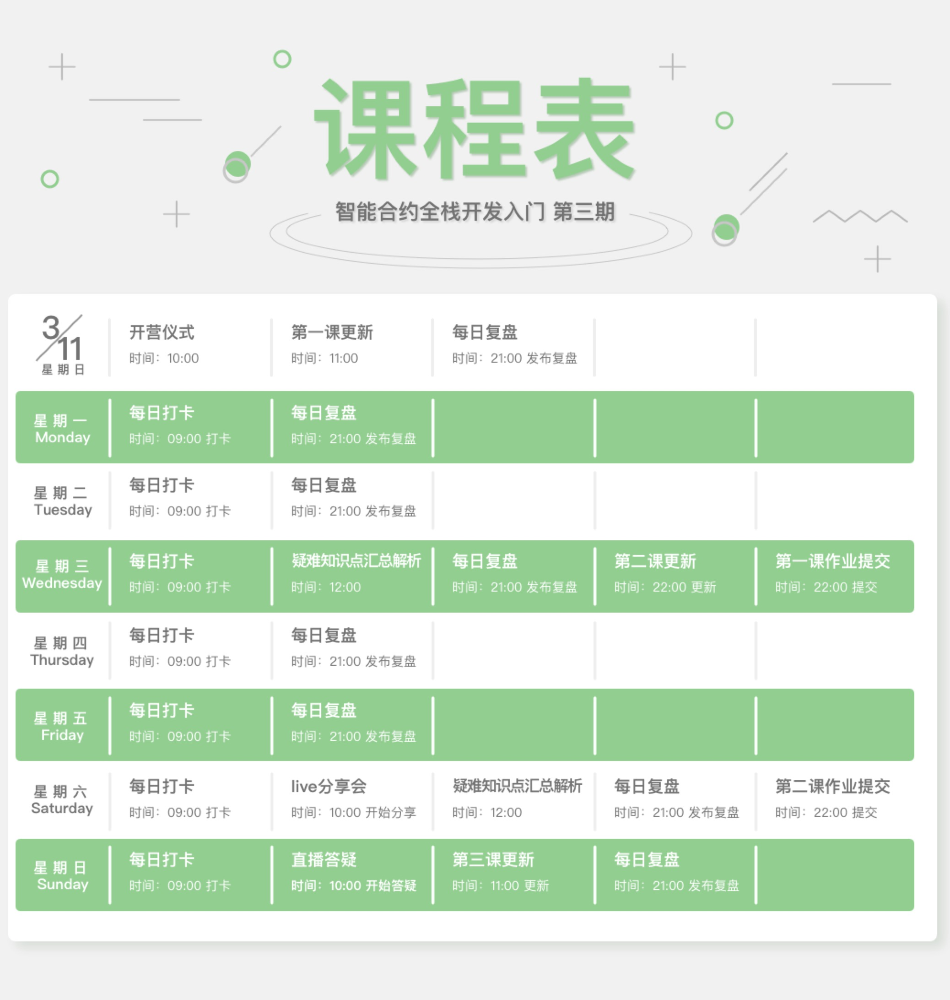
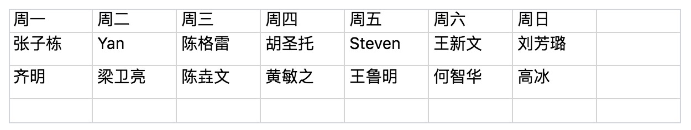

# 硅谷live以太坊智能合约开发课程

## 课程信息
- [开营仪式重要信息汇总](daily-review/posts/3/开营仪式重要信息汇总.md)
- [积分表格](https://docs.google.com/spreadsheets/d/1wFIaFeGkuZ5FF4qDSQX2eSNcmvnfPR7bosbu2x7ySYE/edit?ts=5aa0e091#gid=105166377)
- 课程表

- 助教排班表

## 常见问题FAQ
- [课程常见问题](FAQ/智能合约开发FAQ-0.md)
- [第一课常见问题](FAQ/智能合约开发FAQ-1.md)
- [第二课常见问题](FAQ/智能合约开发FAQ-2.md)

## 课程补充学习笔记
- [Lesson 1](https://github.com/Guigulive/Wiki/wiki/Lesson-1-%E8%A1%A5%E5%85%85%E5%AD%A6%E4%B9%A0%E7%AC%94%E8%AE%B0)

## 课程知识拓展

- [Ethereum的Merkle拓展](https://github.com/Guigulive/Wiki/wiki/Ethereum%E7%9A%84Merkle%E6%8B%93%E5%B1%95)

## [每日优质内容复盘](daily-review/README.md)
- [2018.3.16](daily-review/posts/3/2018.3.16.md)
- [2018.3.15](daily-review/posts/3/2018.3.15.md)
- [2018.3.14](daily-review/posts/3/2018.3.14.md)
- [2018.3.13](daily-review/posts/3/2018.3.13.md)
- [2018.3.12](daily-review/posts/3/2018.3.12.md)
- [2018.3.11](daily-review/posts/3/2018.3.11.md)
