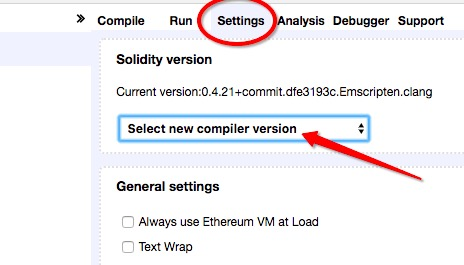
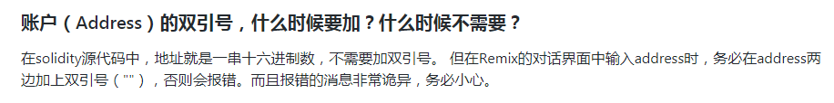

# 每日优质内容复盘-2018.3.11

## 【重要通知】

**@雅珣班长：** 

> 各位同学，有关课程内容的问题如何提问？有以下几项步骤：
> 
> 1）首先在GitHub的FAQ上查看是否有相关的问题；
> 
> 2）在小组群里或者GitHub上@助教并提问，不会提问的同学点击下面链接
> 
> https://shimo.im/docs/AnneAaVmNgUedVo3/ 点击链接查看「怎样在GitHub上给老师和助教提问？」，或复制链接用石墨文档 App 打开
> 
> 3）如果助教没有回复，再到微信大群里提问喔，因为微信大群消息太多的话，助教没法全部关注到，在GitHub上也有利于内容的沉淀。
> 
> 【重点注意】无论在微信群还是在GitHub上提问时一定要@助教 
> 
> 谢谢大家配合啦！

**@雅珣班长：** 

> 今天开营仪式忘了跟大家介绍一下咱们的请假条  
> 
> 1）【请假条】是用于学员在本次学习中有迫不得已的情况无法按时提交作业，但又不想扣除积分，即可使用喔～
> 
> 作业积分细则：优秀作业+3分，上交作业+2分，补交 0分，缺交-2分
> 
> 2）下面是请假条模版：  
> 『请假条』  
> 可爱的助教，这是我本月的请假条——   
> 请假人：小组+学号+姓名+GitHub昵称  
> 请假时间：第几周+第几次作业  
> 请假理由：  
> 承诺补齐时间：几月几日  
> 
> 3）请假条使用规则
> 本学期每位学员仅限用两次！！！并且直接上交至各小组群内给各组的助教，由助教备注在每次作业情况的表格中
> 
> 4）重点注意️
> 使用请假条的同学，将视为放弃参与“按时完成全部作业，返还一半的学费”的活动中，所有请大家三思而后行～～

## 【优质课程资源】

- **@申龙斌助教** 分享的二期课程的体验与收获：[《29天编程挑战，收获知识与友谊》](https://mp.weixin.qq.com/s/FhT1gjM4bREEdaSHSj11yg)
- [开营仪式重要信息汇总](https://github.com/Guigulive/Wiki/blob/master/daily-review/posts/3/%E5%BC%80%E8%90%A5%E4%BB%AA%E5%BC%8F%E9%87%8D%E8%A6%81%E4%BF%A1%E6%81%AF%E6%B1%87%E6%80%BB.md)

- [第一课常见问题FAQ](https://github.com/Guigulive/Wiki/blob/master/FAQ/%E6%99%BA%E8%83%BD%E5%90%88%E7%BA%A6%E5%BC%80%E5%8F%91FAQ-1.md)

## 【课程答疑】

#### Q1. @宗源: 请问下课程支持在pc播放吗？

- **@雅珣班长：** [怎样在PC端上听课？](https://shimo.im/doc/TdYzRDyAdD8MO2PG?r=E83DRZ&from=groupmessage)

#### Q2. @王昕: 如何安装个轻量级的钱包？

- **@助教-华龙：** 可以用在线或者离线轻钱包，也可以开启light模式。
    > 几种常见的钱包:  
    > 全节点钱包：mist、parity  
    > 轻钱包： myetherwallet、imtoken、metamask

- **@陆涛：** 使用mist的话可以参考这个开启light-mode：https://www.jianshu.com/p/46599c2c30a7
    > light , fast, full mode三种同步模式的区别： http://blog.csdn.net/wo541075754/article/details/78360560

#### Q3. @蒋雨辰：第一课用的solidity版本是0.4.14 但是目前好像更新到了0.4.21 所以会有一些变化 比如this.balance被deprecated了 这种情况作业中需要如何处理？

- **@助教高冰：** 建议版本调整成与课程一致，这里可以选择版本

#### Q4. @陈伟列：这个payDuration单位定义是seconds，我赋值是10s，但是感觉不到2s我就可以重新调用payFund，并且成功

- **@陈垚文：** 再看一下代码逻辑，这里的逻辑是欠你几个月工资就可以连续领几次，可以补领工资

#### Q5. @宗源：请教一下，矿工运行合约需要的gas是固定的，意思是矿工运行合约也需要消耗gas吗？那消耗的gas又给了谁？

- **@助教-我才是二亮：** 矿工运行的合约也是部署合约的人发起的，谁发起的合约部署就是谁来支付gas手续费。

#### Q6. Remix中如何输入address参数？

- **@申龙斌-助教：** 

- **@黄敏之-助教；** 我的经验是remix对于不打引号的值会作为int处理，加引号才算bignumber。这里int指js的int，地址明显超范围。类似的输入一个超大int256数也要加引号。

