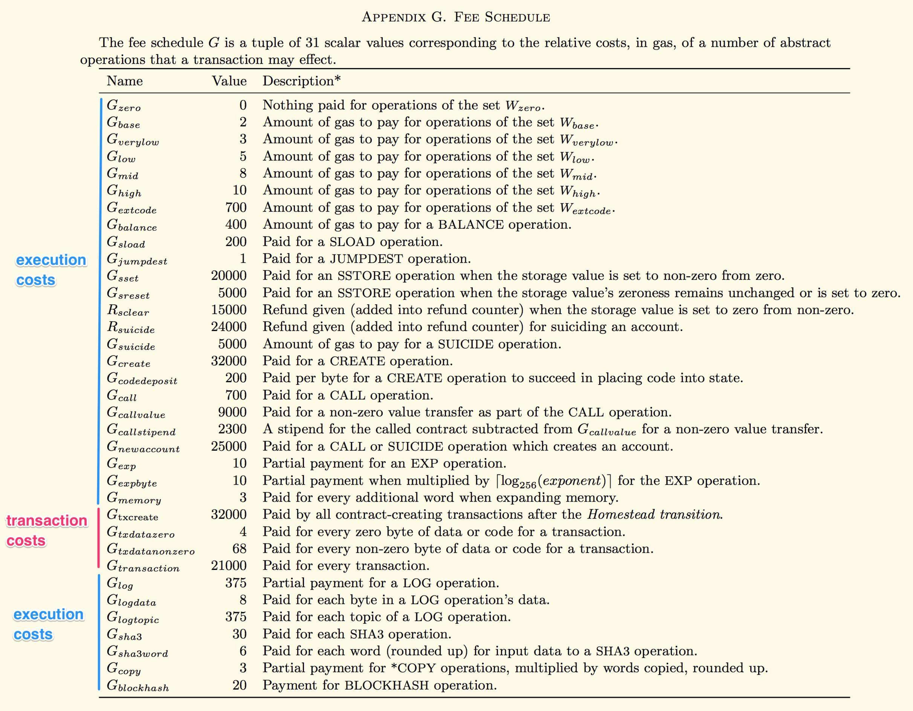
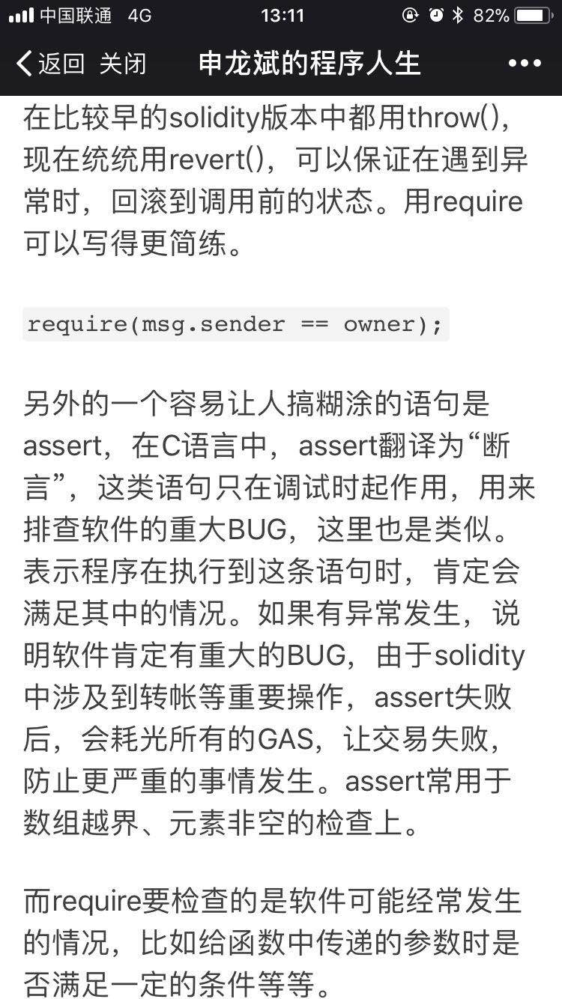
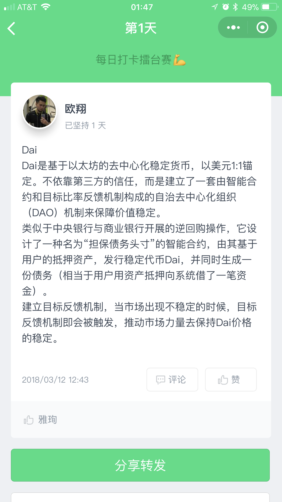
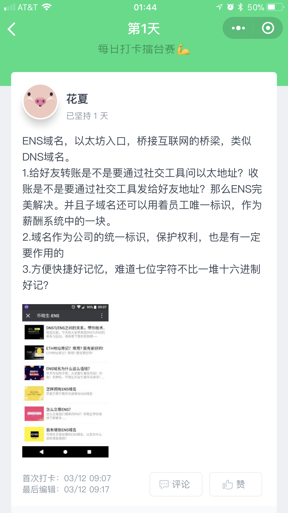
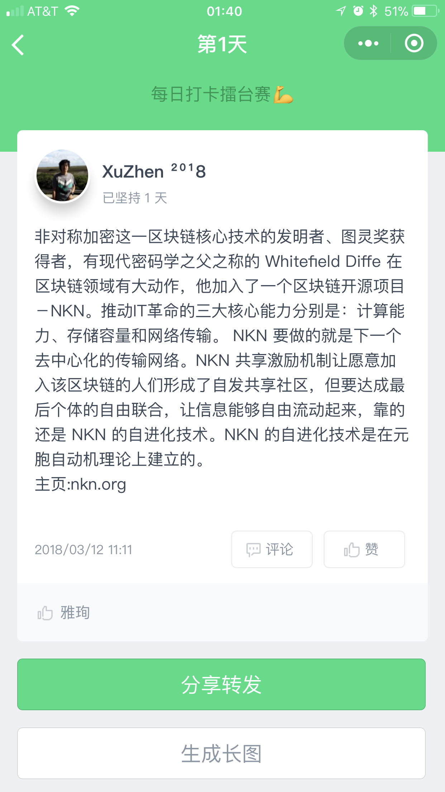

# 每日优质内容复盘-2018.3.12

## 【课程优质资源】

- 感谢 **@刘彪** 分享的atom配置指南：http://mp.weixin.qq.com/s/diXpHpWu4LkVMFWVZJFAbw

- 感谢 **@蒋宏伟** 分享的第一课学习笔记： https://segmentfault.com/a/1190000013660159?from=timeline&isappinstalled=0

- 感谢 **@许鑫鑫** 分享的“transaction costs和execution costs的区别”：



- 感谢 **@彭康政** 分享的区块链资料大合集：https://github.com/chaozh/awesome-blockchain-cn/blob/master/README.md
## 【课程答疑】

#### Q1. @陆涛: 请问有没有人能解释一下function addFund() payble{}的机制，看上去它并没有显式改变this.balance啊？

- **@JASONews-助教:** this.balance是不可以更改的。this.balance是显示当前contract的余额 是由evm 系统修改的

- **@Wei Li:** 里面有解释

    > The value of this.balance in payable methods is increased by msg.value before the body of your payable method executes.
    > https://ethereum.stackexchange.com/questions/29991/when-is-this-balance-updated

#### Q2. @Wei Li: 为何调用address.transfer()的getPaid()无需payable modifier，难道payable是有方向的 只针对接受付款的一方？

- **@杨明轩：** 课程里提到，接受的时候才需要，出的时候不用。我觉得因为接受钱的时候，是自己写的方法。而支付的时候，调用的是系统的方法，系统帮你做了。而你自己写的方法，你需要告诉系统，这里要改变金额

#### Q3. @杨晨朝：请问solidity怎么处理小数的？比如1/2＝0.5，在solidity里面结果是多少，0还是1？

- **@刘彪：** 是0。不是JS那种处理方式

#### Q4. @杨楫：想问下为啥这里是`require(msg.sender == employee);`而不是`require(msg.sender == owner);`呢？
> https://github.com/Guigulive/Team-F/blob/master/Lesson-1/orgin/payroll.sol#L41

- **@子栋-助教：** 这个意思是需要员工自己去从合约里面领取工资。如果改成owner的问题就是只有老板可以给员工发钱，但是如果老板跑路了员工就没法拿到工资了，就失去了这个智能合约原有的目的了

#### Q5. @蒋宏伟：assert 和 require 的区别在哪里？什么时候该用 require，什么时候该用 assert？我的理解是，发生上溢或者下溢时等底层错误时，用 assert，其他普通错误用 require。这样理解对不对？

- **@子栋-助教：** 准确的说应该是internal error时用assert。看我发的官方文档哈。assert主要是用来检查内部的错误，require一般是用在检查输入值。

    > - The assert function should only be used to test for internal errors, and to check invariants. 
    > - The require function should be used to ensure valid conditions, such as inputs, or contract state variables are met, or to validate return values from calls to external contracts.
    > http://solidity.readthedocs.io/en/develop/control-structures.html#error-handling-assert-require-revert-and-exceptions

- **@顺达-助教：** 补充一点，触发assert()会消耗掉所有的gas，而触发require()会把剩余的gas返还
    > `assert(false)` compiles to `0xfe`, which is an invalid opcode, using up all remaining gas, and reverting all changes.  
    > `require(false)` compiles to `0xfd` which is the `REVERT` opcode, meaning it will refund the remaining gas. 
    > https://ethereum.stackexchange.com/questions/15166/difference-between-require-and-assert-and-the-difference-between-revert-and-thro

- **@申龙斌-助教：** 



#### Q6. @王浩：这个函数不能正确的查询到某个地址的余额是什么原因？
```javascript
function getbalance(address person) returns (uint) {
    return person.balance;
}
```

- 这个问题原回答有误，具体查看这个Issue： 
    > https://github.com/Guigulive/Team-G/issues/4   
    > 任何`address`类型的变量都可以直接使用`.balance` `.transfer` 变量和方法，`person` 变量一样可以，他其实和`this`没有本质上的区别

#### Q7. @许鑫鑫： 求更详尽的解释transaction cost与execution cost的区别

- **@齐明-助教：** transaction cost 跟contract大小有关，execution cost是evm执行的cost
    > https://ethereum.stackexchange.com/questions/5812/what-is-the-difference-between-transaction-cost-and-execution-cost-in-browser-so

## 【优质群内讨论】

### 关于预言机的讨论

- **@蒋宏伟：** 关于预言机的可靠性有一个疑问。预言机通常在官网取权威信息，再把权威信息告诉以太坊。比如双色球，周日出号码了，预言机在官网取了双色球号码，并且通过智能合约颁奖。不巧的是，正好黑客把双色球的官网黑了，预言机取的官网号码是一个假的、错误的号码。但是智能合约已经执行，并已兑奖。请问官网出错后预言机是否能够避免继续出错执行智能合约？如果避免不了要怎么弥补？

- **@廖祜秋：** 没有办法，权威官网也需要去中心化。

- **@Xiao:** 这是个好问题。我的理解是，弥补是不可能的，只能事前预防。可能的预防方法之一是预研机并不依赖单点信息来源，而是取多个点进行信息的交叉验证，这样黑客的攻击成本会指数型上升。再加上一定的冷冻与延时机制，应该能比较好的解决问题。

- **@蒋雨辰:** 可以十个预言机从不同的渠道取信息

- **@花夏：** 加入投票机制，不全用自动化。人工审核一下

- **@蒋宏伟：** 一定的冷冻与延时机制的思路非常好。但现实世界中，双色球官网只有一个，所有网站都是去官网取信息。所以大家只能依赖单点信息来源。

- **@执否：** 保证上链的过程的安全，可靠，现在很多项目都有这问题吧，区块链只能保证链上信息

- **@金马：** 欧链就在做这个事情，欧链就是数据提供商，用各种办法保证提供的数据的安全性。你们提到的问题，有机会可以请教下欧链的老狼。看看他是怎么解决的

- **@蒋宏伟：** 其实如果再深究一下，这里就涉及到物理世界的客观事实如何安全可靠地上链的问题。这个问题的解决不但能更充分地发挥区块链的威力，而且应该会是一个海量的蓝海市场……

- **@执否：** 想要真正解决，大概只能所有东西都用物联网+区块链，毕竟人的变数太大，人为鉴定的时候，有物联网得到的区块链的数据做证明

- **@semibon:** 大部分传统物联网设备都是低功耗，低成本的节点，区块链这些实时更新数据，对数据容量体积有很大要求，也很难解决

- **@执否：** 技术迭代是比较快的，比如现在以太坊这么慢，没法商用，这都需要技术，资金的进入

## 【打卡干货集锦】

### 今日话题

分享一个自己熟悉的区块链项目，并用一段话描述项目特点

### 优质回答






