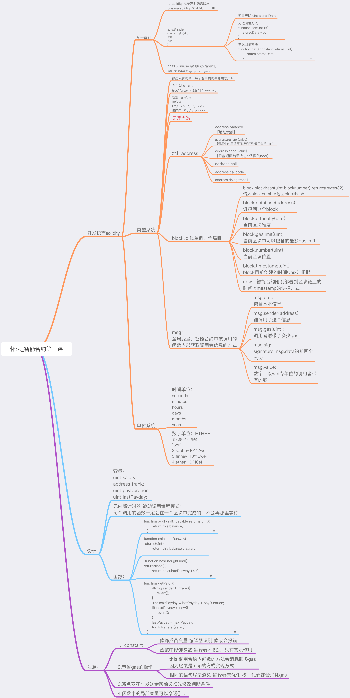
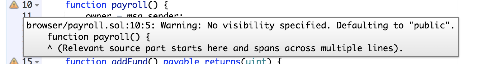
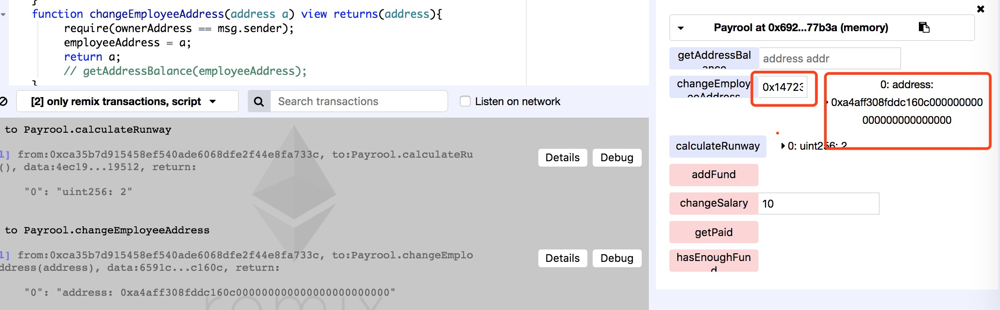
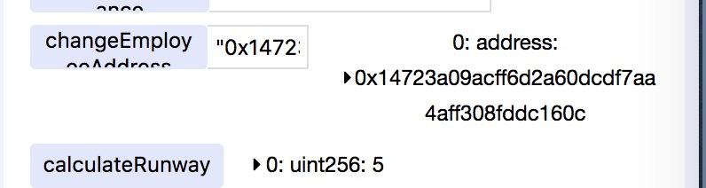
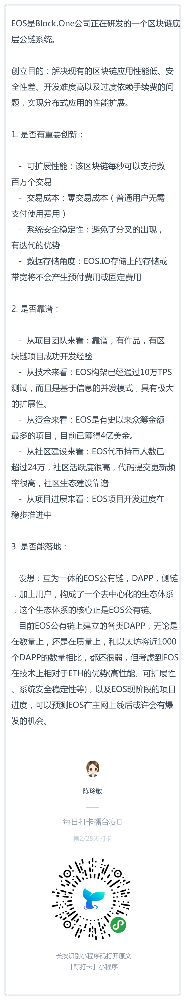

# 每日优质内容复盘-2018.3.13

## 【重要通知】

**@雅珣班长：** 

> 重点注意喔，为了方便你的小组长更迅速的统计到打卡情况，所有同学打卡后分享到各小组群内，不要分享到大群哦

**@会堂班长：**

> 这些已经交作业的小伙伴棒棒哒~  
> 还没有交作业的小伙伴要抓紧了哟  
> A组：3、4、8  
> B组:11、16  
> C组:22、23、25、26、27  
> D组:  
> E组:41、43、44、46、47、49  
> F组:59  
> G组:61、64、65、66、68  
> H组:74、77  
> I组:83、85、86、88  
> J组:92、93  
> K组:101、102、104、106、108  
> L组:112、113、119  
> M组:122、125、129  
> N组:132、134、139  
> O组:141、147、148

**@雅珣班长：** 

> ⭐️再来一波福利⭐️  
> live分享会《智能合约开发课》前两期合并后的社群于每周六举办的社群活动，每周邀请一名技术大牛or优秀学员围绕某热门区块链项目、技术问题等进行深入剖析。  
> 
> 本周的第八期分享会，我们邀请到开发课第三期的助教张岩和Google工程师田线宝，一起来给大家讲解《零编程基础，如何在五分钟内发布一个新代币》  
> 
> 若想参与分享会勾搭技术大牛和学长学姐的同学们，请填写下方报名表噢  
> http://cn.mikecrm.com/E43DzPn  
> 
> 我将选取五名优秀学员加入到社群中参与分享会～

## 【优质课程资源】

- 感谢 **@黎倚杭** 分享的[《ETH智能合约的调试手段》](https://www.jianshu.com/p/2446545837b8)
- 感谢 **@怀达** 提供的第一课思维导图：



## 【课程答疑】

#### **Q1. @王浩：** `getpaid()`以后该怎么查询员工的余额呢？

- **@助教-我才是二亮：** 直接用员工地址`addr.balance`即可，例子如下：
```Javascript
function getBalance(address addr) public view returns(uint256) {
return addr.balance;
}
```

#### Q2. @王浩：请问一下怎么把输出值放在函数右边显示，而不是在details里查询

- **@助教-我才是二亮：** 加view修饰符，可以显示在右侧

#### Q3. @杨小咩：Solidity有在GitHub上开源吗

- **@助教-我才是二亮：** https://github.com/ethereum/solidity

#### Q4. @王浩：从账户转100 ether去合约地址，账户剩的是0.0000...6255，为啥还剩个零头？

- **@助教-顺达：** remix里这些测试帐户的钱都是无限的，虽然一开始只显示100 ether。那个零头其实就是多出来的gas的费用

#### Q5. @乔勇：请教一个问题。直接粘贴网上的代码，在IDE里首先addFund 100 ether，然后用updateEmployee初始化，输入地址和每次付钱数，之后的付钱、统计还能发多久、是否足够操作都正常，但是到了换收款地址的时候就会报错，请问是为什么

- **@姜天宠：** 修改右上角的那个`account`之后，`msg.sender`和最开始部署时的地址不一样了，得再把`account`切回去。`msg.sender`就是判断你现在是雇主还是员工,雇主可以update 员工只能getpaid

#### Q6. @金煜：这种警告是什么意思？



- **@助教-我才是二亮：：** 就是没有设置函数可见性。这个方法是外部可访问的，直接在`payroll()`后面加`public`。其实这也算是一种修饰符，在solidity中修饰符都在函数名的后面，在返回参数的前面
    > http://www.tryblockchain.org/Solidity-VisibilityandAccessors-%E5%8F%AF%E8%A7%81%E6%80%A7%E5%92%8C%E8%AE%BF%E9%97%AE%E6%8E%A7%E5%88%B6%E5%99%A8.html

#### Q7. @金煜： view关键字起什么作用？

- **@助教-我才是二亮：：** 一般情况下，如果一个方法里面没有进行任何的状态的变更，仅仅是获取某一个数据  可以添加`view`修饰符。一般`view`相当于承诺这个方法里面不会进行状态的变更，但是编译器不强制的。  
`constant`是用来承诺不会改变状态，如果使用`constant`修饰变量，编译器是强制不允许修改该变量的，但是如果用来修饰函数的话，是不做强制的，这个函数里面依然可以进行状态的变更。  
而`view`只能用来修饰函数，而`view`也仅仅是承诺，编译器并不强制。

#### Q8. @金煜：设置员工地址和工资时如何给函数传两个参数？

- **@金诗雨：** 参数需要时JSON格式，所以两个参数需要用逗号隔开，并且地址参数需要用引号包起来，如`“0x0000000sajdkhfkjsdf",3`

#### Q9. @怀达: 为什么我换地址的时候 打印出的地址不对呢？



- **@廖祜秋：** 地址传入用引号试试。



## 【打卡干货集锦】

### 昨日话题

分享一个自己熟悉的区块链项目，并用一段话描述项目特点

### 优质回答





