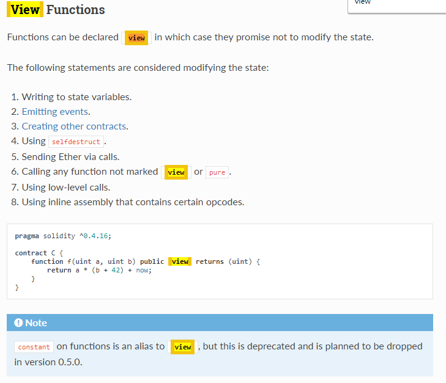
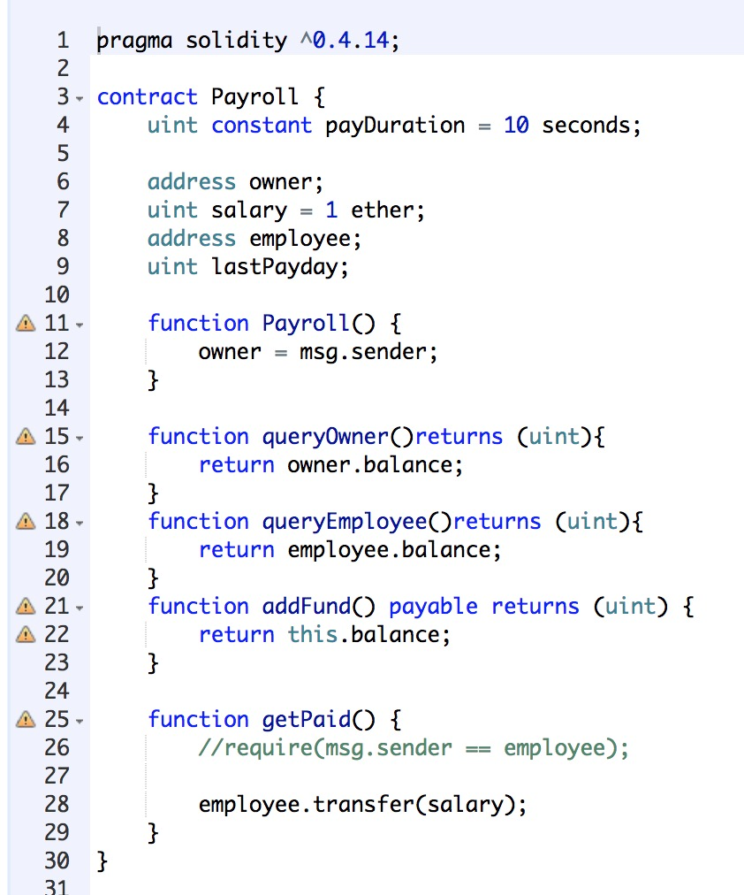
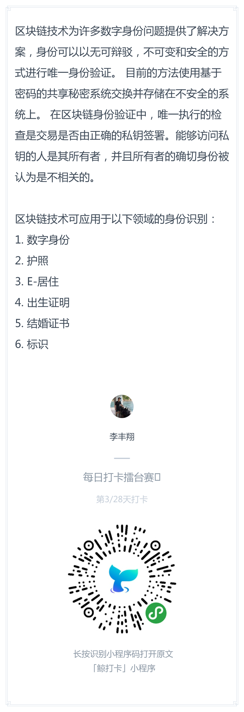
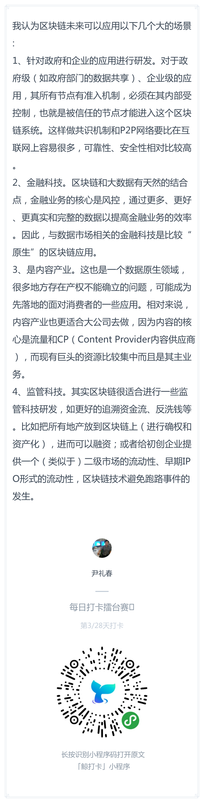

# 每日优质内容复盘-2018.3.14

## 【重要通知】

**@雅珣班长：** 

> 各位同学，北京时间今晚10点截止交作业喔，第一次作业希望大家认真对待，咱们的课程才刚刚开始   
> 三次不交作业会直接被开除，大家加油

## 【优质课程资源】

- 感谢 **@ccya-助教** 整理的[第一课补充学习笔记](https://github.com/Guigulive/Wiki/wiki/Lesson-1-%E8%A1%A5%E5%85%85%E5%AD%A6%E4%B9%A0%E7%AC%94%E8%AE%B0)
- 感谢 **@陈垚文-助教** 提供的以太坊[白皮书](/documents/Ethereum_white_paper.pdf)、[黄皮书](/documents/yellowpaper.pdf)及[米皮书](/documents/beigepaper.pdf)

## 【课程答疑】

#### Q1. @蒋雨辰：请问助教为什么用view的时候会报错呀？


- **@刘芳璐-助教：** 是版本的问题  https://github.com/truffle-box/react-uport-box/issues/15

#### Q2. @杨楫：想问下每个contract都有自己的address,但是如果某一天有两个contract的hash collision了怎么办？

- **@萌面侠：** 我觉得思路和这是一样的： https://bitcoin.stackexchange.com/questions/7724/what-happens-if-your-bitcoin-client-generates-an-address-identical-to-another-pe

- **@杨楫：** 看来2^256已经足够大了 https://www.youtube.com/watch?v=S9JGmA5_unY

#### Q3. Create合约后合约方法未显示在右边区域？

- **@何智华-助教：** 有用 Microsoft Edge 浏览器的同学注意下，remix 在这个浏览器中有不兼容的地方，比如 create 合约成功后，合约方法并未显示在右边区域。如果遇到类似的问题，建议使用 Chrome 浏览器

#### Q4. 怀达；我在这个方法中更改了地址  但是之后调用打印地址的函数时 发现地址还是0地址，没有保存住 ，请问大家知道什么原因吗？

```Javascript
function changeEmployeeAddress(address a) view returns(address){
    require(ownerAddress == msg.sender);
    employeeAddress = a;
    return employeeAddress;
}
```

- **@顺达-助教：** 是`view`的问题，把`view`去掉就可以了。`view`是用在没有对状态进行修改的函数上。加了`view`的函数，调用时所做的修改不会对合约的状态产生影响，只是起一个查看状态的作用。

- **@陈垚文-助教：** 



#### Q5. @Ray: 一个合约从原代码、编译、在EVM中初始化，运行，被别人调用或自已完成事务，事务结束后，整个过程的数据流。哪些数据是在EVM的内存中，哪些是写在区块链中。

- **@盛峰：** 官方wiki里应该都能找到：https://github.com/ethereum/wiki
- **@陈垚文-助教：** 可以看白皮书、黄皮书还有米皮书了解
    > - [以太坊白皮书](/documents/Ethereum_white_paper.pdf) 
    > - [以太坊黄皮书](/documents/yellowpaper.pdf)
    > - [以太坊米皮书](/documents/beigepaper.pdf)

#### Q6. @王信平：`address owner;` `address employee;` 这两个地址有什么区别？

- **@荀辰龙：** 两种身份，一个是发工资的（给合约里添加资金），一个是领工资的

#### Q7. 刘金伟：这段代码执行正常，可是代码中并没有给`employee`赋值，为什么不报错呢？



- **@姚子豪：** 这个跟普通程序的初始变量一个意思。你定义了一个`int`类型，没有初始化，系统会默认为0。`employee`是`Address`类型，没有初始化，默认值就是 0x0000**0

#### Q8. 刘金伟：如果我向一个胡乱写的地址转账 会出现什么情况revert 还是怎样

- **@陈垚文：** 只要地址在2^256范围内，应该都是可以转账的

#### Q9. 张晓：有没有检测地址有效性的函数？

- **@陈垚文：** 参考一下：
https://github.com/ethereumjs/ethereumjs-util/blob/fde15dd0cc65885dc8731d1bd2facbba78fb39ac/index.js#L459-L461
```Javascript
exports.isValidAddress = function (address) {
  return /^0x[0-9a-fA-F]{40}$/.test(address)
}
```

## 【打卡干货集锦】

### 昨日话题

你觉得区块链可以应用在生活中的哪些领域或实际场景呢？理由又是什么呢？

### 优质回答





