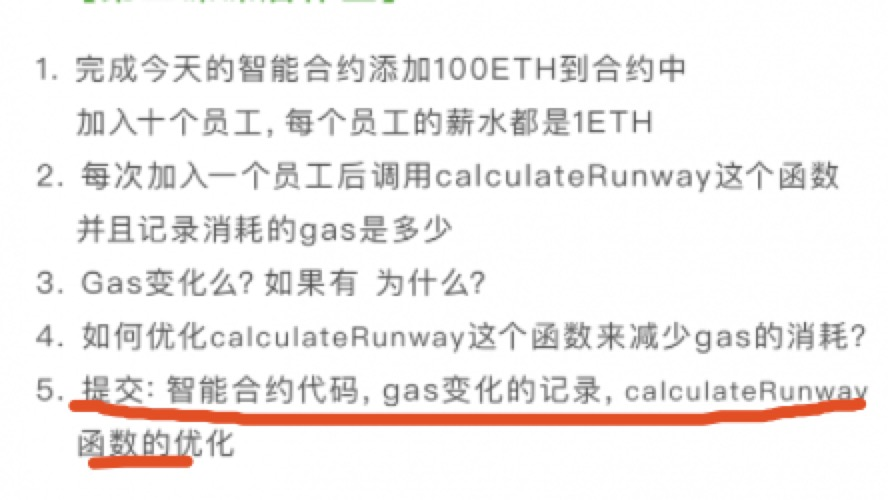
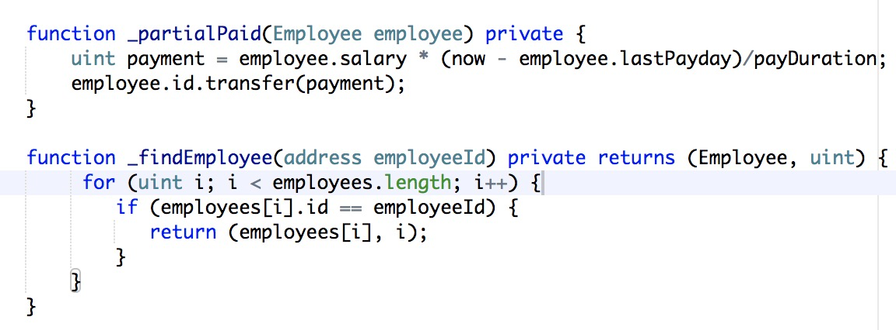
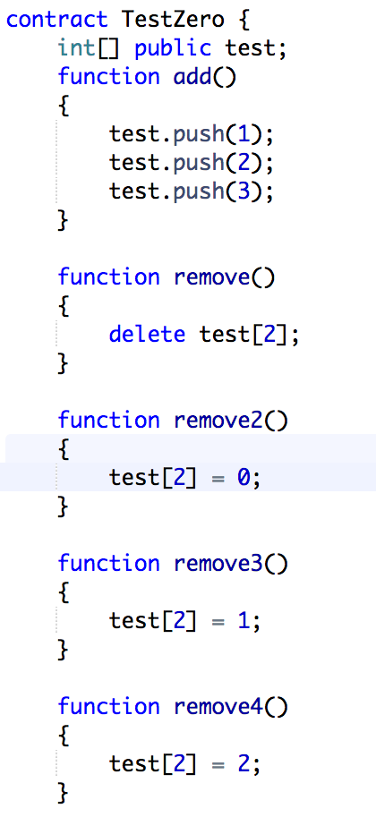
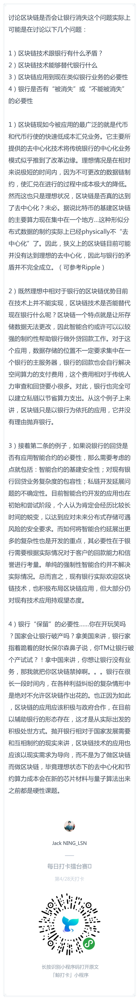
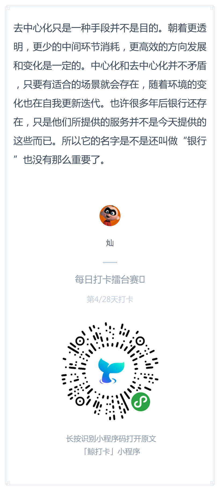
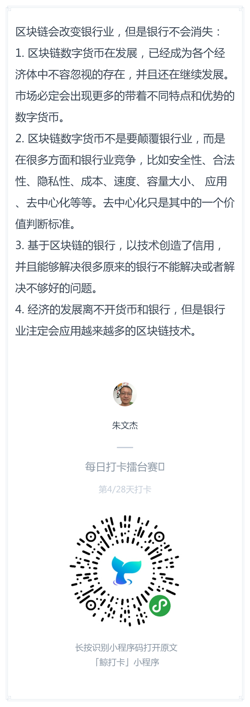

# 每日优质内容复盘-2018.3.15

## 【重要通知】

**@雅珣班长：** 

> 【同学们请注意】
拿源代码的同学直接上交作业，一律会被助教打回重新写～！

**@Nicole班长：** 

> live分享会  
> 本次分享会邀请到前京东移动技术负责人华龙来给大家讲解《对Dfinity共识机制的简单介绍》
> 
> 时间：北京时间周六3月17号，早上10点（硅谷周五下午7点）  
> 地点：微信群内  
> 形式：语音+图文  
> 分享人：题华龙  
> 
> 大家记得准时来收听喔️~~

**@会堂班长：** 

> 同学们，下午好呀。我们酝酿未来开展线下活动，和大家直接面基，不过目前不太确定大家主要所在的城市，所以想征集咱们这期小伙伴的所在城市，需要大家在表单中填写一下自己目前的所在城市(链接在群里查看)

## 【优质课程资源】

- 感谢 **@尹礼春** 开发的作业查询页面：[未来世界的开拓者们第三期提交作业汇总表](http://gg.czk1.com/guigu/)

## 【课程答疑】

#### Q1. @陶维英： 【疑问】 第一课的这句话 `uint payment = salary * (now - lastPayday) / payDuration;` ，如果支付工资的周期是30天，老板每到29天，就给员工更新一个新地址，这样员工是拿不到任何钱的。还有payDuration判断是不是为0，如果是0，程序会奔溃的，被除数不能为0.

- **@Ted熊伟：** 我觉得这里要看salary是不是足够大不，因为单位是wei，如果一个duration的支付工资是1wei的话，就会出现你说的支付工资为0的情况。当salary足够大时，这样算的结果比较接近应该发的实际工资。我们指定ether作为单位时，实质上只是简写了10^18而已，最后结算是按照wei的。

#### Q2. @彭康政：作业的后面两个是以什么形式提交呢？

- txt、md或者注释都可以，只要是纯文本能review就可以了

#### Q3. @Wilson：刚看完第二节课视频，其实看的时候就有个问题，一直用循环来判断是否这个employee存在 。能不能用mapping而不用array？

- **@黄敏之-助教：** 因为不能遍历mapping的key，只能用array。不过如果只是为了判断是否存在的话是可以的

- **@Wilson:** 有没有mapping.contains之类的自带函数呢？这样复杂度能从n到1啊

- **@黄敏之-助教：** mapping用法下节课会讲，一步步来不要急

#### Q4. @彭康政：为什么这里一定要强行加`private`关键字？不加就报错

- **@黄敏之-助教：** 因为这里直接用了结构类型`Employee`，必须`private`。不加`private`的话就默认`public`了，所有人都可以执行。要写成`public`的话必须把每个结构体里的每个值分开写，现阶段不支持直接传结构体。顺便提一下用旧版编译器比如0.4.19不报这个错，然后会在执行时报错。。。

- **@荀辰龙：** 我感觉可能结构体是内部定义，外部不可见的，如果方法是public的话，带有结构体声明的方法当然是不合适的。

#### Q4. @荀辰龙： delete就是赋0值吗？

- **@夏玮欹-助教：** 这篇文章里有介绍关于delete的实际意义：
    > `delete`运算符，用于将某个变量重置为初始值    
http://www.tryblockchain.org/Solidity-LValues-%E5%B7%A6%E5%80%BC%E8%BF%90%E7%AE%97.html

#### Q5. @许鑫鑫：我看了下solidity的文档 delete只是将类型初始化 并没有真正的从内存中移除。那么在removeEmploy的函数中，我们只是把数组中第i个元素引用改为最后一个employee的引用，那么原本第i个元素原本引用的内存空间什么时候被回收的呢，换句话说EVM支持内存回收机制吗？

- **@黄敏之-助教；** EVM的定义就是0值等同于回收，把一个storage设为0是消耗负值的gas

- **@黄敏之-助教；** 小测验时间：remove、remove2， remove3，remove4的gas消耗有什么特点

**实验结果：** remove约等于remove2，同时远远小于remove3和4。且执行完remove12后下次remove34的gas消耗大大增加。这个很有意思。1和2做的都是释放内存的操作，所以有负gas的福利；释放内存后如果要再赋值，需要重新申请内存，所以这样会消耗更多的gas。

关于合约中的存储可以参考下这篇文章： https://programtheblockchain.com/posts/2018/03/09/understanding-ethereum-smart-contract-storage/  

## 【优质群内讨论】

- **@会堂班长：** 

    > 好的打卡和认真的思考真的是能吸引到同样认真的思考的。在Annie这条打卡下面，我给了这样的评论：  
    > 
    > 1）区块链需要共识才能达成，因此只有绝大部分国家和金融机构认可才能全面运转；  
    >
    > 2）如果要达成金融机构的共识，可能更多是联盟链，而非公有链，因为大家需要共享信息。不过目前来看，金融机构建立联盟链还有点困难；  
    >
    > 3）假设最终形成一个公有链，但实际并非所有人都懂理财，最终业务落地还是需要银行和其它金融组织参与才能执行。

- **@卢嘉赋：** 针对目前建立联盟链困难这一点，杜班长可以详细说一下吗？目前我有接触到一些公司在做这一块，实际上已经有很多落地场景了

- **@会堂班长：** 利益比较难牢固绑定吧，所以结成的联盟也很松散，一些政策/市场发生变化，或者联盟个别成员另有想法，就可能会出现退出。比如2016年高盛退出R3就是一个例子

- **@卢嘉赋：** 部分业务先上链改造，看到成本下降效益出来，由利益驱动，形成良性循环，进而推广开来。不过目前没有形成比较大的联盟，小机构都在观望阶段

## 【打卡干货集锦】

### 昨日话题

区块链会让银行消失吗？有人认为银行作为中心化机构，未来会逐渐消失；也有人认为区块链技术本身是去中心化的，但在业务逻辑上不一定完全去中心化。你怎么看呢？

### 优质回答

