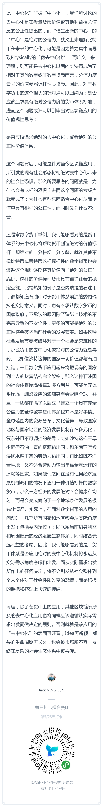
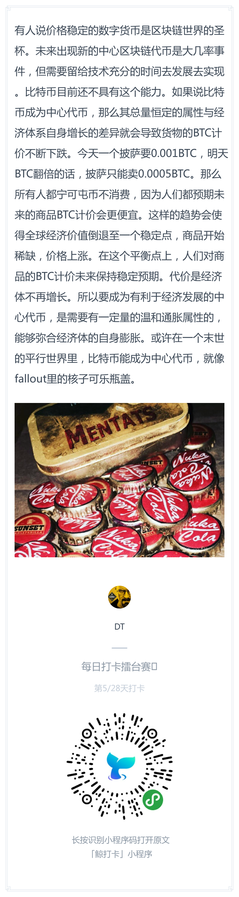
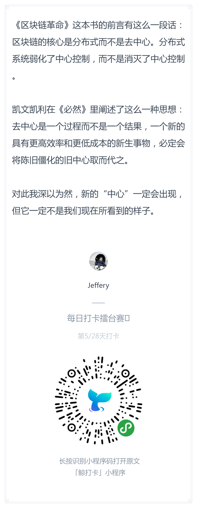

# 每日优质内容复盘-2018.3.16

## 【优质课程资源】

- 感谢 **@刘彪** 分享的 [GitHub仓库同步的教程](https://mp.weixin.qq.com/s/YaBJlMexHK-U0YBts2m-8w)

- 感谢 **@Jeffery** 分享的区块链开发社群资源 https://github.com/BlockchainOne

## 【课程答疑】

#### Q1. @黄敏之-助教：关于返回值storage的用法，可以看这段代码小测验：add和add2有什么区别

**答案：** `get()`返回的是引用，`get2()`返回的是拷贝，所以`add()`执行完之后会改`FIRST`的值，而`add2`不会

> [数据位置(storage、memory、calldata)拓展阅读](https://github.com/linjie-1/guigulive-operation/wiki/Lesson-2-%E8%A1%A5%E5%85%85%E5%AD%A6%E4%B9%A0%E7%AC%94%E8%AE%B0#2-%E6%95%B0%E6%8D%AE%E4%BD%8D%E7%BD%AEstoragememorycalldata)

## 【打卡干货集锦】

### 昨日话题

区块链的“去中心”，最后会不会催生出“新的中心”？比如比特币，最终会不会成为数字代币中的中心代币呢？

### 优质回答

