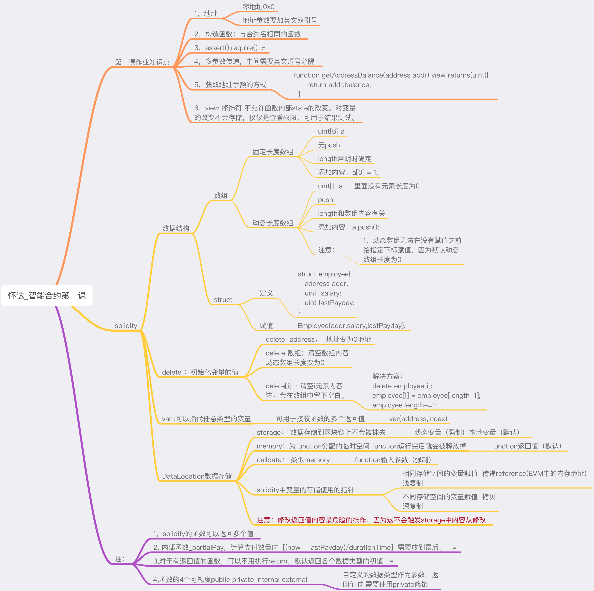
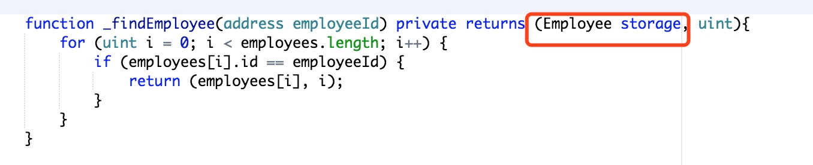
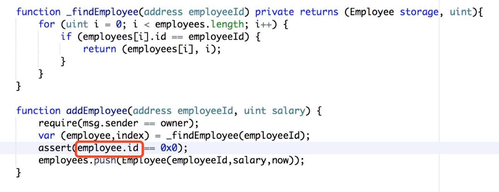
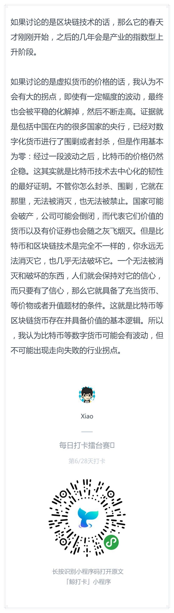
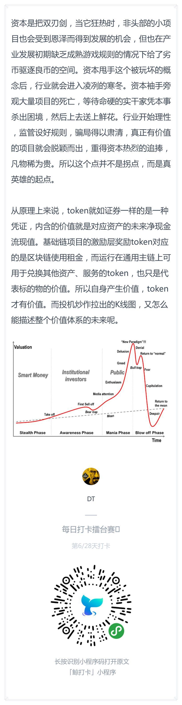

# 每日优质内容复盘-2018.3.17

## 【重要通知】

**@会堂班长：** 

> 目前第二次作业的统计情况：https://shimo.im/sheet/FhGM0meiR3AGYLaC/XDo8X
之前第一次作业有10名同学没有，这次要格外注意了。按照咱们的规定，3次不交作业是要离开学习小组的，希望大家都能坚持下来

## 【优质课程资源】

- 感谢 **@DT** 分享的学习笔记，将Solidity与Python进行了比较： https://github.com/mind-gravity/guigunotes/blob/master/sol2py_l2.md

- 感谢 **@杨楫** 分享的 [Difinity共识系统介绍](https://dfinity.org/pdf-viewer/pdfs/viewer?file=../library/dfinity-consensus-cn.pdf)

- 感谢 **@怀达** 分享的第二课思维导图



## 【课程答疑】

#### Q1. @王昕屹：请问local variable  是存在local storage 而不是permanent storage对吧？函数调用完毕，就直接销毁掉。我的理解对吗？

- **@何智华：**

    你问的问题应该和数据的位置特性有关。在solidity中，memory类型的变量的值用完过了作用域即回收，而storage类型的变量的值会被持久化到区块链中。本地变量默认是storage，一般是将状态变量赋予它做一些运算，它的指向也是状态变量。但是假如赋予本地变量的是函数传进来的参数，则需要用var声明本地变量，它的位置类型取决于传进来的参数的位置类型。

    local storage variable 最终都是会指向合约中的状态变量，而状态变量是永久存储在区块链上的，如果本地变量没有被赋值，那么它实际上会默认指向storage的slot 0区域。所以对local storage变量的操作自然影响的都是区块链上永久存储的状态变量。

    对于solidity而言，了解memory和storage的位置特性很关键，但又不是那么好懂，这边再举一个例子：

    

    这里如果指定返回的employee为storage类型，会发现在找不到employee的情况下，它返回了合约里storage区域的slot 0。这种情况下，assert这个地方会抛错。

    

#### Q2. @宁达非：请问Solidity里有没类似`print`的函数？

- **@宗源：** 需要先定义一个`event`, 然后就可以调用`log`。运行函数之后可以在details里面看到log的输出内容:
```
event log(string);
```

## 【打卡干货集锦】

### 昨日话题

3 · 15晚会结束，之前「可能会对数字货币和ICO点名」的传言并没有成真，币圈和链圈都可以暂时松口气了。但依旧有人认为，在数字货币行情持续走低的大背景下，行业拐点即将到来，即便不是3 · 15晚会，也将通过其他方式实现。你认同「拐点即将到来」的看法吗？

### 优质回答






