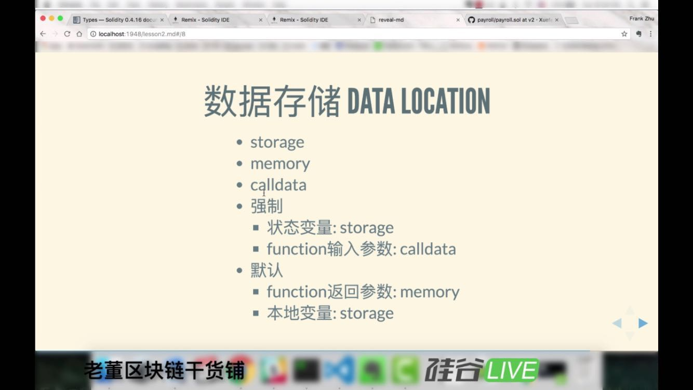
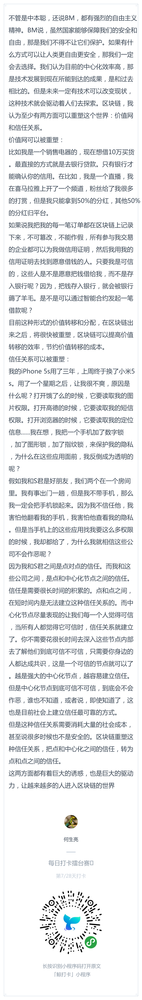
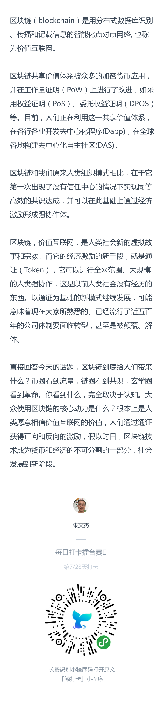

# 每日优质内容复盘-2018.3.18

## 【重要通知】

**@雅珣班长：** 

>各位开拓者们，下周三要更新第四课了，由于第4课要部署安装虚拟机，需要较长时间来下载，故提前三天放出来给大家了：
>墙裂建议：由于虚拟机较大，下载时间较长，需要提前下载好
>
>1）国外同学/ 能翻墙同学戳 https://www.dropbox.com/s/bikdtta0ecw1l1r/juicebox-desktop-1.3.0%20Clone.ova?dl=0
>
>2）不能翻墙的同学戳 chinatechstory.com/juiceboxClone.ova
>
>温馨提示：由于虚拟机较大，下载时间较长，耐心等待呢
>
>下载完成后，根据课程来进行安装部署哦~

**@雅珣班长：** 

>各位开拓者请看下面的通知：
>
>1） 对于Truffle本身的学习，我们的虚拟机镜像已经帮大家配置好了truffle， testrpc，npm等等版本，所以安装truffle，testrpc，npm，nvm的步骤都可以省略，请大家可以直接试运行truffle init，来产生标准的和视频讲解一样的metacoin工程
>
>2）对于react的前端整合部分，因为react box在视频录制之后更新，所以很多东西都有一些小的变化，为了方便大家，请用以下这些步骤运行那个simple storage的例子：
>
>1. 下载官方虚拟机镜像（版本号：5.1.22）
>2. cp -r react-box payroll
>3. cd payroll
>4. npm install
>5. 打开第二个terminal，启动testrpc
>6. truffle migrate
>7. npm run start

## 【优质课程资源】

- 感谢 **@尹礼春** 分享的第二课笔记，大图和mmap文件https://github.com/ylic2018/Homework/tree/master/Learning_notes
- 感谢 **@朱文杰** 分享的[remix离线版链接](https://github.com/ethereum/remix-ide/tree/gh-pages), 下载 remix-7013ed1.zip， 可以离线使用
- 感谢 **@王信平** 分享的 [Solidity调试 - 实现变量打印](https://www.cnblogs.com/huahuayu/p/8593774.html)
- 感谢 **@申龙斌-助教** 分享的[log用法](http://solidity.readthedocs.io/en/latest/contracts.html#low-level-interface-to-logs)

## 【课程答疑】

#### Q1. @宗源：董老师上午提到的数组的slot 0的坑，有兴趣的可以跑下这段代码，先执行f再执行t


- **@杨小咩：** log 输出2， 因为 x, y 指向同一个地址

#### Q2. @张晓：刚试了一下remix本地安装版蛮好用的，分享给需要的同学。

安装：
```
$ npm install remix-ide -g  
```
启动：
```
$ remix-ide 
```
然后在浏览器里访问 `localhost:8080 ` 就可以了

- **@杨小咩:** 公司用的win倒是可以，盐鹅我自己电脑是Ubuntu chromium看不了，链接在手机/平板的浏览器打开也是pc版页面，好像除了微信端并没有考虑移动版

#### Q3. @宁达非： 关于储存这块期待有一个能够系统来看和学习的帖子

- **@何智华-助教：** 刚才搜了一篇写得还可以: http://blog.csdn.net/liyuechun520/article/details/78408588?_t=1521348685
- **@何智华-助教：** 这篇也不错 http://me.tryblockchain.org/solidity-data-location.html

#### Q4. @刘金伟；最后一行，本地变量是指的什么？



- **@宗源：** 就是js function里面的局部变量

- **@何智华-助教：** 正解，不过只针对引用类型，如array和struct。 对于值类型，是在栈里边的，赋值也总是值拷贝

- **@宗源：** 奥原来是这样啊，那函数里面的uint a这种算是？

- **@何智华-助教：** 这个是值类型， 对于值类型，不需要讨论数据location。 同时这个也是本地变量。

- **@宗源：** 哦哦，你的意思是引用类型的存storage，其他类型的存memory吗？

- **@何智华-助教：** 引用类型的本地变量才需要讨论要指向storage还是指向memory， 在方法里，如果定义 Employee memory e，那么它指向内存，可以动态初始化一块区域给它。如果定义 Employee a 或者 Employee storage a,那么它只能指向合约创建时就分配好的storage区域，不能动态初始化出新的一块，它也只能是指向已有的状态变量。 另外，对于引用类型，不同location之间赋值是要做深度拷贝的。 同一location的变量之间的赋值是引用拷贝。 深拷贝是自动的

- **@宗源：** 请问下如果是Employee a, 是不是默认是指向storage，并且是指向storage中的slot 0吗？

- **@何智华-助教：** Employee a不赋值的话默认是指向storage slot 0

- **@宗源：** 引用类型得本地变量想指向memory只能添加memory关键字吗？

- **@何智华-助教：** 嗯， 或者var。 然后取决于赋值给它的是那种location类型的， 即var的location取决于赋值。 比如函数参数默认是memory的，var一个变量，并将函数参数赋值给它，那么这个变量就是memory的

- **@宗源：** uint a 这种本地变量就只是存在memory中吧

- **@何智华-助教：** uint a存在于栈中，另一种内存区域。 memory可以类比java或者.net中的堆

- **@宗源：** 咦我记得之前讲的参数默认存在calldata里

- **@何智华-助教：** 那是external的函数，才是calldata,一种只读区域

#### Q5. @老董: local variable可以是memoery可以是storage，需要具体情况具体分析: 

>A common mistake is to declare a local variable and assume that it will be created in memory, although it will be created in storage:
```
/// THIS CONTRACT CONTAINS AN ERROR

pragma solidity ^0.4.0;

contract C {
    uint someVariable;
    uint[] data;

    function f() public {
        uint[] x;
        x.push(2);
        data = x;
    }
}
```
>The type of the local variable x is uint[] storage, but since storage is not dynamically allocated, it has to be assigned from a state variable before it can be used. So no space in storage will be allocated for x, but instead it functions only as an alias for a pre-existing variable in storage.
>
>What will happen is that the compiler interprets x as a storage pointer and will make it point to the storage slot 0 by default. This has the effect that someVariable (which resides at storage slot 0) is modified by x.push(2).

#### Q6. @老董：solidity的文档中写着delete只是将类型初始化，并没有真正的从内存中移除。那么在removeEmploy的函数中，我们只是把数组中第i个元素的引用改为最后一个employee的引用，那么第i个元素原本引用的内存空间什么时候被回收的呢，换句话说EVM支持内存回收机制吗？

- **@老董：** 简单来说，不支持。但这里面更需要注意的是，cost是在存储的时候就已经发生了，而且这个数据存在过的证据是会永远存在，所以并不存在退还cost的概念，每一个transaction都是对当下block的状态负责的

#### Q7. @宗源：请问下为什么一个函数中有error，会导致前面一句log也无法执行？

- **@老董：** 每一个函数调用过程是个整体。某个地方跑出异常时，会回滚所有状态。

#### Q8. @刘彪：有没有像js原型链这样的东西，一个一个函数这么堆切一起，好乱，不便于管理和命名空间

- **@老董：** 没有

#### Q9. @蒋宏伟：
```
Stuct s = Stuct() 
```
以上代码在函数中执行会报错，但在合同中（函数外部）执行不会报错。这是为什么呢？storage 和 memory 之间为什么不能互相自由转换呢？

- **@老董：** struct 只能存在在storage上面 所以在函数中初始化会出现问题

#### Q10. @宗源：Transaction cost里面的zerodata和nonzerodata指的是什么呢？

- **@老董：** good question: 0 data = 你没有任何附属的data，只是一个简单的value transfer。 那么这里就有一个很有意思的问题，作为一个0data的transaction，他的available execution gas就只有21000

- **@张晓** 我可以这样理解吗: transaction cost 是内存占用为主的cost，execution cost 是CPU占用为主的cost？

- **@老董：** 这个并不是这样的哈，假设你调用了一个函数foo（），这个函数随机产生了1000个element的数组，产生数组的cost就是execution cost。 发送函数名，调用参数等等这些cost是transaction cost。 我再解释一下transaction cost， 比如两个函数功能一样，一个有参数，一个没参数。他们的execution cost是一样的，transaction cost那个有参数的高， 因为区块链需要记录这个（没什么卵用的）参数。

#### Q11. @宗源： 可以举一个智能合约在日常生活中的使用场景吗？

- **@老董：** 还是有很多可能的应用的哈，比较好理解但又不trivial的例子的话可以去看看预测市场（Prediction Market）

#### Q12. @老董: 请问local variable 是存在local storage 而不是permanent storage对吧？函数调用完毕，就直接销毁掉。这样理解对吗？

- **@老董：** 对 没错的，但是切记并不是说local variable就不花钱，花的比storage少很多， 但还是花钱的。

## 【打卡干货集锦】

### 昨日话题

区块链到底能给人们带来什么？如果中心化设施的效率已经很高了（比如支付宝相对银行），促使大众（而不是极客）使用区块链的核心动力会是什么呢？

### 优质回答





