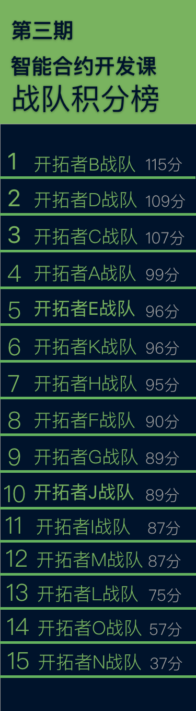
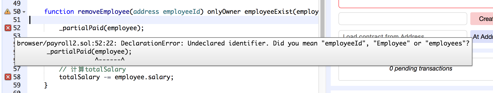
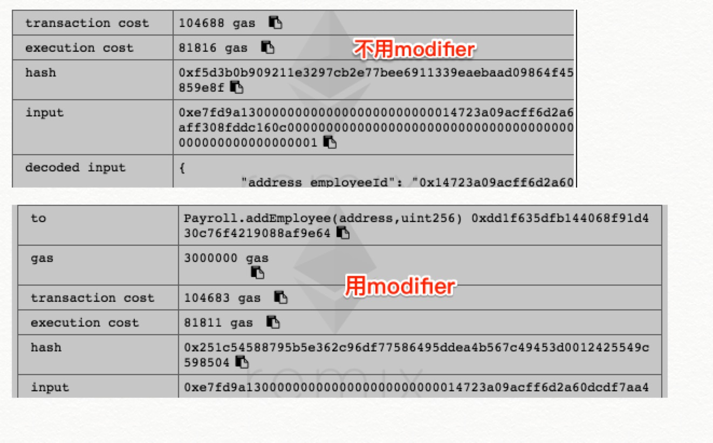
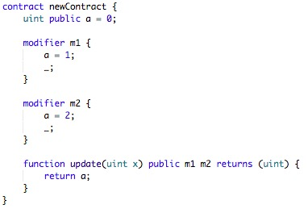
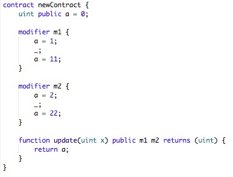
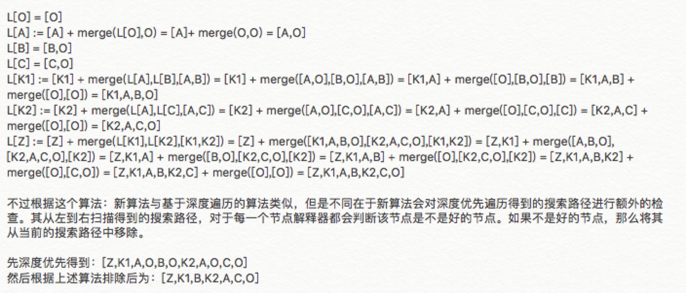
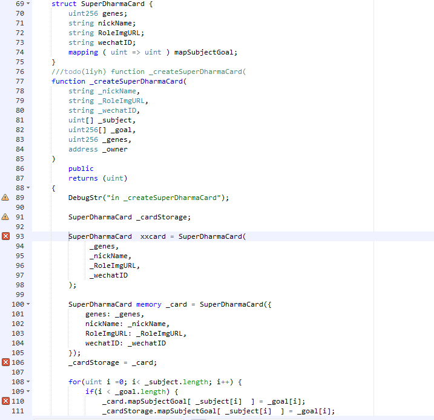
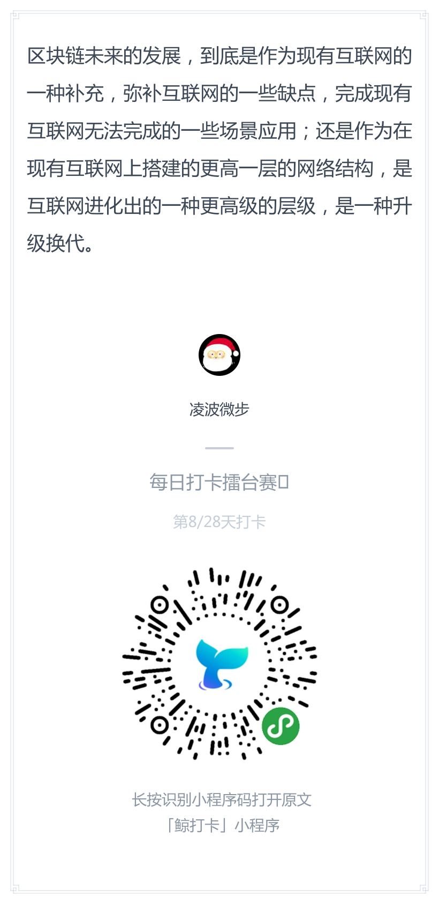
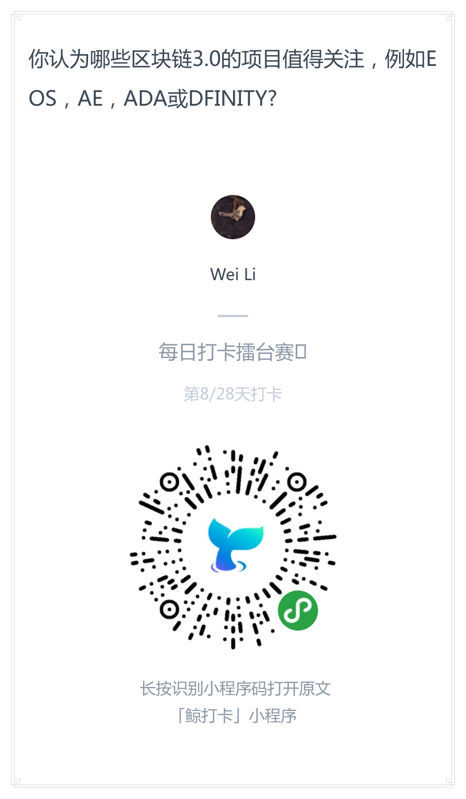
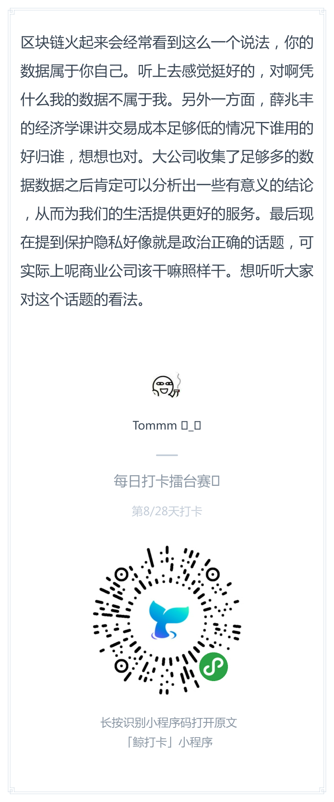

# 每日优质内容复盘-2018.3.19

## 【重要通知】

**@班长雅珣：** 

> 【重要通知】  
> 各位同学们，为了让国内和国外的同学都能在每周享有一次周末写作业的机会，因此教研组一直决定～～～
> 
> 每周三晚22点更新的课程，交作业截止时间由周六晚22点改为北京时间周日上午10点前！

**@班长雅珣：** 

> 各位同学们，上周的积分汇总来啦！  
> 希望大家继续努力，部分小组要加油咯

## 【优质课程资源】

- 感谢 **@郭乔** 提供的[remix-ide 本地下载地址](https://github.com/ethereum/remix-ide/blob/gh-pages/remix-7013ed1.zip)

## 【课程答疑】

#### Q1. @宗源：请问下modifier里面有employee了，这个地方还是需要定义一下吗？

- **@金诗雨：** 需要的，modifier里变量应该是局部的

#### Q2. @宗源：调用addEmployee进行测试，发现使用modifier的方式比不使用modifier的方式消耗的gas少

#### Q3. @金诗雨：modifier根据`_;`位置的不同，会将代码添加在不同的位置
 
- 这种情况下，m2会被添加到`a = 1;`之前，所以返回m1的值：

- 这种情况m2被添加在m1之后，所以返回m2的值：

- 结合前两种情况，下面这种情况的返回值是11：

#### Q4. @宗源：请问下算法大大那个L3算出来是多少，有点迷糊，两种算出来不一样

从这两篇文章看的:

http://kaiyuan.me/2016/04/27/C3_linearization     
https://en.wikipedia.org/wiki/C3_linearization

- **@齐明：** 算法都一样，你注意用老董视频里讲的继承顺序来做。看哪个先哪个后

#### Q5. @黎倚杭：struct中的mapping如何初始化？查了下资料，mapping不能在初始化列表中初始化，  	
1 直接是storage的结构体就报，`memory is not implicitly convertible to expected type struct SuperDharmaCardBase.SuperDharmaCard storage pointer.`   
2 尝试对memory结构体变量的mapping赋值，会报错`Error: Member "xxx" is not available in struct StructMappingInitial.A memory outside of storage.`

- **@齐明：** 你这个代码是要做什么？看你的代码这两个 errormessage 是93和106行的吗？感觉代码没什么问题，106行和93行加上 storage 试试行不行？ 另外你把74行 mapping 去了行么， 没试过 struct 里 mapping 过另一个 struct

- **@齐明：** 正常来说你这两种方法都应该 可以https://ethereum.stackexchange.com/questions/1511/how-to-initialize-a-struct

- **@黎倚杭：** 是为了初始化struct里的mapping。 106行 和 93行 加上 storage 试了不行，默认结构体局部变量就是storage的吧。 另外你把74行mapping 去了也不行。

- **@齐明：** 用这种方法，https://solidity.readthedocs.io/en/latest/types.html#structs 先建一个public的mapping呢

- **@黎倚杭：** 好的谢谢，我试试。看他的代码是把结构体加入全局的容器后，取出元素对mapping成员赋值。

#### Q6. @牛堃：在第一次pull request 是open的状态下，我修改了对应的文件，怎么重新建立 pull request?

- **@齐明：** 不用建，之前的PR里会包含你新的commit

- **@牛堃：** 那如果我这个pull request不通过，没有更新到我的分支里的话，我如果新建lesson3的提交，是不是也会包含前2课的内容？

- **@齐明：** 可以在你的repo里另外建一个branch，用那个branch提交第三课

#### Q7. @刘金伟：没搞懂internal跟private有啥区别

- **@宗源：** internal子类可见，private不行

- **@助教-二亮：** 可以看看这个 http://me.tryblockchain.org/solidity-function-advanced1.html

#### Q8. @李一杰：请问老师，两个用户可以发布了同名的contract到区块链上吗？如果可以怎么区分呢

- **@助教-二亮：** 可以，根据地址区分

## 【打卡干货集锦】

### 昨日话题

打卡话题征集：提交你的话题，大家来点赞投票。  
得票最高的可以被选为下周的打卡话题哦

### 优质回答

         