# 每日优质内容复盘-2018.3.20

## 【重要通知】

**@雅珣班长：** 

> 【重要通知】  
> @蒋宏伟-北京-前端 同学在上周的学习中的表现突出，并且2次都获得助教点评的优秀作业，因> 此教研组决定他升为咱们班级的学委啦～～  
> 希望各位学员都能积极写作业，不然学委会每天倒计时提醒的喔！大家加油

**@雅珣班长：**

> 咱们每周三、周六有Ellie助教给大家整理的知识点解析，每周五有刘虹男助教整理的课外知识拓展，都上传在GitHub·wiki上，大家可以关注一下
> 
> https://github.com/Guigulive/Wiki/wiki

## 【优质课程资源】

- 感谢 **@蒋宏伟** 分享的 [第二课学习笔记](https://segmentfault.com/a/1190000013806383?from=singlemessage&isappinstalled=0) 和 [第三课学习笔记](https://segmentfault.com/a/1190000013843334?from=singlemessage&isappinstalled=0)
- 感谢 **@申龙斌-助教** 分享的 [Windows环境下跑通Truffle开发环境](http://mp.weixin.qq.com/s/lK9O0gEbDTJgcpyM3x2e9g)
- 感谢 **@DT** 分享的 [「区块链书单：8位区块链专家向你推荐10本藏书」](https://36kr.com/p/5121351.html)
- 感谢 **@尹礼春** 分享的 C3 linearization 流程图：

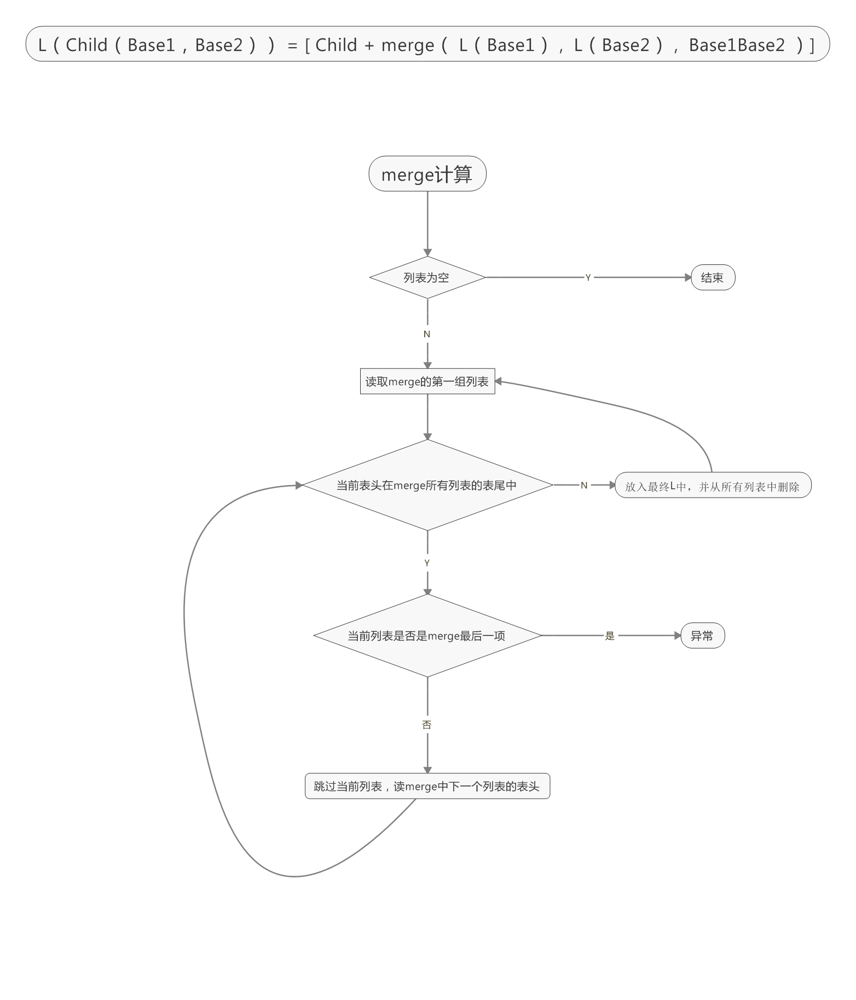

## 【课程答疑】

#### Q1. 使用VMware导入镜像时报错

- **@刘彪：** 

使用vm的同学下载这个解决2.0版本的问题: https://my.vmware.com/cn/web/vmware/details?downloadGroup=OVFTOOL410&productId=491

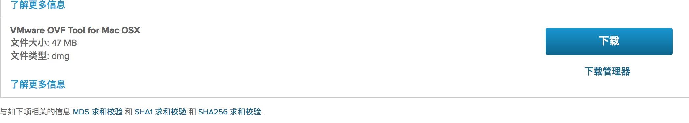

#### Q2. @杨信：执行合约消耗的gas，是从当前合约执行者的balance中扣除吗

- **@董老师：** 是从transaction中扣除，你发的transaction （function call之类的）会附带gas fee。gas的数目是确定的，需要调整的是你的gas fee。

#### Q3. @许鑫鑫：有两个问题请教下

> 1.合约A部署到以太坊网络中后，A可以调用已经在网络中部署好的合约B的代码吗，可以的话怎么调用？ （假设B是另外一个公司写的合约代码）
> 
> 2.合约D引用了Library C的代码，那么这个Library C是需要跟D一起静态编译后再部署到主网。还是C可以被别人事前部署到主网，这样我们不需要编译C的代码，D部署到主网后只需要运行时调用C，像动态链接一样。

- **@助教二亮：** 问题1：可以调用，只要有B合约的地址，就可以调用。假如B合约中存在方法`getName()`，那么就可以`bContractAddress.getName()`。其实第二个问题跟第一个问题一样，都可以看做一个合约。可以看下这个 https://ethereum.stackexchange.com/questions/11743/how-to-call-a-library-contract

- **@许鑫鑫：** 那像视频中介绍的库zeppelin-solidity 有公开的地址调用吗？ 还是说需要我们自己加到我们contract源代码中自己编译部署。

- **@黎倚杭：** 需要我们自己加到我们contract源代码中自己编译部署

- **@许鑫鑫：** 那如果有contract A使用library B，是不是编译部署的时候是先编译部署B到EVM，然后再编译A并link B后部署到EVM，所以其实是两个文件都被部署到EVM了，而不是内部编译成一个文件部署。这样理解对吗？看这个帖子貌似说的是分别部署：https://ethereum.stackexchange.com/questions/34303/deploy-contract-with-dependencies

- **@王鲁明-助教：** 应该是分别部署的。这也是上次为什么parity钱包被攻击。他调用的第三方库被别人删除了

- **@许鑫鑫：** 恩，这种情况应该是他在合约代码里面就直接调用第三方库address对应的代码吧。 还有一种情况是用import 这种方式导入本地源代码，这种情况应该也是分别部署的吧。

- **@王鲁明-助教：** 在以太主网上面所有的contract library都是独立的，每个合约和library都对应于一个唯一的哈希值，这是我的理解。

- **@陈垚文：** 用library的话，合约的bytecode可以看出需要link。如果import一个本地合约的话，应该是放在一起编译了吧，没看到link。

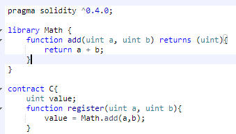

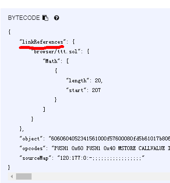

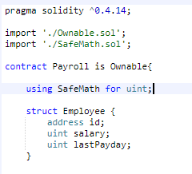

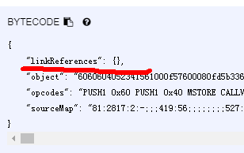

- **@李老师：** 这个应该可以回答library部署的那个问题([Library Driven Development in Solidity](https://blog.aragon.one/library-driven-development-in-solidity-2bebcaf88736))，因为link实际上是把缺失的library address填进去，那肯定是先部署library（一种特殊的contract），再部署contract

#### Q4. @彭康政：

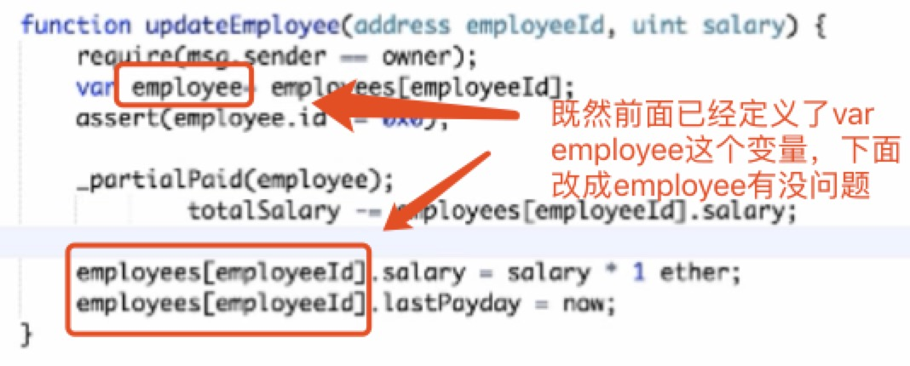

- **@黎倚杭：** 我觉得没问题。使用`var employee = employees[employeeId];`是引用，能真正修改

#### Q5. @乔勇：这个为什么会报错?

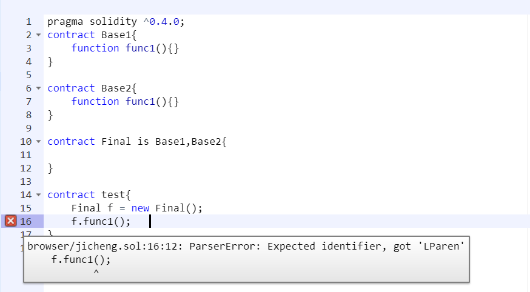

- **@翁启：** 

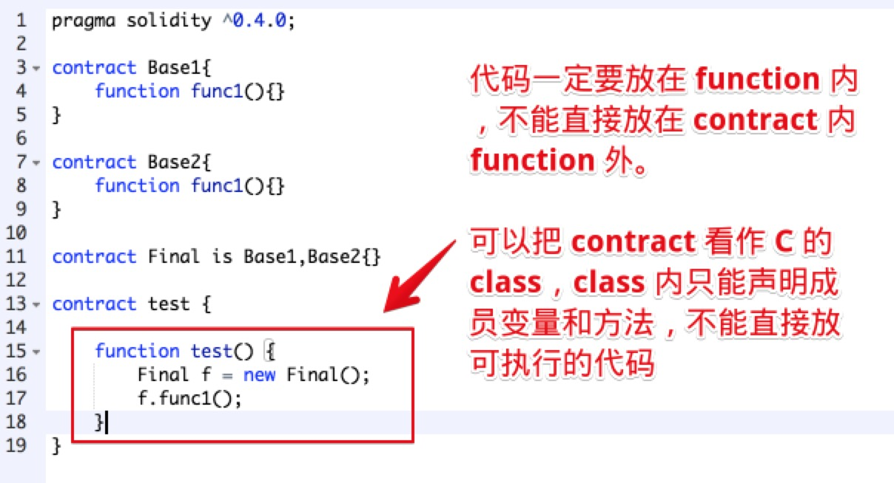

#### Q6. @Ted熊伟: 有人遇到过Mac环境下，看教程视频的同时使用remix编码，结果Chrome没多久就卡死的问题吗？困扰我很久了，很影响效率

- **@黄灿：** 应该是小鹅通的 flash 播放器的问题，最好把视频下载后看。抓包+youtube-dl

## 【优质群内讨论】

### 代码风格

**@金诗雨：** 

推荐大家看一下官方的style文档，其中一些跟老董用的有出入。

https://solidity.readthedocs.io/en/v0.3.1/style-guide.html 

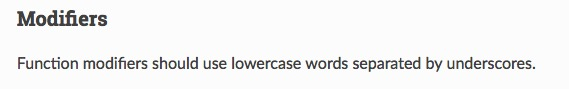

尤其是modifier的名字格式，官方是用employee_exist这种，老董上课使用的是employeeExist。

不过OpenZeppelin里面对于onlyOwner的modifier用的也不是这个格式。

**@朱文杰：**

Many projects will implement their own style guides. In the event of conflicts, project specific style guides take precedence.

### Truffle环境配置

**@宗源：** 

下面这两篇文章跑不通，填了几个坑之后填不动了，亲测，想跑truffle和testrpc的请绕开这两篇  
https://mshk.top/2017/11/truffle-4-0-geth-1-7-2-testrpc/  
https://zhuanlan.zhihu.com/p/26735367

**@申龙斌-助教：**

我在第二期培训时，被vm折腾得死去活来，最后用windows跑了一遍。Windows中truffle中首先要把环境变量弄通。

Windows环境下跑通Truffle开发环境： http://mp.weixin.qq.com/s/lK9O0gEbDTJgcpyM3x2e9g

## 【打卡干货集锦】

### 昨日话题

你觉得，目前区块链技术普及的最大障碍是什么？技术？应用？还是大众认知？

### 优质回答

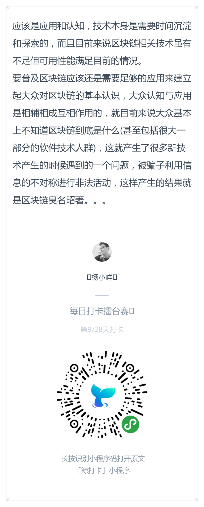

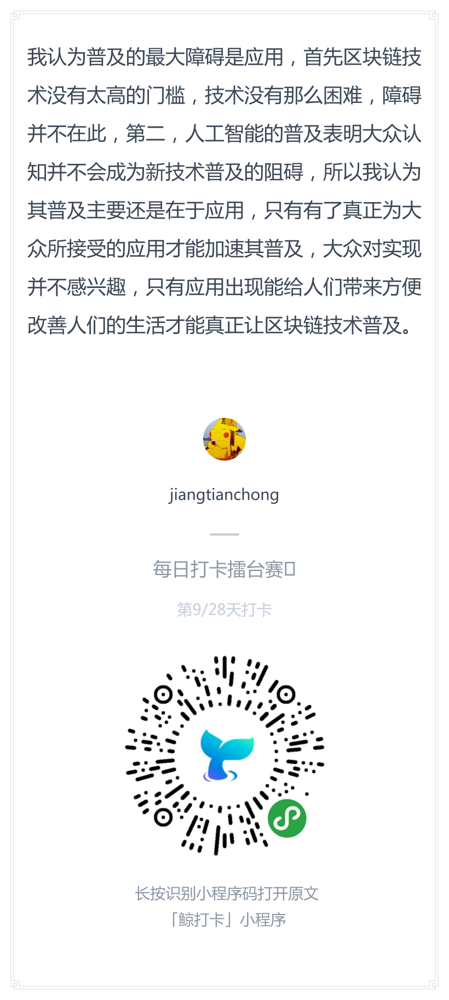
