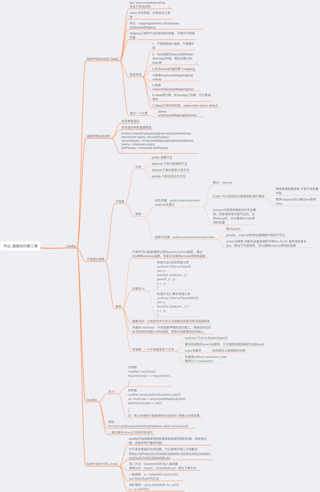
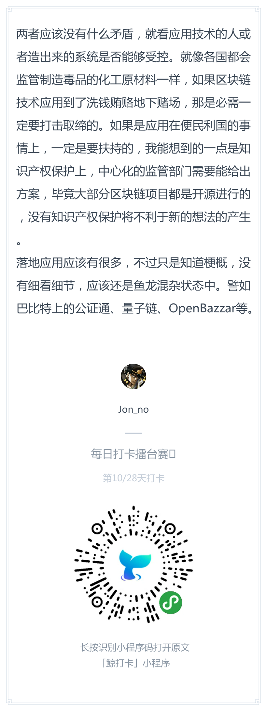
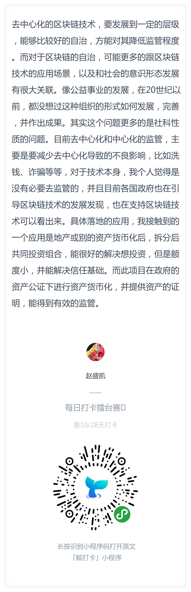
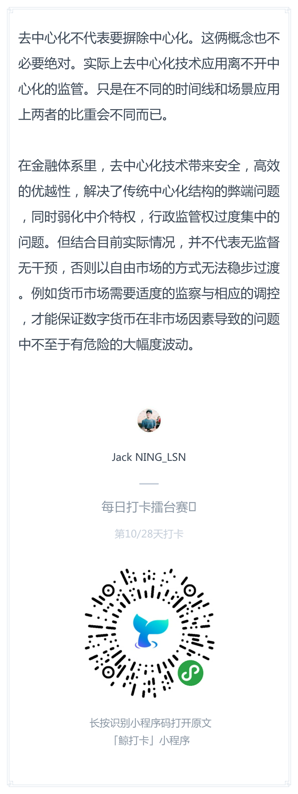

# 每日优质内容复盘-2018.3.21

## 【重要通知】

**@雅珣班长：** 

> 从今天开始，为了方便美国的小伙伴们参与打卡，我会在凌晨0点更新每天天的打卡话题喔～  
> 同学们24小时内参与打卡都阔以啦

**@蒋宏伟学委：**  

> 作业会根据关键字来判断做没做。同学们PR的标题中一定要有下列关键字:  
> const keywords = /第3|第三|lesson\s3|lesson3|3rd/;

## 【优质课程资源】

- 感谢 **@楚舒雅助教** 整理的 [第三课补充学习笔记](https://github.com/Guigulive/Wiki/wiki/Lesson-3-%E8%A1%A5%E5%85%85%E5%AD%A6%E4%B9%A0%E7%AC%94%E8%AE%B0)
- 感谢 **@Ted熊伟** 整理的 [C3 Linearization 的文章](https://blog.tedxiong.com/C3_Linearization.html)
- 感谢 **@杨小咩** 分享的继承相关的资料：
    - https://en.wikipedia.org/wiki/C3_linearization  
    - https://www.youtube.com/watch?v=YLgf8wGCX2w  
    - http://kaiyuan.me/2016/04/27/C3_linearization/  
    - https://mozillazg.com/2016/11/python-mro-compute.html
    - solidity的官方文档：http://solidity.readthedocs.io/en/v0.4.21/contracts.html#inheritance
    - 多继承：http://solidity.readthedocs.io/en/v0.4.21/contracts.html#multiple-inheritance-and-linearization
    > **注意：** solidity的 is 继承顺序，转换到C3 Linearization算法中是倒序的。
- 感谢 **@怀达** 分享的『第三课思维导图』：

## 【课程答疑】

#### Q1. @杨晨明：请问更改了employees的id，能更新它对应的key值吗?

- **@顺达助教：** 更改id它对应的key是不会自己变的。你如果想更新就手动给新的key赋值：在新key的位置上新建一个对象，把原来的salary和lastPayday copy过去，id改成新的，然后把原来位置的对象delete掉。

- **@杨明轩：** key变了,那不就是一个新的了？我的理解是应该变得是对象里的地址吧，不是key吧？

- **@顺达助教：** 要不要更新key其实看业务理解吧，因为不更新key的话，员工得用原来的地址调用getPaid函数。如果这里的意思是员工希望弃用原来的地址，改换一个新的地址操作和收款，那就得更新key，这样才用通过新的地址调用getPaid

#### Q2. @姜天宠：请问这次作业的截图是截payroll里的函数调用么 还是视频里出现的所有函数啊？

- **@曹轶辰：** 『第一题：完成今天所开发的合约产品化内容，使用Remix调用每一个函数，提交函数调用截图』，好像是全部

#### Q3. @宁达非：请问在solidity里，如果`a = 5, b = 2 c = 2`, 那么`a / b * 2`的结果是 4 还是5 呢？

- **@季天殊：** 是4

## 【打卡干货集锦】

### 昨日话题

去中心化的区块链技术与中心化的监管，矛盾如何平衡？具体落地的应用有哪些？

### 优质回答

