# 每日优质内容复盘-2018.3.22

## 【重要通知】

**@姜天宠：** 

> 提醒大家一下node和truffle的版本都直接用juicebox里装好的就行 不用自己再跟视频走一遍 不然新版本和视频中有一些差别

**@雅珣班长：**

> 来自教研组的温馨提示---
>
> 从第四课开始，后面几课的作业因为开发工具较多、环境较复杂，会比较耗时。所以提醒大家记得早点开始看视频做作业啊，赶deadline不适用于后面几课的作业哦
> 
> 同时，为了让国内和国外的同学都能在每周享有一次周末写作业的机会，每周三晚22点更新的课程，交作业截止时间由周六晚22点改为北京时间周日上午10点前，其他不变。

## 【优质课程资源】

- 感谢 **@杨楫** 总结的 [Mac下Truffle配置指南](https://github.com/yyssjj33/Team-F/wiki/Setting-truffle-locally-Mac)

## 【课程答疑】

#### Q1. @乔勇：求解各位，交作业的时候切换到自己的分支，但是没有绿色的create pull request按钮怎么解？

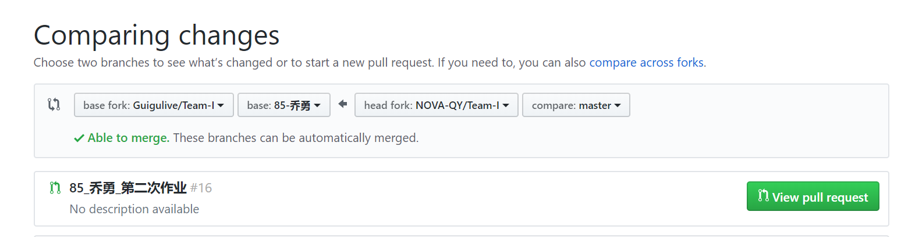

- **@牛堃：** 需要先让助教merge你前两课的作业。或者在这里建立一个新的分支，提交的时候，从自己的新分支提交到自己的库，不过这样的话，你前2课的内容应该也会在里边

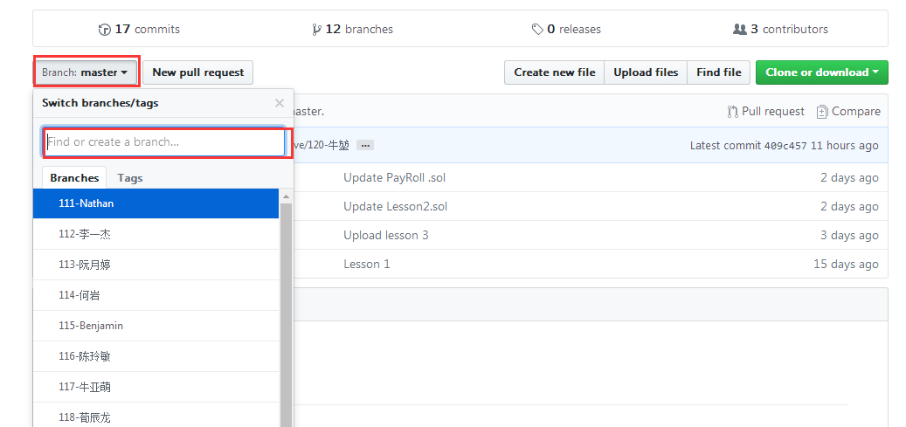

#### Q2. @刘彭：关于changeAddress，两个实现，是互换了第3 第4行，然后我测试下来，第一个实现会清空employee里的值。第二个不会。求大神解释一下，为什么哈！我用的是0.4.14

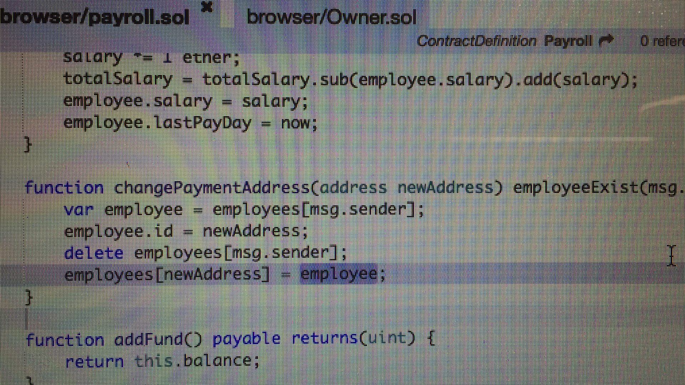


- **@杨小咩：** 因为第一个你赋值进去的是已经被你delete清零的块数据
- **@刘彭：** 但是第二次，我也delete了呀
- **@杨小咩：** 第二个delete的是原来地址的数据块，delete前已经把更改过的数据mapping到了新地址对应的数据块了
- **@刘彭：** 按你这么说，employee是做了一次拷贝呀。要不应该共享一块地址吧
- **@杨小咩：** 简单来说，第一张图里面，var employee 引用的是employees[msg.sender]
然后你一个delete直接清零了这块数据，所以最后一行你给employee[newaddr]的是个数值都为初始值的employee数据块

#### Q3. @彭康政：这是版本不对的问题？view关键字为何报错

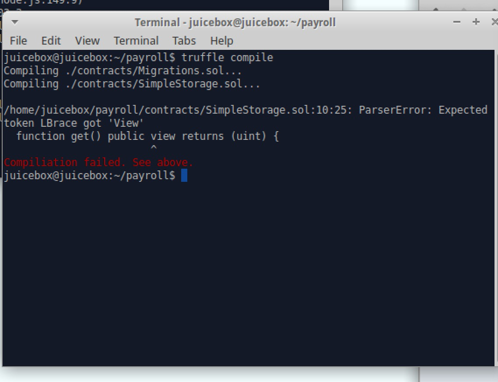

- **@John：** 改成constant，然后solidity得版本也要降低，因为view是新的特性。反正我把第一行改成`pragma solidity ^0.4.15;`, 把view改成constant就ok了
> https://github.com/truffle-box/react-uport-box/issues/15

#### Q4. `truffle migration` 时出现 `No network specified. Cannot determine current network.` 的错误

- **@彭康政：** 

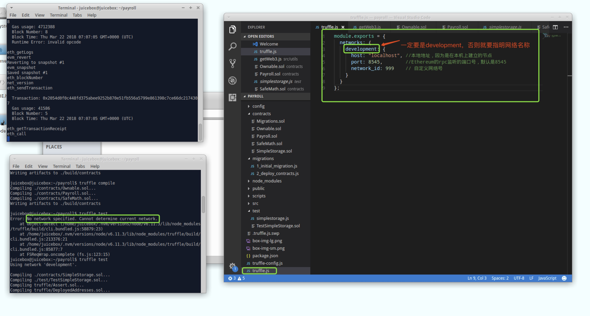

- **@陈威：** network可以配置多个，`truffle migration` 时指定一个

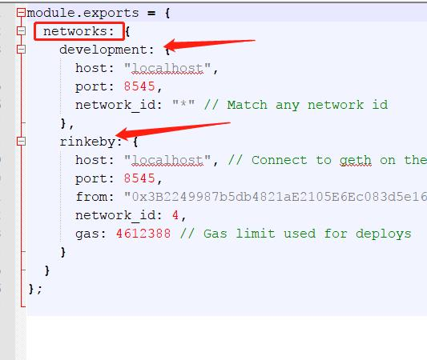

#### Q5. @杨信：之前我发的问题是，我加了一个新的函数，重新migration，发现新的函数没有部署上来。然后重启testrpc，重新truffle  migration 就出现has not been deployed 的问题

-  **@杨信：** 删除build目录，重新编译，重新migrate，好了

#### Q6. @杨信：我加了3个ether，这里的c单位是什么呢？没摸清他的规律

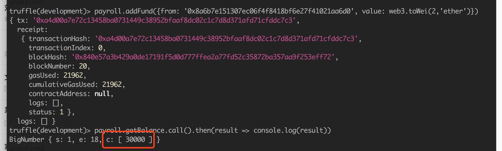

- **@黄敏之助教：** 这里是用了`bignumber.js`这个库，一个大数处理用的库，具体含义参考库文档就行了

- **@申龙斌助教：** 
```
The value of a BigNumber is stored in a decimal floating point format in terms of a coefficient, exponent and sign.

x = new BigNumber(-123.456);
x.c                                 // [ 123, 45600000000000 ]  coefficient (i.e. significand)
x.e                                 // 2                        exponent
x.s                                 // -1                       sign
```
#### Q7. @乔勇：vi truffle.js后显示的和课程的不一样，是因为框架版本不同导致的吗

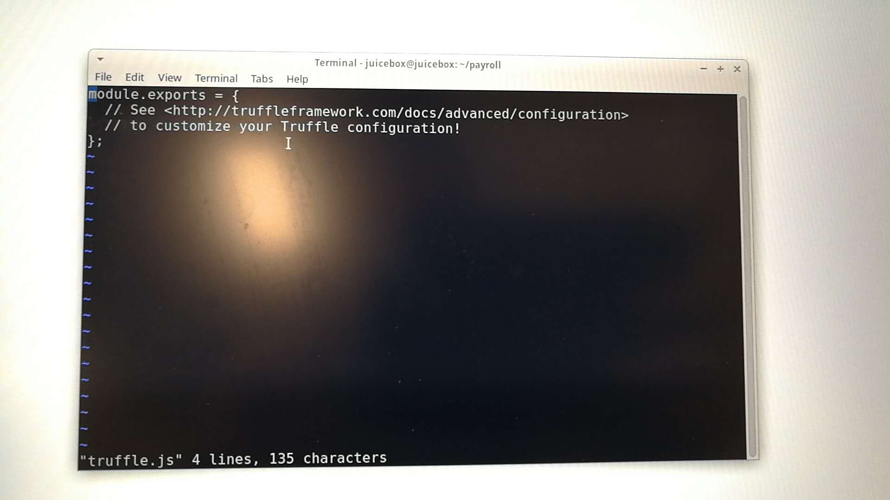

- **@陆周：** 需要自己添加：http://truffleframework.com/docs/advanced/configuration#networks

#### Q8. @刘彪：这个文件端口号要一致，请大家注意


## 【打卡干货集锦】

### 昨日话题

区块链网络相对是比较安全的，但智能合约安全漏洞层出不穷，还不是具备商业化成熟的阶段，从哪些层面可以解决安全问题？或者说畅想一下有没有一种经济模型可以平衡这个问题？

### 优质回答

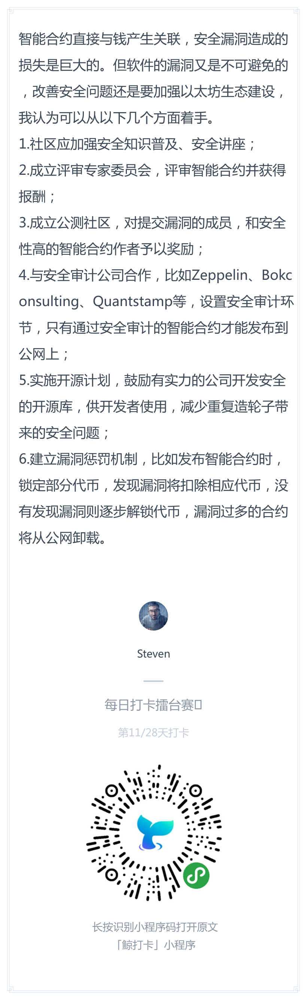

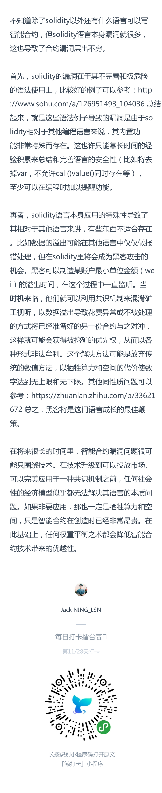

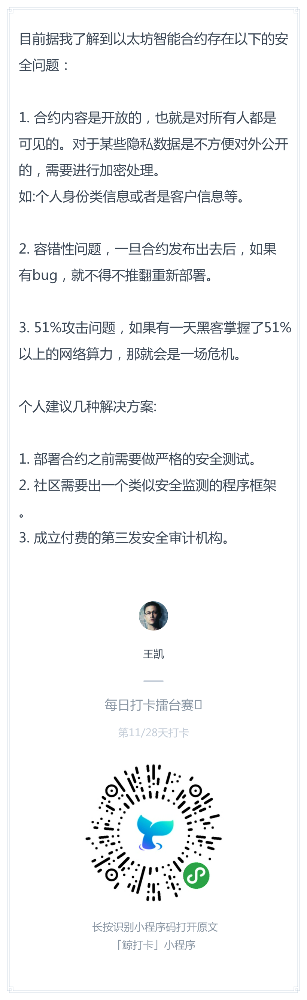
