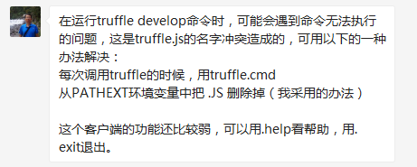
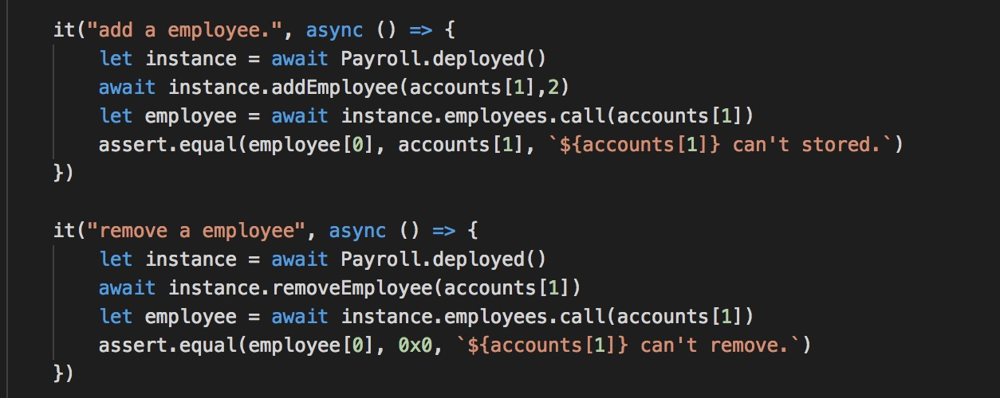
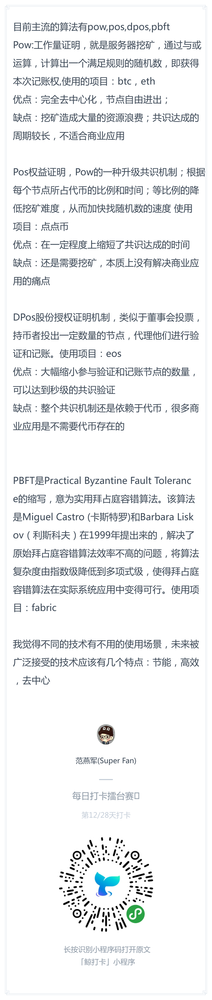
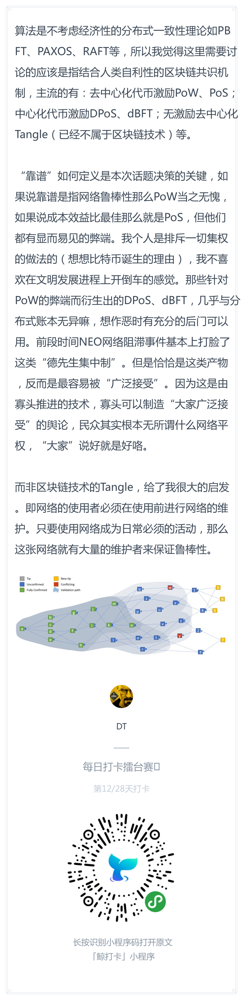
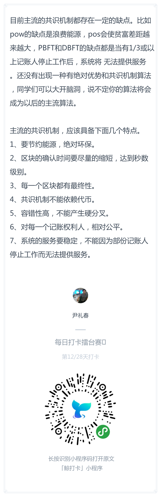

## 每日优质内容复盘-2018.3.23

## 【重要通知】

**@Nicole班长：** 

> live分享会
>
> 本次分享会邀请助教Ellie来带大家一起看闪电网络的白皮书！
>
> 时间：北京时间周六3月24号，早上10点（硅谷周五下午7点）
> 地点：微信群内
> 形式：语音+图文
> 分享人：Ellie助教
> 
> 大家记得准时来收听喔️~~

**@雅珣班长：**

> 嘻嘻各位同学，今天周五咱们聊点轻松的话题呀
> 
> 通过2周的学习，我发现有部分小伙伴对于咱们课程的一些问题有疑虑，包括咱们的学习安排、课外拓展、运营人员、课程服务等各个方面。那么我就来对小伙伴的疑惑进行解答啦
> 
> 结尾有惊喜喔
> https://shimo.im/docs/Aq5KgZNfa9oYX7BA/ 点击链接查看「来自雅珣班长的一封信」，或复制链接用石墨文档 App 打开

## 【优质课程资源】

- 感谢 **@廖祜秋** 提供的Docker镜像：https://github.com/liaohuqiu/cube-box
- 感谢 **@DT** 提供的Docker镜像：https://github.com/mind-gravity/guigunotes/blob/master/useDocker.md

    > **@DT:** 我也学着build了个image推到docker hub了。我这个image是用挂载本地文件夹，所以可以用宿主机ide编辑文件，映射了端口，可以用宿主机浏览器访问

- 感谢 **@夏玮欹助教** 整理的 [第四课常见问题FAQ](https://github.com/Guigulive/Wiki/blob/master/FAQ/%E6%99%BA%E8%83%BD%E5%90%88%E7%BA%A6%E5%BC%80%E5%8F%91FAQ-4.md) 
- 感谢 **@廖祜秋** 分享的关于 ethereum sharding 的内容：https://github.com/ethereum/sharding
- **@宗源：** 推荐下这两个资源，挺快就能学完，对比着我们之前用remix的流程，可以意识到web3,ganache,truffle分别有什么用：
    - http://www.netkiller.cn/blockchain/ethereum/truffle/truffle.tutorial.html
    - https://ethfans.org/posts/ethereum-development-walkthrough-part-2-truffle-ganache-geth-and-mist

## 【课程答疑】

#### Q1. @蒋宏伟：[第四课FAQ](https://github.com/Guigulive/Wiki/blob/master/FAQ/%E6%99%BA%E8%83%BD%E5%90%88%E7%BA%A6%E5%BC%80%E5%8F%91FAQ-4.md) 中的 `下载官方虚拟机镜像（版本号：5.1.22）` 地址是什么？

- **@蒋宏伟：** 

> 1）国外同学/ 能翻墙同学戳 https://www.dropbox.com/s/bikdtta0ecw1l1r/juicebox-desktop-1.3.0%20Clone.ova?dl=0
> 
> 2）不能翻墙的同学戳 chinatechstory.com/juiceboxClone.ova

#### Q2. @牛堃：大家注意下，如果在windows环境下，运行 truffle compile 等命令不执行，或者是打开truffle.js等文件的时候，可以按照申龙斌助教的办法调整，我已经可以编译了，方法如下：

#### Q3. @王浩：怎么正常关闭testrpc和启动localhost：3000那个终端窗口？

- **@DT：** Ctrl + C

#### Q4. @刘彪：这个怎么格式化呀，要引入什么node包么？

- **@助教二亮：** https://github.com/MikeMcl/bignumber.js/

#### Q5. @彭康政：求removeEmployee 的测试的思路

- **@杨信：** 我是这么写的：

#### Q6. @许鑫鑫：我从employees中获得一个employee的struct时候 怎么获得employee的id， 我发现直接调用employee.id会报错，感觉id=employee[0], salary=employee[1], 这边好像变成数组了。是这样吗？

- **@王鲁明助教：** struct是sol的概念，javacript本身没有这个概念，对于javacript而言就是返回了三个变量，array比较方便

## 【打卡干货集锦】

### 昨日话题

共识算法是block chain技术中最重要的环节之一，你觉得现在的技术中哪个最靠谱，最有可能成为大家广泛接受的技术？或者未来那个大家广泛接受的技术应该有些什么特点呢？

### 优质回答

