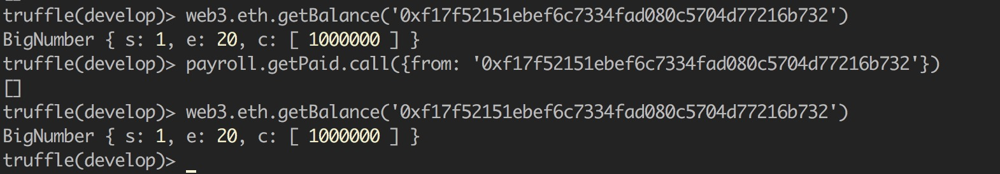
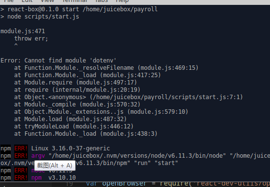
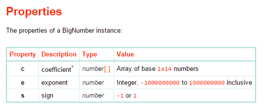
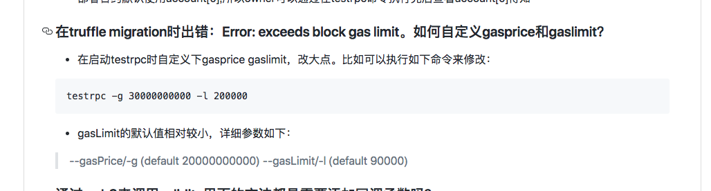
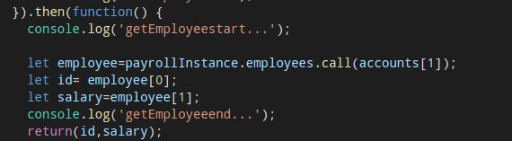
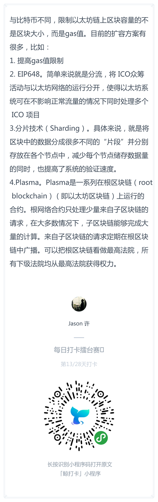
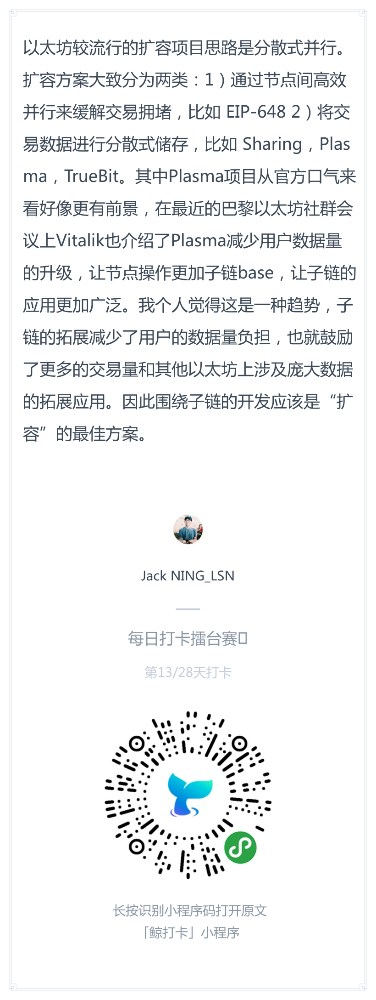
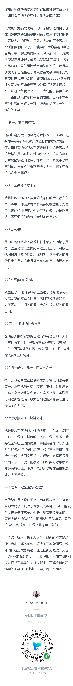

# 每日优质内容复盘-2018.3.24

## 【重要通知】

**@雅珣班长：**

> 反映视频特别难用的同学，可以在 PC 端观看，并把页面，用 快捷键  `fn` + `+` 一起按，放大 300%。

## 【优质课程资源】

- 感谢 **@刘虹男助教** 准备的 [第二周知识拓展](https://github.com/Guigulive/Wiki/wiki/Ethereum%E7%9A%84%E5%90%88%E7%BA%A6ABI%E6%8B%93%E5%B1%95)
- 感谢 **@Ellie助教** 准备的 [第四课知识点拓展](https://github.com/Guigulive/Wiki/wiki/Lesson-4-%E8%A1%A5%E5%85%85%E5%AD%A6%E4%B9%A0%E7%AC%94%E8%AE%B0)
- 感谢 **@陆周** 分享的区块链可扩展性的文章：http://mp.weixin.qq.com/s/4LwYgsa4Kgn9UhnOXp1lVA

## 【课程答疑】

#### Q1. @杨信：使用`getPaid`领取薪水后，好像余额没有变化



- **@何智华助教：** call是不改变状态变量值的，把call改成send试试看

#### Q2. @郑广军：执行`npm run start`报错



- **@杨信：** 这个错好像是`dotenv`模块没有安装，在项目根目录下执行下`npm install`

#### Q3. @杨楫：bigNumber中c,e,s的意义：

http://mikemcl.github.io/bignumber.js/#instance-properties



#### Q4. @杨楫：怎么在test wait 10秒？

- **@杨信：** 
```
const sleep = (timeountMS) => new Promise((resolve) => {
        setTimeout(resolve, timeountMS);
    });
```

- **@杨楫：** 我也是差不多这样的，不过用的async/await。用的这个方法：https://stackoverflow.com/a/33292942

#### Q5. @郑广军：`truffle unbox react` 这个需要很长时间吗？

- **@杨楫：**  对的，`truffle unbox react`要一段时间，因为他自己会`npm install`

#### Q6. @何生亮：我在虚拟机里`truffle init`后的项目contract文件夹里为什么只有Migrations.sol一个文件呢？是版本问题吗

- **@宁达非：** 不要`truffle init`, 直接输入`truffle unbox metacoin`

#### Q7. @XIUZE：问一下那个then代表了什么？具体的用法是什么？

- **@廖祜秋：** https://developer.mozilla.org/en-US/docs/Web/JavaScript/Reference/Global_Objects/Promise/then 简单理解就是调用链的事情做完了，做完的结果有成功和失败两种。

#### Q8. @XIUZE：`console.log`是什么？

- **@刘彪：** `console.log` 是js的输出语法，类似`println`。推荐快速看下这个：http://www.runoob.com/js/js-tutorial.html

#### Q9. @王浩：`truffle migrate`后出现`Exceeds block gas limit`的错误

两种可以尝试的解决方式：
1. 修改`truffle.js`添加`gas:500000`(这个值可以自己调整)
```
module.exports = {
  // See <http://truffleframework.com/docs/advanced/configuration>
  // to customize your Truffle configuration!
  networks: {
    development: {
        host: "127.0.0.1",
        port: 8545,
        network_id: "*", // Match any network id
        gas:500000
    }
}
```
2. testrpc启动的时候设置gaslimit 

> https://github.com/Guigulive/Wiki/blob/master/FAQ/%E6%99%BA%E8%83%BD%E5%90%88%E7%BA%A6%E5%BC%80%E5%8F%91FAQ-4.md#%E5%9C%A8truffle-migration%E6%97%B6%E5%87%BA%E9%94%99error-exceeds-block-gas-limit%E5%A6%82%E4%BD%95%E8%87%AA%E5%AE%9A%E4%B9%89gasprice%E5%92%8Cgaslimit



#### 10. @DT：请问用solidity写单元测试 怎么调用原payroll合约？

- **@何智华助教：** http://truffleframework.com/docs/getting_started/solidity-tests

#### 11. @刘彪：测试用例里  怎么获取当前的操作者的addres地址？

- **@何智华助教：** `web3.eth.defaultAccount`： http://web3.tryblockchain.org/Web3.js-api-refrence.html#toc_23

#### 12. @牛堃：请问助教，我的id和salary 为什么还是undefined？我已经按照数组来取了。。。。我应该怎么写?



- **@许鑫鑫：** 因为是异步的 你要用then拿到结果，或者await 

#### 13. @许鑫鑫：请问怎么在js中用sleep？`await sleep(10*1000);` 这个会报错说不能识别sleep

- **@杨楫：** js没有sleep，js都是异步的，不能同步阻塞。但是可以用promise模拟：https://stackoverflow.com/questions/951021/what-is-the-javascript-version-of-sleep

## 【打卡干货集锦】

### 昨日话题

你知道哪些解决以太坊扩容拓展性的方案，你是如何看待的？你有什么新想法嘛？

### 优质回答






