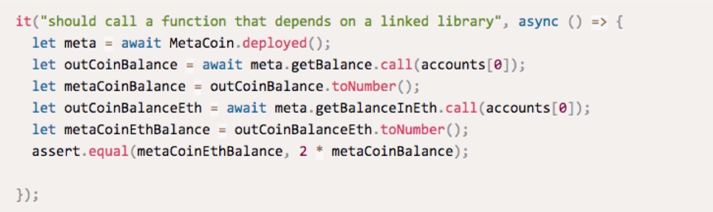

# 每日优质内容复盘-2018.3.25

## 【优质课程资源】

- 感谢 **@蒋宏伟-北京-前端** 我写了一个 nodejs 的查询脚本，可以查询已交作业的同学有哪些。(现在只能在本地运行)

查询规则：

1.  必须提交 pull request 到 Team-X 上。
```
const url = `https://github.com/Guigulive/Team-${abc}/pulls${q}`;
```
2.  必须以学号开头，学号和姓名等信息中间需要添加 _ 或 - 或 空格
```
const msgReg = /(\d+)[\-\_\s]/;
```
3.  必须要有 “四” 这个关键字。
```
const keywords = /四/;
```
正确示例： 19_蒋宏伟_第四课作业
```
https://github.com/jiangleo/finish-assignment
```

- 感谢 **@宗源-杭州-前端开发**  可以装个ganache的 cli 或者客户端, 也是一个eth测试环境

http://truffleframework.com/ganache/


## 【课程答疑】

#### Q1. @宗源-杭州-前端开发： 大家如果想在truffle console里面执行多行命令，可以用 
```
exec xxx.js
```

- truffle会在该js文件中注入web3，这样就可以通过web3以及truffle套件（如truffle-contract、truffle-artifactor）在测试网络创建新的合约，就可以忽略之前提到的作用域问题了

- 记得truffle-contract是需要用npm安装的
```
const artifacts = require('./build/contracts/MetaCoin.json')
const contract = require('truffle-contract')
const MyContract = contract(artifacts);
MyContract.setProvider(web3.currentProvider);
const accounts = web3.eth.accounts;

MyContract.deployed().then(function(instance) {
    meta = instance;
    return meta.sendCoin(accounts[1], 10, {from: accounts[0]});
  }).then(function(result) {
    // If this callback is called, the transaction was successfully processed.
    console.log('lzy',result)
  }).catch(function(e) {
    // There was an error! Handle it.
    console.error(e)
  })
```

#### Q2. @宗源-杭州-前端开发：s e c的含义如下， c是系数，e是指数，s是符号。 我看web3 package.json里面引用的是这个库
https://github.com/frozeman/bignumber.js-nolookahead


#### Q3. @宗源-杭州-前端开发：对了嫌promise麻烦的同学可以用await，官方教程里面有写



http://truffleframework.com/docs/getting_started/javascript-tests

#### Q4. @老董： 合约A部署到以太坊网络中后，A可以调用已经在网络中部署好的合约B的代码吗，可以的话怎么调用？ （假设B是另外一个公司写的合约代码）

- **@老董：** 可以，只要有public interface。调用有两种方法，第一个是call函数，
```
example: address(0x213asd123).call("foo", param1, param2)
```
调用的返回，一定是最简单的true/false。即使有返回值，也是无法拿到的。因为以太坊的return value 无法定义多长, 如果想使用return结果，需要介入汇编拿出来结果，但是比较危险。

#### Q5. @老董：合约D引用了Library C的代码，那么这个Library C是需要跟D一起静态编译后再部署到主网。 还是C可以被别人事前部署到主网，这样我们不需要编译C的代码，D部署到主网后只需要运行时调用C，像动态链接一样。

- **@老董** 可以，是可以先部署在主网的。migration那里要改变sol。但是library 函数不能 access 本身的看不到的 data。那么如何实现代码重用呢？ 比如多签名钱包的逻辑因为比较复杂，不希望每次都要重新编写， 这时要用一些底层的汇编调用。一个 function 部署时需要先 copy 到本地的栈上再执行。  但是这样copy很有风险，去年有个多签名钱包被攻击就是这样，合约是以前的合约，但是为了可以copy而不用每次部署，但是就是因为但是没有将原始合约的自杀函数屏蔽掉，有个github用户就把原合约干掉了，相当于杀掉时代码就不存在了，所以用户 copy 代码时得到空指针，一个 0x0 ，导致 parity 钱包的资金被锁死。

#### Q6. @老董： web3接口具体命令很多，有案例可以参考吗？
- **@老董** 是 ethrem full node 这个 API 做的包装，是完整的映射。最好的文档如下。 

https://github.com/ethereum/wiki/wiki/JSON-RPC#json-rpc-methods

#### Q7. @老董： truffle 测试时候，怎么切换使用者地址？

- **@老董** 可以定义from address的。
```
meta.sendCoin(account_two, amount, {from: account_one});
```
```
payroll.getPaid({from: account_one});
```

#### Q8. @老董： Contract creation之后有个Contract call，请问这是什么？
- **@老董** contract 的 life cycle是： 发一个transaction时，是部署合约的 byte code 不只是要运行的code，也是部署的可以generate code的代码，creation可以认为是特殊的function call，有excution cost。

#### Q9. @老董： 为什么现在测试都是用js写的，用solidity很少？
- **@老董** js比较接近区块链前端的开发，是完整模拟整个环境。solidity会有很多问题。更多只能在后端测试。返回值比较复杂时会有问题。


#### Q10. @老董： 测试用的是私有链，还是共有链？
- **@老董** 可以认为是私有链，是只存在于自己电脑。只模拟区块链的行为。也可以去测试链，比如testnet，去测试用户体验.

#### Q11. @老董： 如果想master truffle的使用，应该把javascript学到什么程度，或者说有哪些javascript的知识需要着重掌握
- **@老董** truffle只需要理解js的基本思想和语法就够了。区块链本身没有贴的很近。对于测试和部署有基本了解就够了。


#### Q12. @老董： 有没有好的solidity的社区介绍吗
- **@老董** 我们这里。本身的社区是比较分散。reddis 或者官方 github 可能会问一下。stackoverflow/stackexchange ethereum板块有。偏research
的和cutting-edge的东西可以参考： https://ethresear.ch/


#### Q13. @老董： 合约是否可以理解为一个条件触发的交易？这个过程的安全机制是怎样的？
- **@老董** 可以，但是是一个具象的比较窄的理解。但是其实可以更加复杂。


#### Q14. @老董： 有没有方式reset balance到100？
- **@老董** 比较难。如何和rpc做交互，最近有了新的test infrastacture, 可以通过非标准的手段，去将js这样的测试程序穿透给testrpc。如
https://github.com/trufflesuite/ganache-cli
但是这个不是一个standard framework，只是为了测试的方便

#### Q15. @老董： 能讲下现在最新的智能合约发展趋势吗，就是其他区块链项目对solidity的改进，假如有时间的话
- **@老董** solidity本身好用，所以像EOS， Qtum，都是直接搬用照搬了EVM的架构，EVM架构上的东西都是可以直接照搬。 但是solidity本身问题很大，是一个不好形式化验证的语言。Dfinity用的是ewasm而不是evm的架构。
https://github.com/ewasm/design
这个是基于web assembly，有很多语言。Dfinity希望可以直接是functional programming的，这样可以很好的进行formal 
verification


#### Q16. @老董： solidity里面的int256为了防止测试溢出，是不是在js中应该总是用bignumber来处理呢？
- **@老董** 对


#### Q17. @老董： 学习区块链要掌握哪些技术？
- **@老董** 上层应用主要是solidity／以及各种智能合约的编程语言和application stack，底层主要是1. 分布式系统，网络；2.密码学；3.博弈论


#### Q18. @老董： 能不能稍微讲一下WebAssembly的现状，包括在区块链领域的应用？我看EOS也支持WebAssembly
- **@老董** 它出现的原因在于，能够让各家语言都可以使用，在web client端都可以执行。在区块链上使用的原因在于，是基于stack的虚拟机，
大概的design在
https://docs.google.com/document/d/1CieRxPy3Fp62LQdtWfhymikb_veZI7S9MnuCZw7biII/edit
有已由的很多compiler去编译语言可以直接使用。机制是很吸引人的。


#### Q19. @老董： 区块链程序的形式化验证
- **@老董** formal verification
程序有各种输入输出，那就让所有可能的输入的进行分析输出
```
int foo(int x) { if (x>0) return x; else if (x<=0) return x^2;}
```
建立图模型，各种输入参数分割成等价空间，对于每个空间操作是一样的。需要建立所有可能性的模型。
有的语言好建立这样的模型，有的很难。因为输入输出的define不明确，需要compile才能得到等价类
有一类的程序语言设计让它们贴近数学函数的表达方法，
https://en.wikipedia.org/wiki/Functional_programming
但是分析不能得到哪些程序行为是正确或者错误的。甚至更多错误在于程序的逻辑。我们需要清晰的define程序输入输出的关系。
智能合约这里会很有用，简单的情况很容易很好用。但是有限制，在程序逻辑有问题的时候，需要规定逻辑是什么，然后用规定逻辑的骨架去验证。

#### Q20. @王浩-北京-互联网： 这个javascript测试文件，运行顺序是怎样的？是从上到下一条条运行吗？it有影响吗？
- **@何智华-助教** 整个contract测试集共享测试空间。it执行后若不恢复场景，下一个case的执行会在它执行的结果上继续执行， 你可以建多个contract测试集， 或者在同一个测试集里用不同的测试数据， 具体可以看 http://truffleframework.com/docs/getting_started/javascript-tests
```
What makes Truffle tests different from that of Mocha is the contract() function: This function works exactly like describe() except it enables Truffle's clean-room features. It works like this:

Before each contract() function is run, your contracts are redeployed to the running Ethereum client so the tests within it run with a clean contract state.
```
