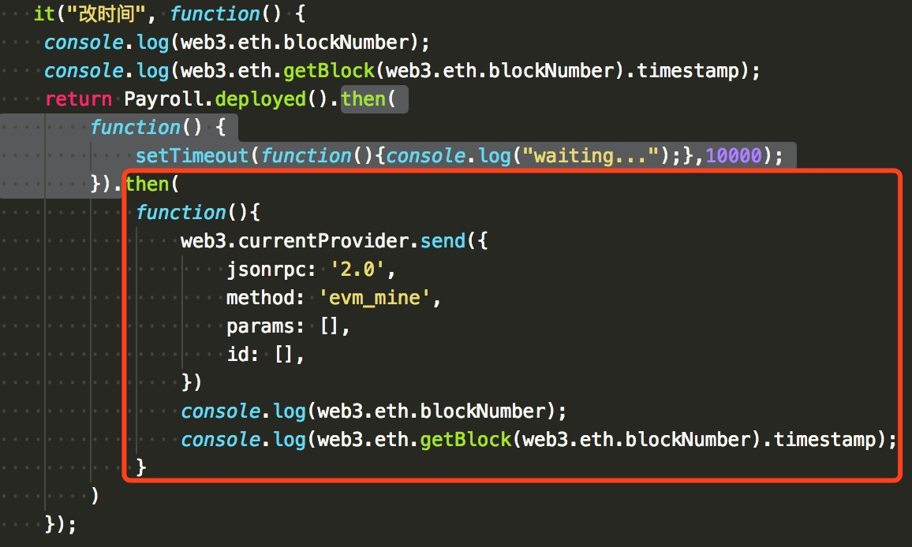
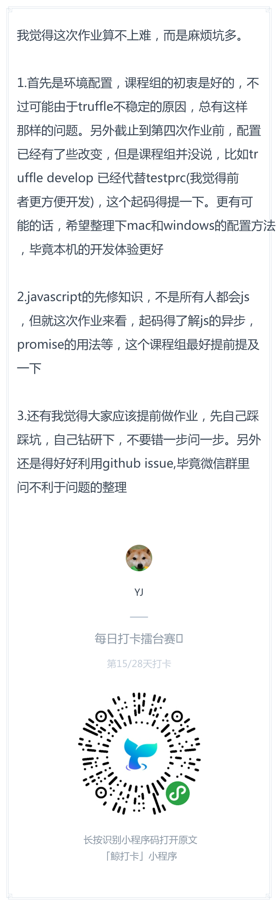
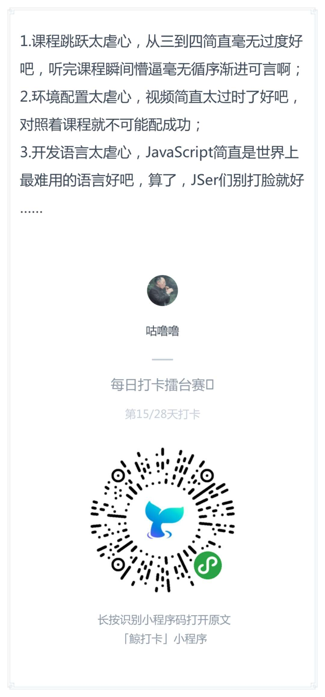

# 每日优质内容复盘-2018.3.26

## 【重要通知】

**@雅珣班长：**

>  同学们～  
第三课C3_linearization的作业，上期智华助教的解答很不错，所以提供给大家参考  https://github.com/linjie-1/guigulive-operation/issues/339  
> 第四课的作业可以参考刘芳璐助教曾经的 [优秀作业](files/payroll.js)

## 【优质课程资源】

- 感谢 **@朱文杰** 分享的一个Medieum上区块链的rss订阅资源：https://medium.com/feed/topic/cryptocurrency

## 【课程答疑】

#### Q1. @Ted熊伟：很多人removeEmployee的test case都是add之后马上remove，这样在结算工资的时候，容易触发工作时长为不到10s，结算工资的判断逻辑里一般都会有相应的assert或者require，导致抛出异常。

#### Q2. @黎倚杭：当前项目上做以太坊开发，提高性能和降低手续费的方法，有什么建议，知道有个loomx以太坊侧链在内测

- **@齐明：** 这个问题有点大，目前就我们能做的就是优化代码。至于扩容问题，目前有很多方法但是没有具体说哪个就是最好的。

#### Q3. @廖祜秋：Common.js 这个 component 中调用的是 payroll.getInfo()，在合约中定义的是 checkInfo()，大家注意一下这里需要自己修一下，保证二者一致。

#### Q3. @DT：红框里的then不是应该等前一个promise执行完才开始执行的吗？为什么实际运行的时候 他和前一个then是同时进行的？



- **@杨楫：** 因为你第一个then里面的settimeout不是一个promise

- **@吴冠禧：** 试下这样
```
return Payroll.deployed().then(function () {
  return new Promise((resolve, reject) => {
    console.log('waiting 1000');
    setTimeout(resolve, 1000);
  });
}).then(function(){
  console.log('test');
});
```

#### Q4. @牛堃：咱们的虚拟机需要安装 antd 吗？还是已经安装好了？

- **@齐明：** 这个需要在项目文件夹里自己`npm install`

## 【打卡干货集锦】

### 昨日话题

哈哈，同学们第四课作业是不是很难！！！  
既然教研组如此开明把交作业时间延长了14小时，那大家花五分钟来吐槽一下你在第四课中遇到的困难吧～

### 优质回答




