# 每日优质内容复盘-2018.3.27

## 【重要通知】

**@雅珣班长：** 

> 第三课、第四课优秀作业的同学：

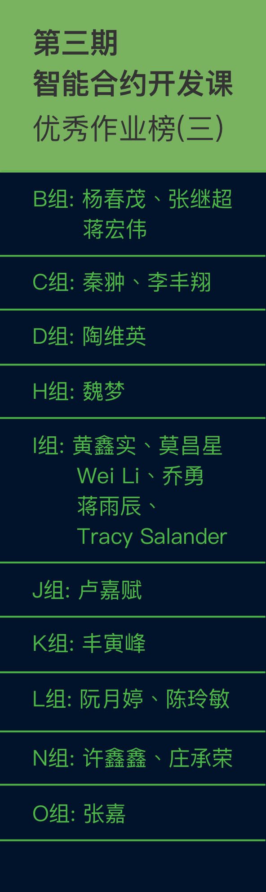

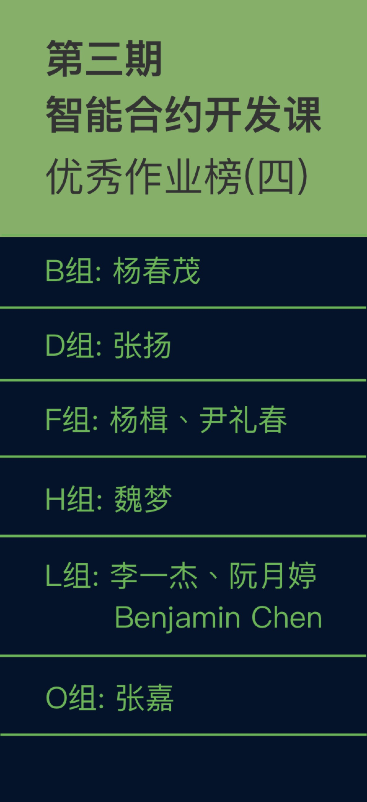

**@雅珣班长：**

> 截止上周末的积分榜来啦：

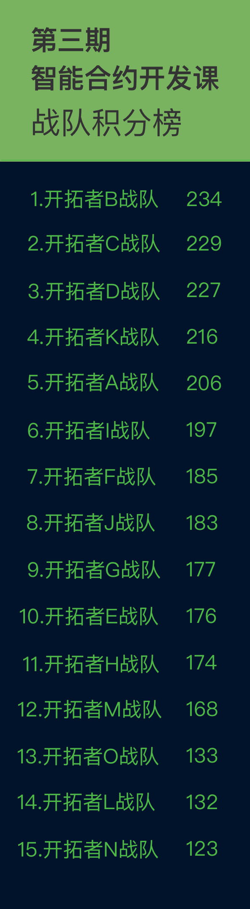

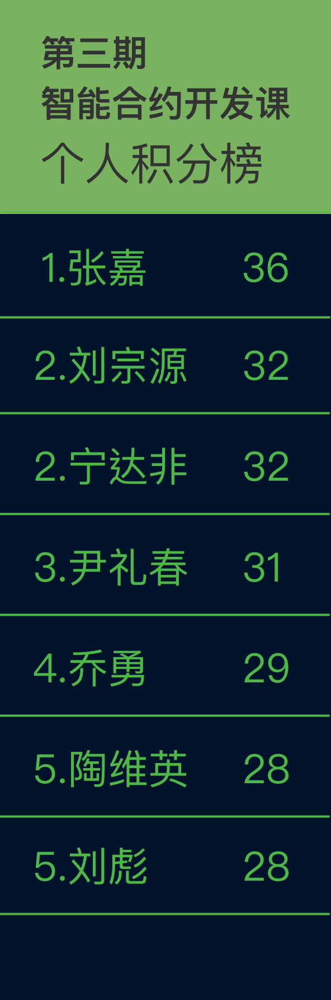

## 【优质课程资源】

- 感谢 **@刘彪** 分享的 [React Router 使用教程](http://www.ruanyifeng.com/blog/2016/05/react_router.html?utm_source=tool.lu)
- 感谢 **@刘彪** 分享的 Vue脚手架：https://github.com/huarxia/generator-wv
- 感谢 **@廖祜秋** 分享的第五课Docker环境：https://github.com/liaohuqiu/cube-box
- 感谢 **@杨楫** 分享的 zeppein的测试代码：https://github.com/OpenZeppelin/zeppelin-solidity/tree/master/test
- 感谢 **@怀达** 分享的第四课思维导图：

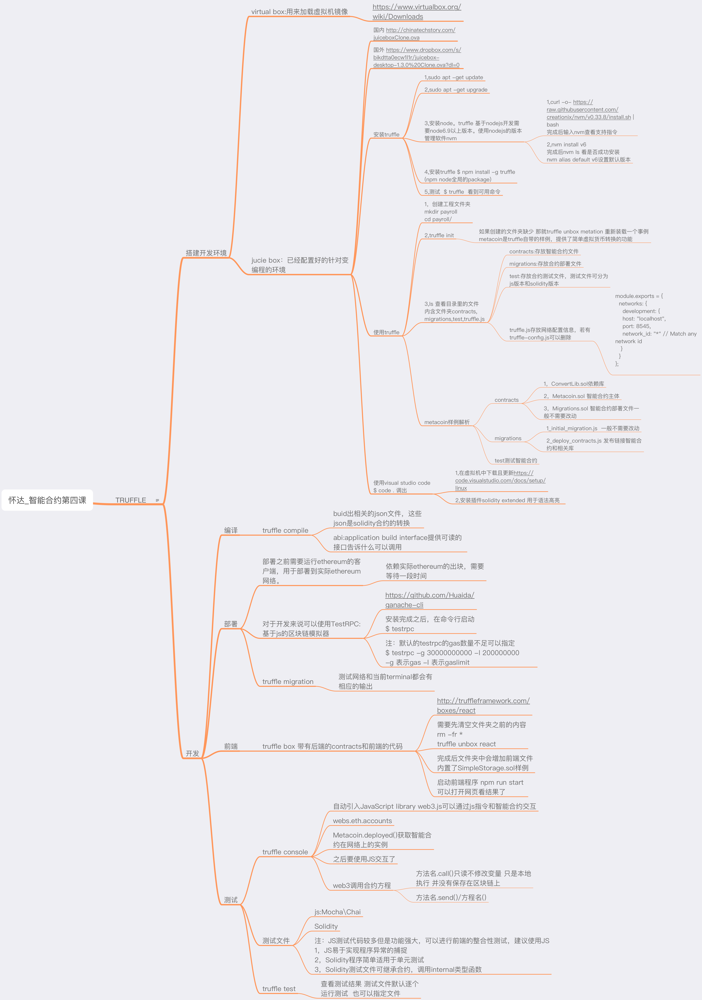

## 【课程答疑】

#### Q1. @陆涛：有关smart contract的storage一直有个问题。storage是在区块链上的 不是在EVM/node里的对吧？可是区块链上的信息不是不可更改的嘛，为何可以修改storage里面状态变量的值？

- **@李明助教：** 不可篡改，指的是历史变化不可篡改。打个比方，皇帝朝朝换，可是唐朝的开国皇帝是谁，不可篡改，历史已经发生了，就那样了。storage被transaction修改，虚拟机执行transaction，调用智能合约方法，修改storage。
- **@DT：** http://www.8btc.com/how-does-ethereum-work-anyway

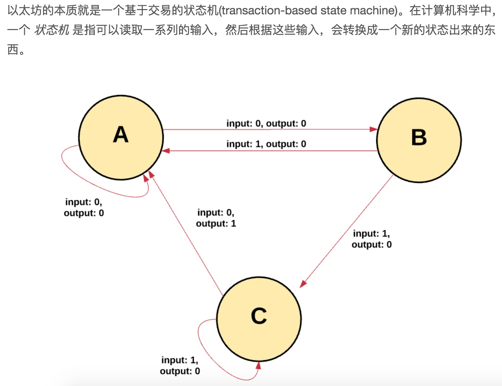

#### Q2. @陆涛：不考虑testrpc，考虑实际主网的话，修改状态变量的function call, 是以transaction的形式发送到链上嘛？那这样是不是需要等到包含这个tranx的block被mine之后才会生效？

- **@Ted熊伟：** 是的。我用私有链测试过。得一直有个miner在。

#### Q3. @Lxl：请问这个怎么解决，Virtual Box 换了2个了

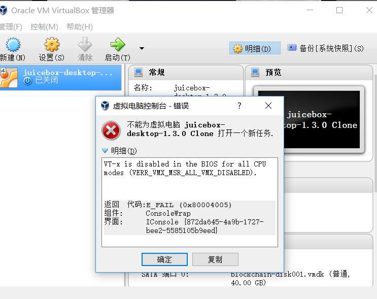

- **@曹轶辰：** 在bios里把 vt-x 打开。这你得自己查查自己的机器怎么进bios打开vt-x，不同品牌的主机不一样，不过大同小异。

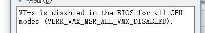

#### Q4. @宁达非：请教一下，我加employee的时候，跟教程里相比，多出来个 logsBloom 这么一大坨是什么呢？ 另外我还多出来一个 status 显示是 0x01，这又是什么东西呢？

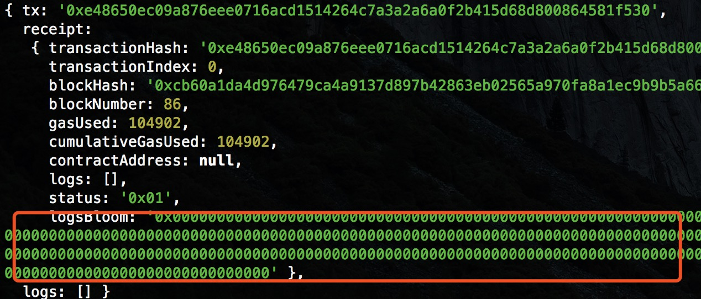

- **@助教二亮：** logsBloom是你这笔交易里面如果有Event被触发，就会有数据。status是交易状态吧，你试试pending的交易，看看status是什么

#### Q5. @刘彪：web3 里面怎么判断`0x0`哇？

- **@牛堃：** 试试，我payroll里边这么写的，貌似可以通过

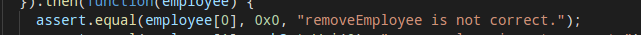

- **@刘彪：** 十六进制转换为10进制判断吧

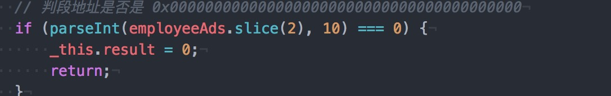

#### Q6. @Ted熊伟：请教一下 npm install antd --save 是在代码目录执行安装？ 我在根目录执行安装，怎么发生一堆问题？

- **@高冰助教：**  在你的truffle工程代码目录下安装

#### Q7. @助教二亮：web3判断是否是地址：https://github.com/ethereum/wiki/wiki/JavaScript-API#web3isaddress

## 【打卡干货集锦】

### 昨日话题

你觉得现在的dapp和智能合约存在哪些缺陷？为什么？

### 优质回答

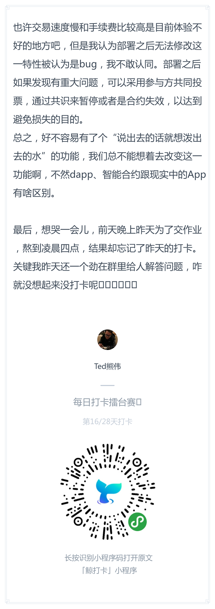

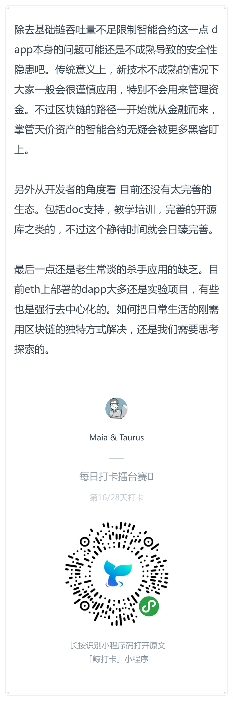

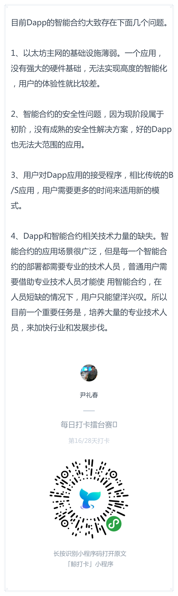
