# 每日优质内容复盘-2018.3.28

## 【重要通知】

**@班长雅珣：** 

> 这是有关第四次作业的参考，大家可以看看，欢迎交流。这次作业有两位同学做得挺不错的！大家也可以看看他们的作业，学习、交流、讨论：@尹礼春_51_ylic2018 和@杨楫_53_yyssjj33 
> 
> https://github.com/Guigulive/Team-F/tree/asn4/Lesson-4/assignment

## 【优质课程资源】

- 感谢 **@刘彪** 分享的 [智能合约之前端开发](http://mp.weixin.qq.com/s/HC2n2fNMCmjVEMKYs_6Mvw)

## 【课程答疑】

#### Q1. @王信平：这个问题谁遇到过

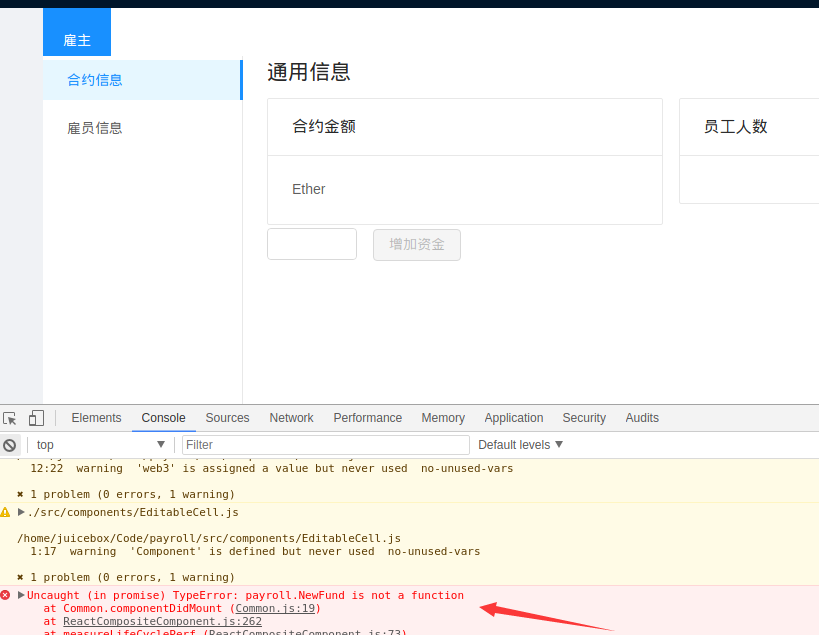

- **@牛堃：** 就是因为这个代码功能才报错的，先注销掉吧，跑起来看看以后用到了没

- **@王信平：** 注销了还是有问题

- **@牛堃：** 这些都要注销掉，你看看是不是引用了对应的代码，注销后就能正常跑了，然后就需要补齐功能。以后会不会用到就需要看补的代码了，我暂时还没用到这些。

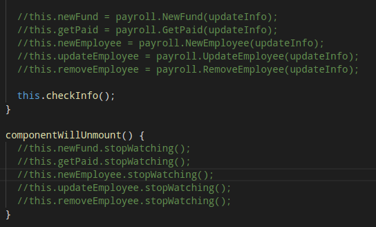

#### Q2. @王振华：我的`antd`安装不了，执行命令后根本没进度，等了十几分钟也不行

- **@李君向：** 用`cnpm`装下吧。`npm install -g cnpm --registry=https://registry.npm.taobao.org`

#### Q3. @蒋雨辰：第五课作业要求在哪能看到？

- 按照老师课程的讲述，实现基本的用户界面，然后上交项目文件。课程提供的代码中有些函数的实现被挖掉了，需要自己补上。

#### Q4. @牛堃：请问怎么从虚拟机往外复制文件啊？

- **@杨明轩：** 共享文件夹直接就搞出来了。这里有方法：https://www.linuxidc.com/Linux/2016-04/129851.htm ,2、3、4步照着做一下就行了

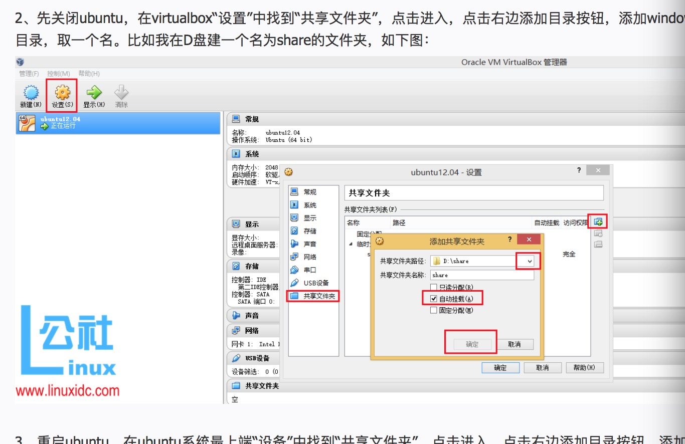

#### Q5. @张继超：请问有没有人遇到这种情况：

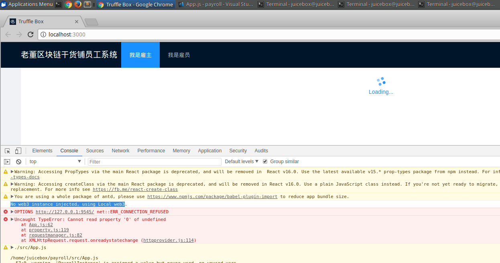

- **@John：** 如果你用的是testrpc之类的，端口应该是8545吧

- **@张继超：** 解决了，是`getWeb3.js`里面配置有问题

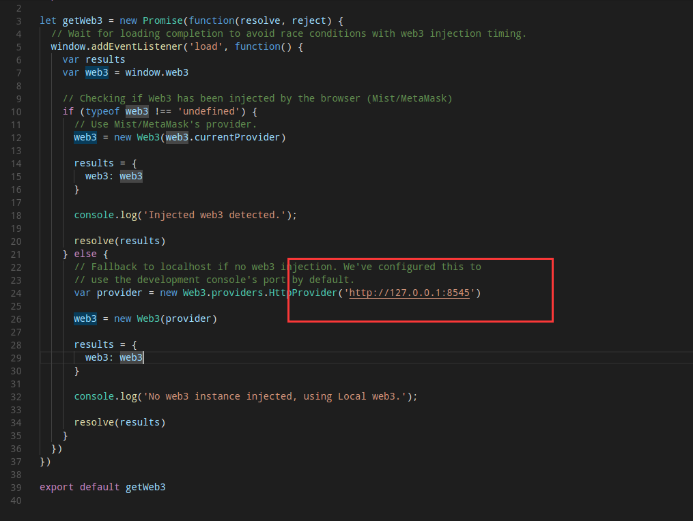

#### Q6. @李泽：add employee的时候`out of gas`怎么办？

- **@牛堃：** 调用的时候设置下交易的gas参数：

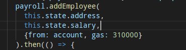

#### Q7. @王振华: 请问 提交作业的时候，是 build 目录和 node_modules 不用提交吗？

- **@Ted熊伟：** 是的

#### Q8. @王浩：为啥我选这个进去就说我没有权限了呢

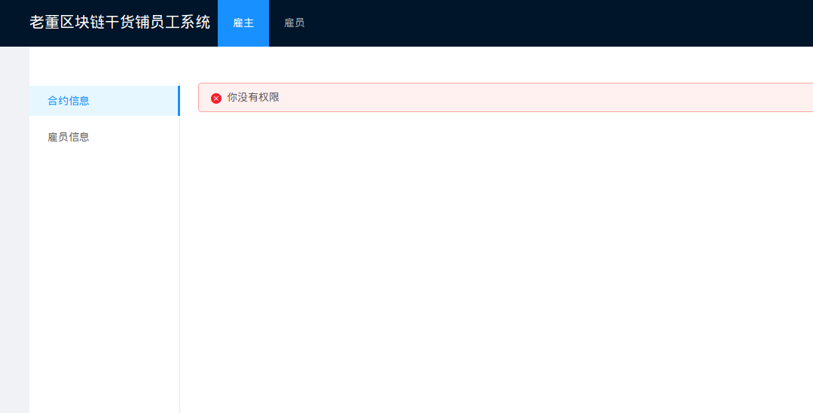

- **@刘金伟：** 我是这么弄的，把account1作为prop传给子组件 ，account1是员工

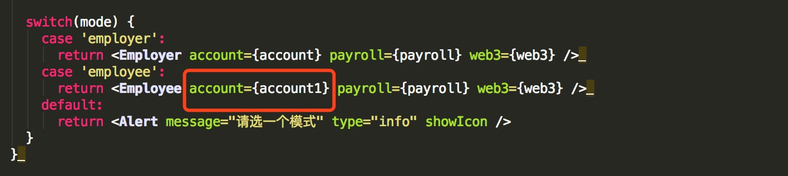

## 【优质群内讨论】

### 课程内容设置的讨论

- **@董老师：** Solidity的语法前面几节课还是讲了不少的，除了inline assembly，基本主要需要用到的都讲了哈，以及后面还会有一节课专门讲解solidity语法／设计中安全的问题，对于前端开发，我们也犹豫了很久要不要加入，但是最后觉得既然是full stack，可能还是需要加入一下，前端框架这东西，确实是各有所爱，前端开发这块我们会在作业上面要求松一些，大家主要关注和后端的衔接就好了～

- **@董老师：** 我感觉课程上面所讲的东西，去写一个CryptoKitty是够的。

- **@董老师：** 我们在下期课程中会加入另外的一些高阶内容比如EVM的原理，EVM汇编语言和栈调试，这期学员如果感兴趣的@雅珣班长 都会直接给听课码

- **@陈威：** 我们现在课程的进阶就是合约安全和EVM吗

- **@董老师：** 其实进阶有很多种进阶的方法哈，继续深挖ETH是一种，然后还有一些其他的虚拟机架构，以及新的共识算法，扩容的手段，形式化验证等等内容，从理论到实践跨度不等，我们还是倾向于能够实践的内容

## 【打卡干货集锦】

### 昨日话题

你觉得有什么问题是没有区块链就很难解决的？

### 优质回答

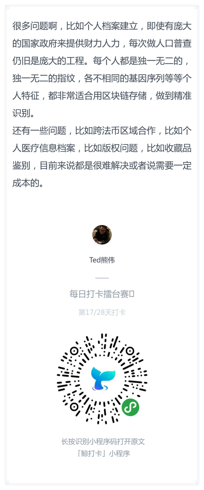

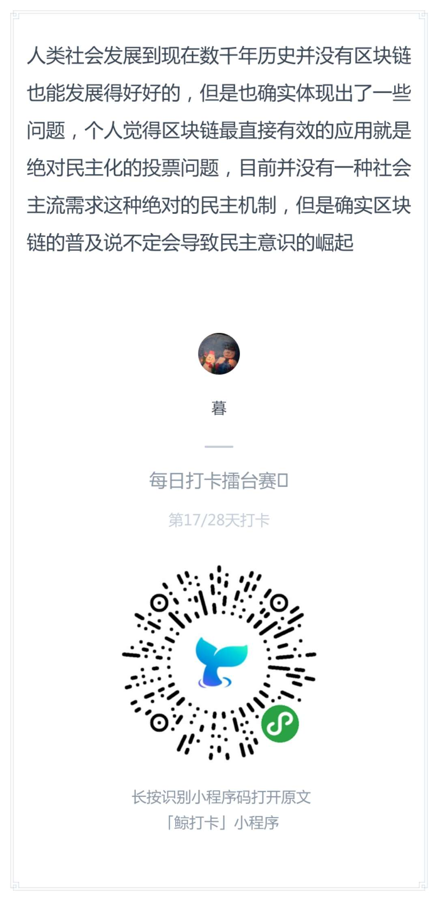

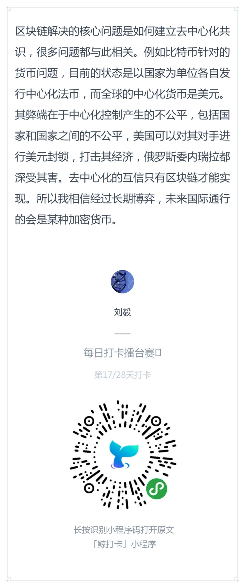
