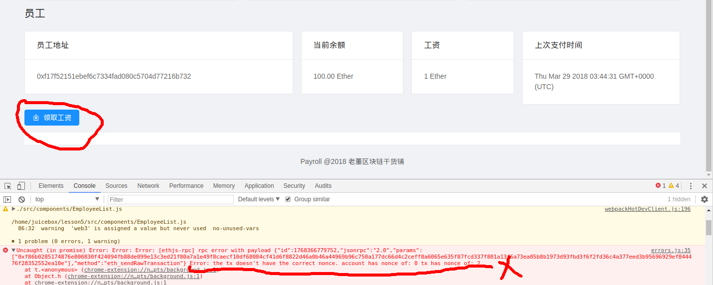

# 每日优质内容复盘-2018.3.29

## 【重要通知】

**@卜绮虹Nicole-班长** 

> 时间：北京时间周六早上10点

> 高冰助教会在微信群内做一个IPFS是个什么S（System），IPFS与Filecoin的关系的讲座, 大家准时携小板凳参加啦！

> 解读完，同学们如果有疑问可以提出来哦, 大家一起交流～

## 【优质课程资源】

- 感谢 **@廖祜秋-北京杭州-工程师** 关于公钥，私钥，如果不是很了解的，推荐 @刘金伟-北京-前端 同学的一个文章[文章](https://www.jianshu.com/p/5b1b002c39bd) 可以说很简单易懂了。想详细了解的[Wiki](https://en.wikipedia.org/wiki/Public-key_cryptography)；这个[视频](https://www.youtube.com/watch?v=ERp8420ucGs)也不错.

- 感谢 **@雅珣班长-智能合约开发**  关于第五课的作业————给大家提供张子栋助教曾经的[优秀作业](https://github.com/linjie-1/guigulive-operation/pulls?utf8=%E2%9C%93&q=%E5%BC%A0%E5%AD%90%E6%A0%8B)，昨天已经完成作业的同学可以围观参考一下


## 【课程答疑】

#### Q1. @廖祜秋-北京杭州-工程师： MetaMask 如果之前已经了解了，就是实现一下 event 就好了。昨晚赶作业，看 origin 下有 event.stopWatching 现成代码，想用 setInterval 代替挺麻烦，时间紧迫，用 event 只要 10 句重复代码，顺手加了代码……感觉改改 PR 的 Title 作业就做完了 [捂脸]

#### Q2. @范燕军-深圳-区块链：我的电脑科学上网能安装metamask， 虚拟机 就不能安装metamask 求指导

- **@廖祜秋-北京杭州-工程师：** 虚拟机也先科学上网先。或者用 Docker 来运行，方便快捷。『非常完美』。https://github.com/liaohuqiu/cube-box attach 之后，ganache-cli 跑起来，
```
import private key 
```
就好。非常非常快捷。

#### Q3. @尹礼春-广东-全栈：用Metamask领工资出错，这个是什么问题呀，哪位助教解答下。
```
Error: the tx doesn't have the correct nonce. account has nonce of: 0 tx has nonce of: 2
```



- **@胡圣托-助教：** reset account是可以的，就是为了解决nounce计算出错的问题， 这个issue里有讨论nonce出错的原因：
https://github.com/MetaMask/metamask-extension/issues/1999

#### Q4. @范燕军-深圳-区块链： 昨天谁遇到这个问题 如何解决的？
```
Error: Cannot find module 'dotenv'
    at Function.Module._resolveFilename (module.js:547:15)
    at Function.Module._load (module.js:474:25)
    at Module.require (module.js:596:17)
    at require (internal/module.js:11:18)
```

- **@廖祜秋-北京杭州-工程师：** 安装 dotenv, 我还是想安利 docker，珍爱时间，拥抱 docker

#### Q5. @怀达+北京+IOS开发：metamask创建的多个账号相当于一个钱包的多个夹层，import的账号相当于一个钱包。这个理解对吗？

- **@刘彪-北京-前端** 对的，没毛病， 建议助记词和私钥都保存好。

#### Q6. @刘彪-北京-前端： 其实还是想问像这种revet错误怎么反映给js，因为知道是余额不足或者其他错误，我想更友好的提示给用户

- **@DT-上海-爱好者** 单元测试的时候 不就可以捕获错误代码吗 invalid opcode或者 revert。 有谁知道为什么metamask切到account[1] 地址也没法getpaid（你不是员工）可能是哪里出问题了吗？

- **@刘彪-北京-前端** @DT-上海-爱好者 不是单元测试，真正用的时候可以不加钱，然后添加员工，再删除员工的。 总金额为0时，有些按钮不应该出现

- **@DT-上海-爱好者** 我的意思是 单元测试其实也是用合约生成一个instance 然后进行了运行 promise reject 就catch error的string 实际程序也可以这么写呀

- **@刘彪-北京-前端** 哦，明白，thk

#### Q7. @黄鑫实-成都-PM：突然有个问题请教，代码什么情况下需要烧gas?是不是只有改变区块数据的时候才烧?查询之类的不烧?

- **@黄敏之-助教** @黄鑫实+成都+PM 在本地节点执行不烧，上传交易就要烧

- **@黄鑫实-成都-PM** 查询之类的功能应该不需要吧？只有写才需要，这样理解对么？毕竟区块浏览器查询是不需要花gas的

- **@刘彪-北京-前端** 记住一点：查询不需要钱，发生交易请求需要

- **@黄鑫实-成都-PM** okay，谢谢

## 【打卡干货集锦】

### 昨日话题

区块链和人工智能是否可以结合，怎么结合?

### 优质回答


