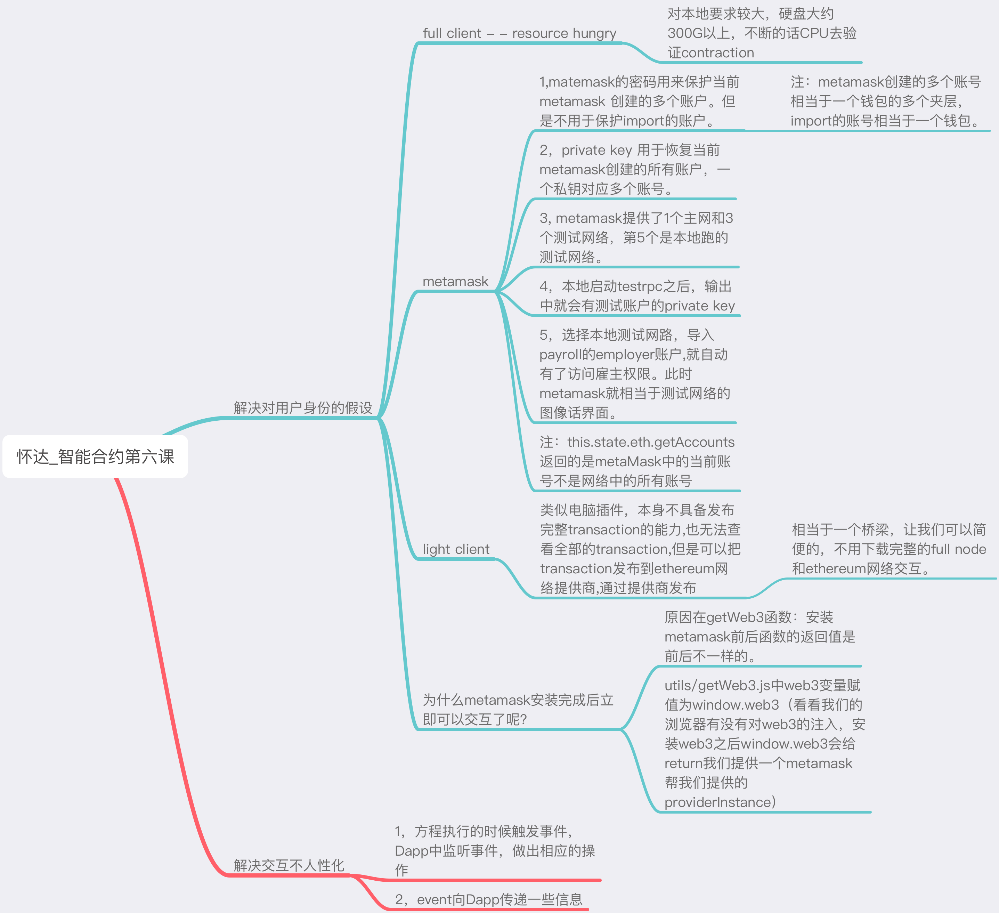
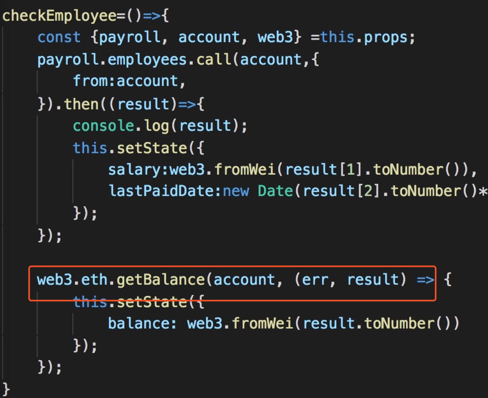
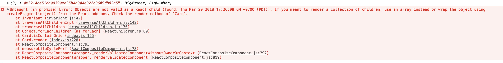
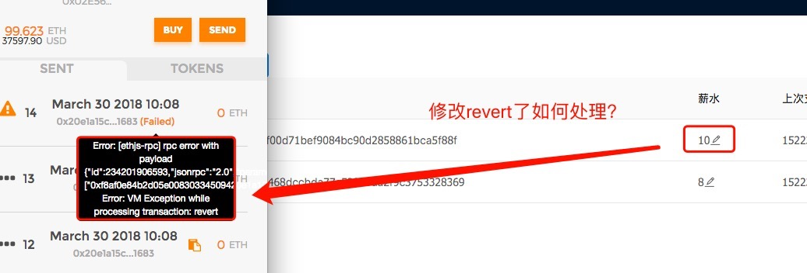
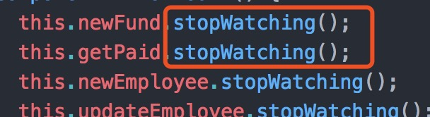
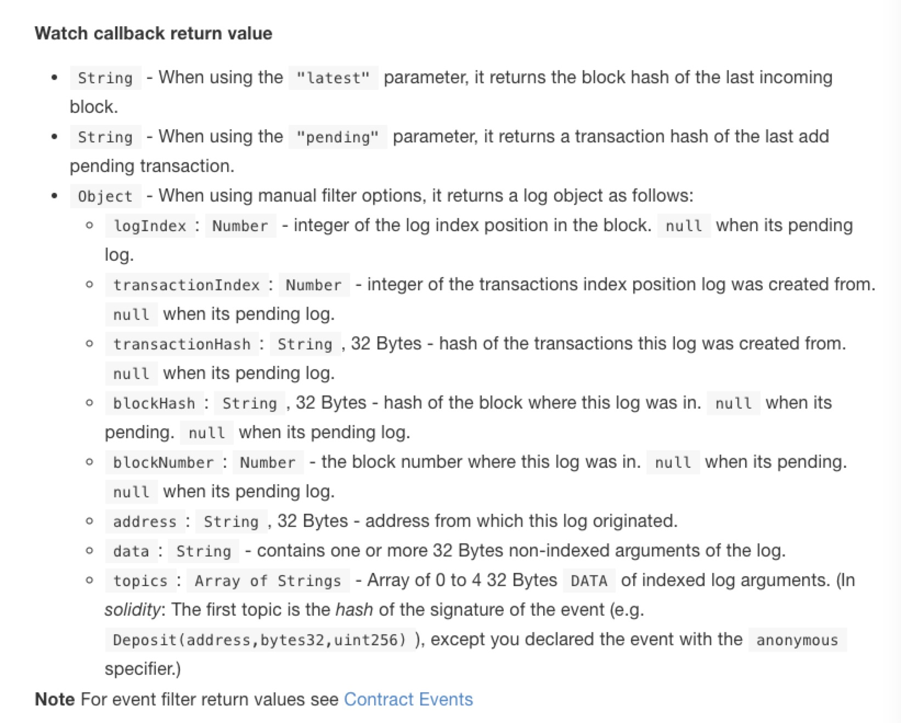
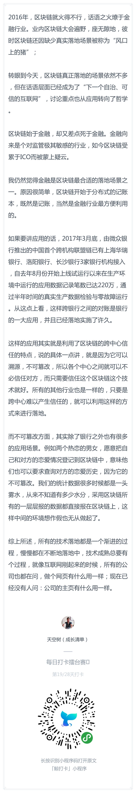

# 每日优质内容复盘-2018.3.30

## 【重要通知】

**@雅珣班长：** 

> 嘿嘿嘿开拓者们：  
> 睡前插播一条重大消息啦！
> 
> “白帽黑客”团体挑战赛正在紧张有序的报名中。  
> 嗯，它也是你们的结业考试。
> 
> 考试是检验学习的唯一标准～  
>（下方海报扫码即可报名喔）
>
> **注意：** 表单中要填写的以太坊地址是用于比赛的，不是用来发奖金的，不要用交易所的地址。建议使用metamask里生成的地址

## 【优质课程资源】

- @宗源：之前没理顺gas price和gas limit，这篇文章比较容易理解可以看看：https://cryptonews.com.hk/2017/11/20/ethereum%E4%BB%A5%E5%A4%AA%E5%9D%8A-gas-price-vs-gas-limit-%E5%B0%8F%E7%9F%A5%E8%AD%98/
- 感谢 **@怀达** 分享的第六课思维导图：

## 【课程答疑】

#### Q1. @宁达非：在metamask里怎么删除create的account？

- **@子栋助教：** 删account似乎没有，不过可以通过用助记词恢复钱包的方式

#### Q2. @宁达非：我添加了雇员的private key以后从雇员的account进入为什么雇员页面仍然是你没有权限？这是代码问题么

- **@杨小咩：** 目测是出错了，是不是employee.js里有web3.eth.getbalance

- **@宁达非：** 是说这个吗：

- **@杨小咩：** 是的，你看console还有什么提示没，页面异常基本上都是代码出错导致的

- **@宁达非：** 

- **@杨小咩：** checkEmployee里的lastPaidDate，new Date之后要toString

#### Q3. @范燕军：

- **@牛堃：** 可能是你合约里面的钱不够发工资了，所以改薪水的时候不够发，revert了，你多加点钱

#### Q4. @彭康政：`stopWatching`要自己实现吗？ 

- **@廖祜秋：** 不用

- **@彭康政：** 看了下文档，是web3的接口：https://ethereum.gitbooks.io/frontier-guide/content/web3.html#web3shhfilter

#### Q5. @尹礼春：请问下，项目代码怎么用git上传到 作业目录中，比如 `https://github.com/ylic2018/Team-F/tree/51-尹礼春/Lesson-6/assignment` 这个目录下，难道必须要先新建一个仓库，才可以提交吗？

- **@怀达：** 在本地项目库中使用git 添加忽略文件，然后推送到远程地址，流程是这样

## 【打卡干货集锦】

### 昨日话题

2016年，区块链就火得不行，话语之火燎于金融行业。业内区块链大会遍野，座无隙地，彼时区块链还因缺少真实落地场景被称为“风口上的猪”；  

转眼到今天，区块链真正落地的场景依然不多，但在话语层面已经成为了“下一个自治、可信的互联网”，讨论重点也从应用转向了哲学。

区块链始于金融，却又差点死于金融。金融向来是个对监管极其敏感的行业，如今区块链受累于ICO而被蒙上疑云。

你是否也觉得金融是区块链最合适的落地场景之一？如果是的话，说说为什么区块链适合落地金融行业，以及区块链的不同特点分别可以适用于哪些金融场景？如果不是的话，说说你的其他看法。

### 优质回答

