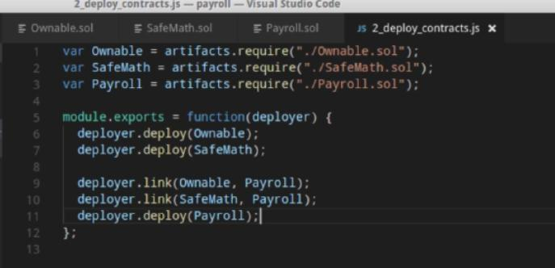
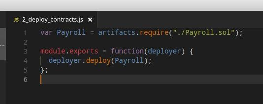
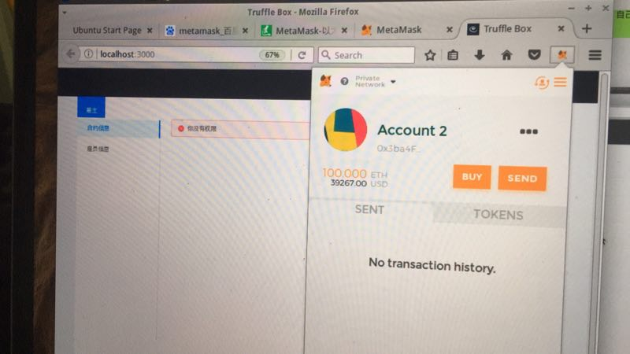
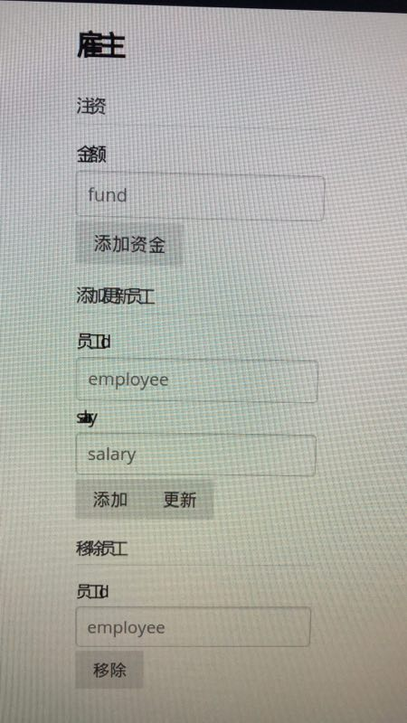
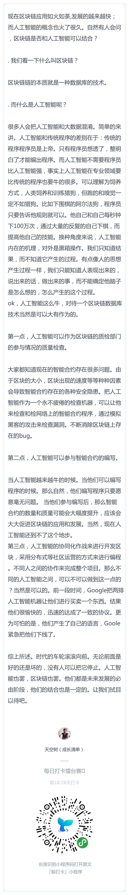
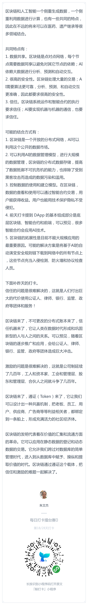
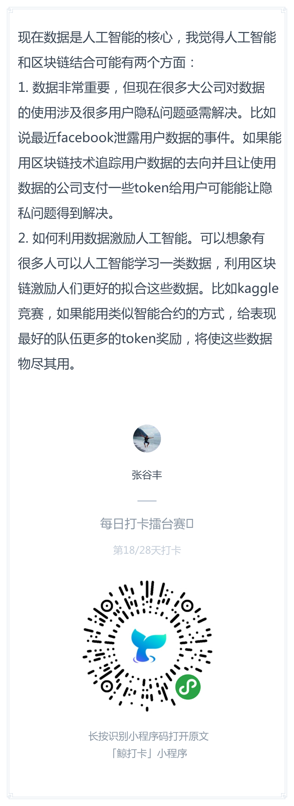

# 每日优质内容复盘-2018.3.31

## 【优质课程资源】

- 感谢 **@宗源-杭州-前端开发** 关于事件的api可以看看这个https://github.com/ethereum/wiki/wiki/JavaScript-API#contract-events

## 【课程答疑】

#### Q1. @尹礼春-广东-全栈： 发现一个小问题，视频中 2_deploy_contracts.js中，需要引用库文件，联接库文件。在新版的 truffle中，只要引用主合约文件就可以了。

- **@蒋宏伟-北京-前端：** 这个改进不错

- **@吴逸飞-东京-区块链开发：** 本来就是这样的[捂脸], 而且那个1的migeration也可以不要[捂脸]

#### Q2. @唐华-深圳-软件开发：metamask切换到本地的testrpc的账户，为什么localhost刷新还是显示“没有权限”？有同学遇到这种问题吗？

- **@宁达非-洛杉矶-SE：** 你第一个 private key, import了么

- **@唐华-深圳-软件开发：** 第一个地址是metamask创建的，直接在Metamask中importtestrps的 privatr key

- **@宁达非-洛杉矶-SE：** 刷新，如果不好用说明employer或者common有问题, 或者你可以看看console

#### Q3. @张晓-烟台-DevOps8：请教个问题，在虚拟机里显示前端时，可能是因为没有装中文字体，页面显示出来的文字都是挤在一起的. 请问大家如何处理的？谢谢

- **@DT-上海-爱好者** css里的设置吧 换个字体family 可以召唤前端大神来指导下

- **@Ted熊伟-上海-安卓** @张晓-烟台-DevOps 有个css样式，替换一下，你对比origin分支里的css文件，有个不一样，替换一下

## 【打卡干货集锦】

### 昨日话题

区块链企业的数量。从2012年再到2017年初，被人所知的增长率平均在65%。从得到融资的全球初创企业来说，到2017年5月有近500家的初创企业获得了数量不等的融资。

从投资机构的关注度来看。一些国际大机构，像高盛等很看看好这个领域。数据显示，有将近200家投资机构，当然这200家是指有一定规模的机构，小的还不包含在内。

从领域来看。大体上我们可以看到，区块链技术在金融行业的应用最为广泛，其中大部分都是国外的公司，中国的初创公司也有。

从融资额表现的特点来看。最早2012年的时候，有投资机构给一些区块链企业投了200万，到2017年一年投资额已经是18亿，平均增长率超过了500%。

今日打卡话题:
随着区块链技术的进一步发展和普及，未来的区块链会是什么样子呢？

### 优质回答

