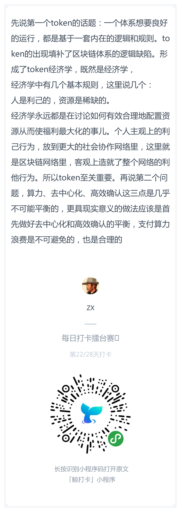
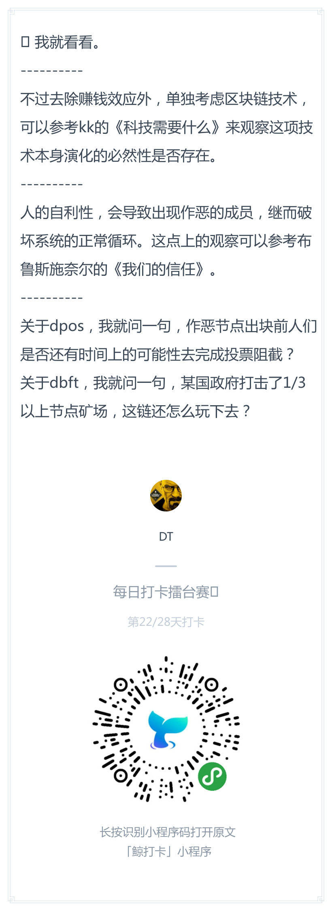
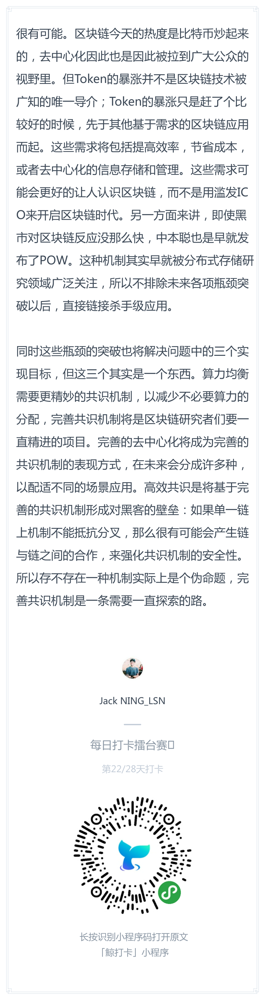

# 每日优质内容复盘-2018.4.1

## 【优质课程资源】

- **@DT：** 打算自己学下react的可以看这本《react学习之道》，之前学长分享的链接失效了。补官方链接：https://leanpub.com/the-road-to-learn-react-chinese
- 感谢 **@胡圣托助教** 复盘了周六高冰助教分享的IPFS：https://github.com/Guigulive/Wiki/blob/master/weekly-seminar/2018.03.30-ipfs/2018.03.30-ipfs.md
- 感谢 **@夏玮欹助教** 整理的 [第七课&白帽黑客比赛常见问题](/FAQ/智能合约开发FAQ-7&Competition.md) 

## 【课程答疑】

#### Q1. @杨晨朝：按照视频中添加event以后，不用刷新，但是需要切换一次table才能更新，这是什么问题，有人遇到吗？

- **@宗源：** 

> 不知道是不是跟你遇到一样的问题
> 
> debug了一下，发现2点：  
> 1.不用metamask是不会有问题的  
> 2.在brave浏览器下的metamask是没有问题  
> 
> 估计chrome的metamask在抛出事件的时候有问题，你可以换brave浏览器试试看，或者把chrome重新关了试试看 

#### Q2. @XIUZE：问一下truffle压缩指令怎么办啊子文件夹也include进来？

- **@尹礼春：** 把整个文件夹复制一份，再删掉node文件夹，然后tar
- **@杨楫：** `zip -r9 payroll.zip . -x *.git* node_modules/\*`

#### Q3. @唐华：白帽黑客挑战赛报名后是随机分组参赛，还是按照原来的组参赛？

- **@雅珣班长：** 原组参赛，并且部分小组安排一期、二期的学员一起参加

#### Q4. @王振华：第七课视频中的很多内容完全看不清楚，尤其是一些红色的字，根本看不清写的啥

- **@宗源：** 可以看这个教程，把xxx改成你自己的就好了：http://truffleframework.com/tutorials/using-infura-custom-provider

```
var HDWalletProvider = require('truffle-hdwallet-provider');

var mem = 'xxx'

module.exports = {
  migrations_directory: "./migrations",
  networks: {
    development: {
      host: "localhost",
      port: 7545,
      network_id: "*" // Match any network id
    },
    ropsten: {
      provider:function() {
        return new HDWalletProvider(mem,'https://ropsten.infura.io/xxx');
      },
      network_id: 3 // Match any network id
    }
  }
};
```

部署失败有可能是助记词对应的第一个账号没钱

可以在第三个参数指定账号，教程里有详细的：
```
return new HDWalletProvider(mem,'https://ropsten.infura.io/Q7Rs4RiyJ1rL1C7g0lMj',4);
```

## 【直播答疑】

### 代码什么情况下需要消耗gas?是不是只有改变区块数据的时候才消耗?查询之类的不消耗?

- **@董老师：** 这个并不一定是这样的。即使一个函数是只读的，如果你硬是要通过区块链来调用，它也是消耗gas的。现在比较通用的钱包都会做优化，避免你在调用这些只读函数的时候还得通过区块链，这样就不需要消耗gas了。

### 增加区块链吞吐量的几个思路

首先要记住当今互联网的吞吐量大约在每秒百万级

1. 通过改变共识算法，比如采用比较中心化的DPoS， PBFT可以达到100-200的TPS
2. 通过分片技术Sharding。平时是每个小区域之间达成共识，再定期和整个区块做check point。其实是scalability和finality之间的trade off。可以达到1000-10000的TPS
3. 老董认为百万级TPS需要状态通道（state chanel），通过在链上的一个智能合约和一系列的链下转账来实现

## 【打卡干货集锦】

### 昨日话题

如果没有token的暴涨，区块链行业是否会达到今天的热度？如果没有token的收益，是否还有人愿意运作公正的节点？是否存在一种机制能够同时实现：算力均衡（vs算力浪费）、去中心化（vs授权代表联合作恶）、高效共识（vs低速确认或容易分叉）？

——————来自学员张嘉提供的打卡话题

### 优质回答






