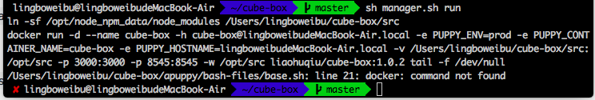

# 每日优质内容复盘-2018.4.2

## 【优质课程资源】

- **@Ted熊伟：** 第七课看不清truffle.js代码的同学，可以参考这里 https://github.com/trufflesuite/truffle-hdwallet-provider
- 感谢 **@DT** 分享的 [使用infura部署的教程](http://truffleframework.com/tutorials/using-infura-custom-provider)

## 【课程答疑】

#### Q1. @王浩：请问下docker是怎么运行的？git clone下来那个cube-box以后直接运行那些命令吗？运行以后出现这个错误有人遇到过吗？

- **@DT：** 需要到 docker 官网下载安装 docker ce

#### Q2. @刘毅：请教各位，我在metamask里创建了多个Account。重装mm之后用助记词进去，就只有第一个Account了。我记得老董说助记词是钥匙串，为什么只能恢复第一个Account，其他Account怎么找回来呢？

- **@宗源：** 助记词是一个seed吧，你新创建的account跟之前的address是一样的可以试试，不需要通过其他途径导入，除非之前的部分账号是你通过导入导进来的
