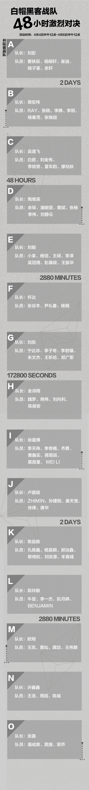
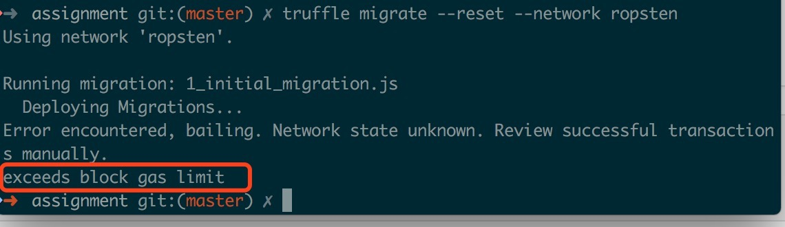
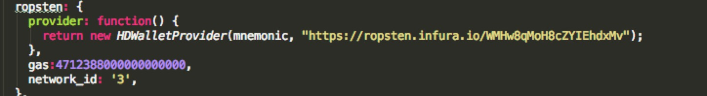
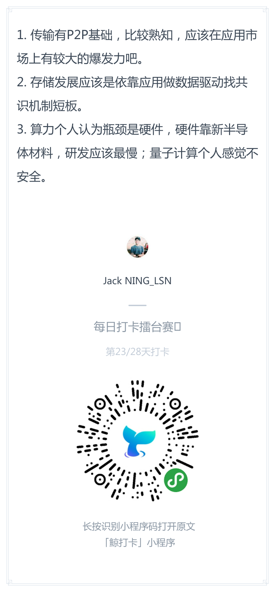
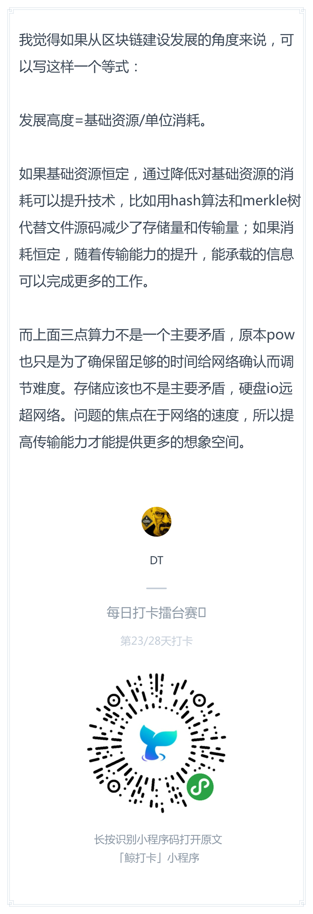

# 每日优质内容复盘-2018.4.3

## 【重要通知】

**@雅珣班长：** 

> 第三届白帽黑客挑战赛，各小组参赛人员名单来啦～  
好事多磨，比赛时间改为明天中午12点开始，老董会在各小组群内公布比赛规则，大家好好准备！

## 【课程答疑】

#### Q1. @刘金伟：这个怎么破，gas改成了`4712388000000`还是不行

- **@齐明助教：** `truffle.js`里可以设置部署时gas大小，那里调小点

- **@鲁明助教：** 4600000是我的幸运数字，设成这个从没出过问题

#### Q2. @刘金伟：migrate的时候，是如何将metamask中选中的账户作为owner的呢？

- **@刘毅：** 默认应该是助记词的第一个account发创建合约交易的地址，也是owner

#### Q3. @刘金伟：钱包，账号，助记词之间是什么关系？

- **@刘毅：** 我前两天问过，基本搞清楚了。地址是公钥，助记词是生成非对称密钥对（私钥和地址）的种子。一个确定的助记词，能够连续生成很多确定的密钥对。钱包是管理密钥和用密钥做签名交易的软件。

- **@刘金伟：** 也就是说丢了一个私钥，只会丢一个账号的钱。如果丢了助记词，有可能丢一坨账号的钱，对吧？

- **@刘毅：** 是，如果你用助记词生成了一堆地址，每个上都有钱，那就是这么不幸

> 关于助记词是如何生成地址私钥的，具体可以看 《精通比特币第二版》的第五章：http://book.8btc.com/books/6/masterbitcoin2cn/_book/ch05.html

## 【打卡干货集锦】

### 昨日话题

算力，传输和存储三个关键点上，哪一个在最近有大的发展潜力，为什么？

———-来自学员徐臻提供的话题

### 优质回答

