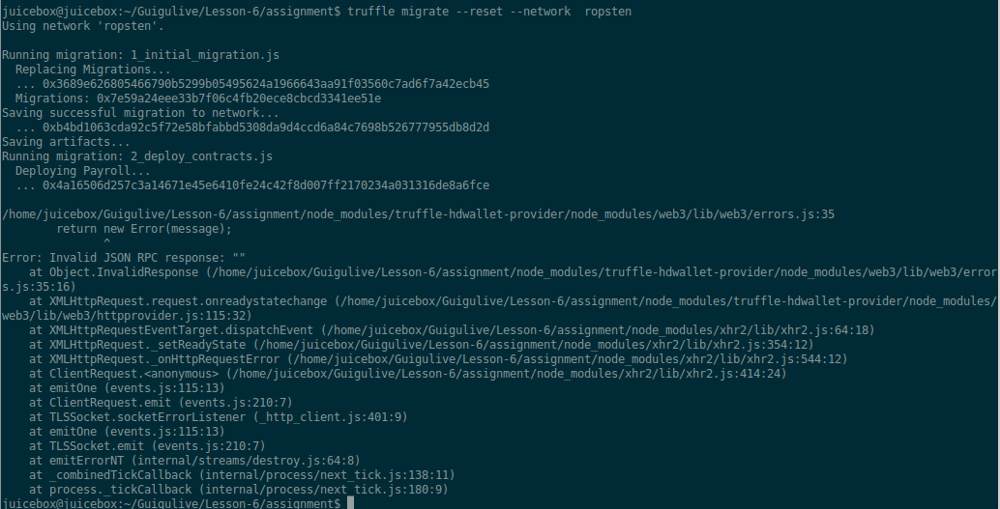
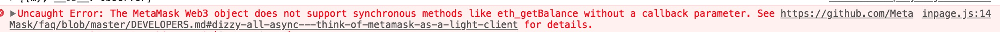
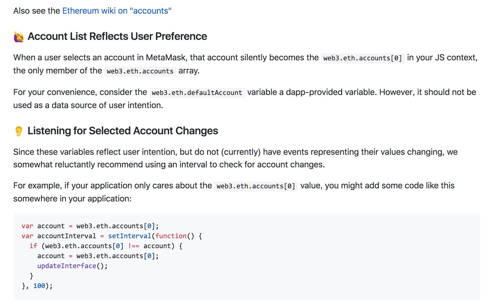
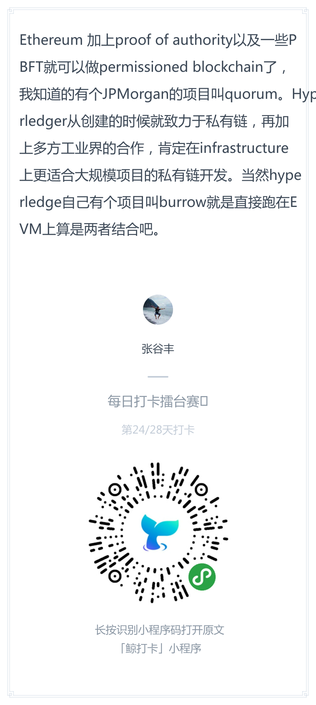
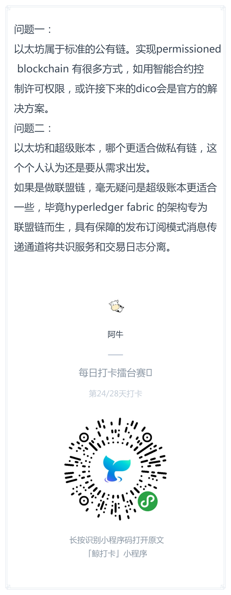
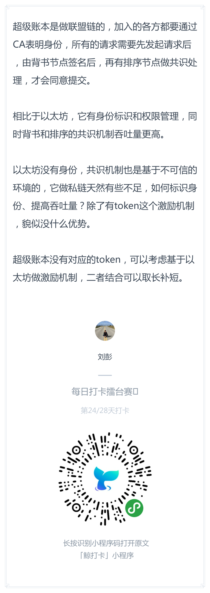

# 每日优质内容复盘-2018.4.4

## 【课程答疑】

#### Q1. @尹礼春：这个错误有同学遇到过吗？



- 这应该是网络的问题，需要翻墙

#### Q2. @许鑫鑫：使用truffle+infura 这种架构，为什么薪酬系统不会自动更新页面了，是event事件监听超时失效了吗？我刷新页面就可以更新 所以transaction是成功的

- **@Ted熊伟：** ropsten test 网络要等好久才回成功。我刚做过测试，可能这会使用测试网的比较少，很快就成功了。点击增加金额之后，大概一分钟，就回调页面刷新了。

#### Q3. @刘彪：不支持同步方法这个问题又遇到过么？



> https://github.com/MetaMask/faq/blob/master/DEVELOPERS.md#dizzy-all-async---think-of-metamask-as-a-light-client



- **@刘金伟：** 我遇到过，第二个参数搞成callback就行：`function(err, result){}`, 而且回调函数的第一个参数必须是error。好像只有metamask注入的web3有这个毛病，自己引入的就没事。有时还会遇到web3版本过高导致跟truffle-contract不兼容。callback跟promise().then() 这些语法都很讨厌
最正经的还是async await

```
we3.eth.getBalance(accountAddress, function(error, res) {
    console.log(res);
    balance = res;
});
```

- **@子栋助教：** 想用await搞可以看看这个：https://medium.com/@angellopozo/testing-solidity-with-truffle-and-async-await-396e81c54f93

## 【打卡干货集锦】

### 昨日话题

Ethereum实现permissioned blockchain有哪些方法，是否Hyperleger相比它更适合做私有链的项目？

### 优质回答






