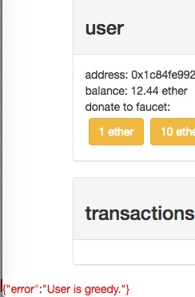
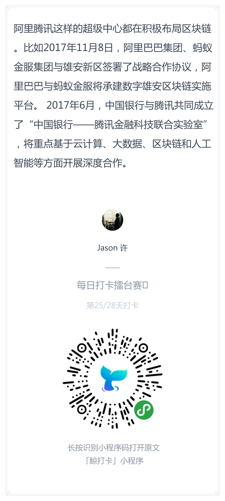
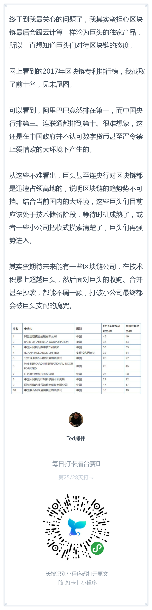
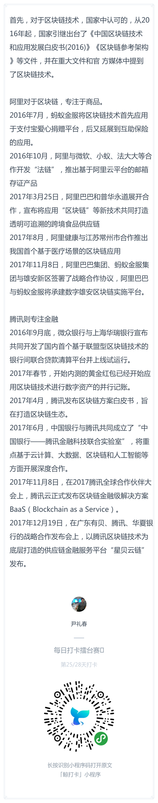

# 每日优质内容复盘-2018.4.5

## 【重要通知】

**@董老师：** 

> 传统美德说，做好人好事要不留名才是坠好的，关于如何不留名， 可以学习一下这篇文章： https://medium.com/@montedong/towards-cracking-crypto-kitties-genetic-code-629fcd37b09b

**@Nicole班长：** 

> ⭐️分享会⭐️
>
> 时间：北京时间本周六早上10点
>
> 李明助教会和大家分享：如何站撸经典pos，聊聊不无聊的peercoin！大家不要错过啦
> 
> 解读完，同学们如果有疑问可以提出来哦^_^大家一起交流～

## 【课程答疑】

#### Q1. @faust：第七课作业是必须的吗？

- **@雅珣班长：** 第七课的作业是比赛，自愿参加

#### Q2. @余轩：这个有解么？



- **@刘毅：** 这个应该是有限制，太多了以后就领不了了。你如果真需要很多，就把eth先转到别的账户，继续申请就行了。或者多生成几个地址，用没币的地址去申请。

#### Q3. @许鑫鑫：有个问题请假下大家 如果一个方法最后out of gas 那整个调用栈里面修改的状态会回滚吗？ 比如老董在视频里面设置的那个`stack++<10`，如果把这行去掉，貌似也可以成功啊，我在remix和rospen网络上试了之后都成功了啊


- **@黄敏之助教：** 去掉就是死循环，最后一个出错的会回滚其它不会

- **@许鑫鑫：** 我刚刚试了一下 throw 和 out of gas都会回滚整个状态，可以看这段代码，最终time的值并没有改变


但是      
```
// if(stack++ < 5){
    dao.withdraw(amount);
// }
```
这段代码在执行50次左右的时候就会停下来 然后状态也改变了。那我理解这种涉及转账的是最后一个失败，不涉及转账的是全部revert，我自己测下来是这样的。

## 【打卡干货集锦】

### 昨日话题

像阿里腾讯这样的超级中心，它们会如何迎接区块链，它们会怎么把去中心化和当前业务相结合？

### 优质回答    






