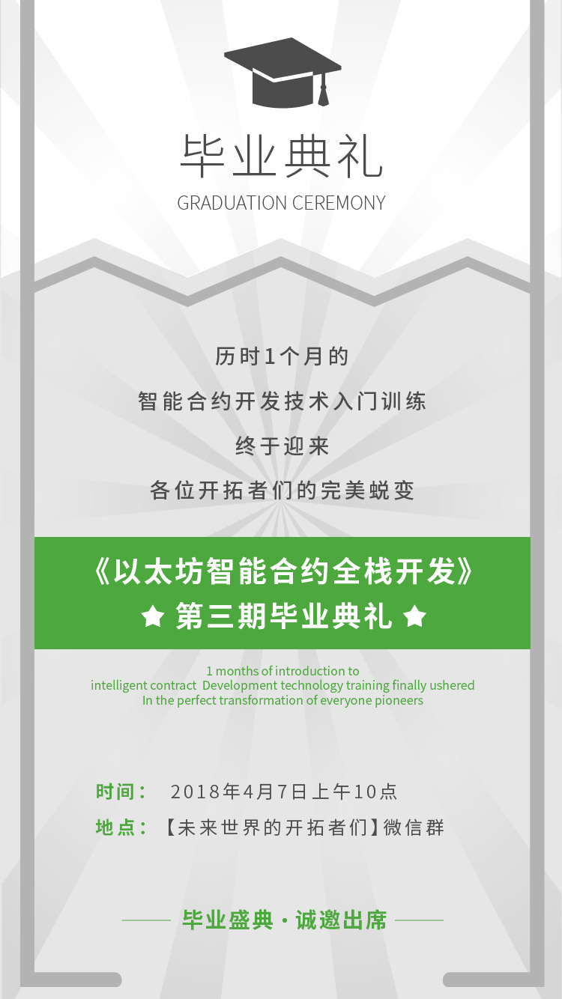

# 每日优质内容复盘-2018.4.6

## 【重要通知】

**@雅珣班长：**

> 各位同学们～
> 北京时间今天下午3点结束白帽黑客比赛。明天上午九点老董在直播间进行总答疑，10点准时开始结业仪式喔！
> 
> 今天我会邀请所有同学加入【未来世界开拓者们】总微信群，明天的结业仪式将在群内和一期二期的学长学姐们一起进行
> 
> 另外，由于明天的结业仪式时间冲突，李老师的周六分享会时间改为周日上午十点在合并后的社群进行啦，大家相互告知哈

## 【优质课程资源】

- 感谢 **@刘虹男** 助教提供的课程知识拓展： [Ethereum交易详解](https://github.com/Guigulive/Wiki/wiki/Ethereum%E4%BA%A4%E6%98%93%E8%AF%A6%E8%A7%A3)

## 【课程答疑】

#### Q1. @张晓：课程结束之后，课程的视频还可以看多长时间？

- **@雅珣班长：** 有效期是三个月

#### Q2. @陶维英：在remix下，如何调用其它合约的接口？

- **@陈垚文助教：** 参考一下黑客比赛的代码，根据需要使用`call`或者 `delegatecall`

> `call`和`delegatecall`的区别：
>  
> `call`与`delegatecall`的功能类似，区别仅在于后者仅使用给定地址的代码，其它信息则使用当前合约(如存储，余额等等)。  
https://www.jianshu.com/p/fd5075ff0ab9
