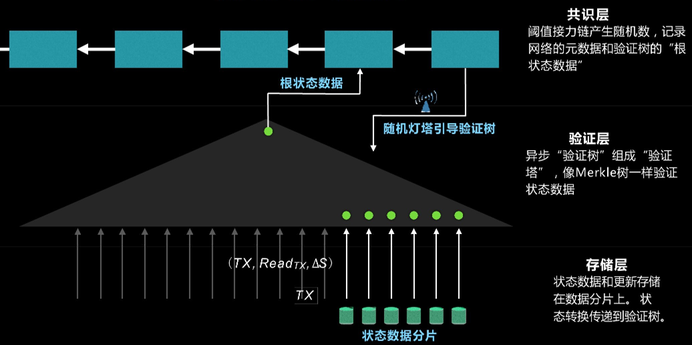
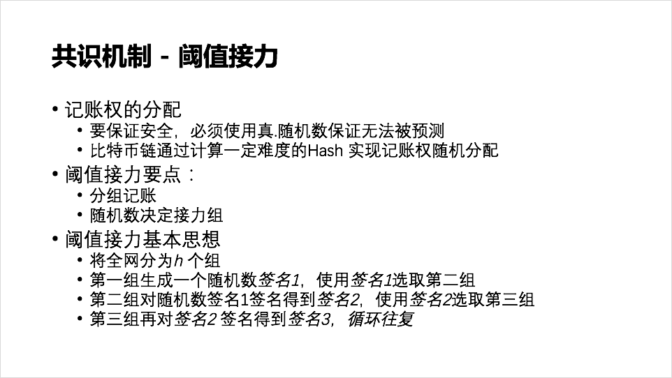
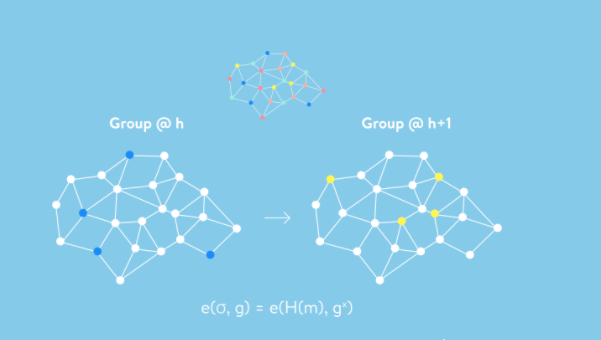
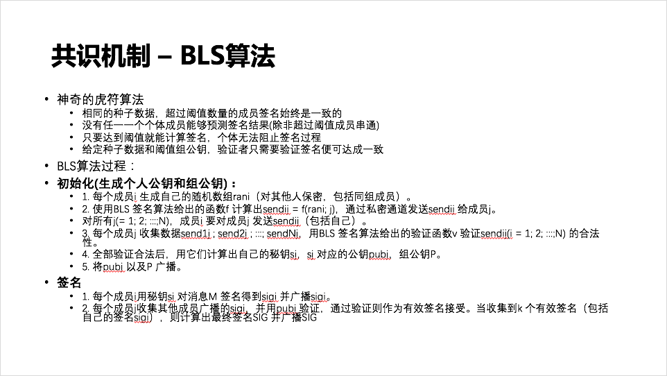
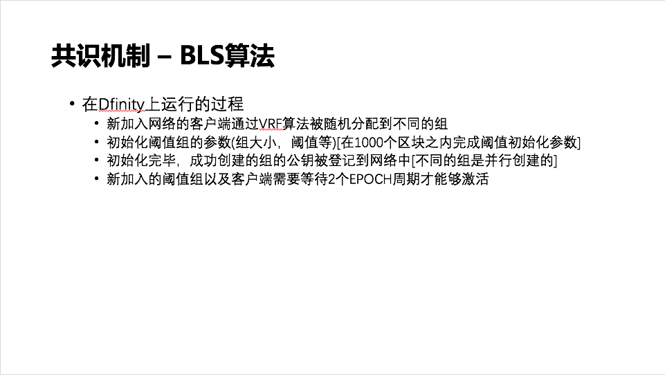

对Dfinity共识机制的简单介绍
===

分享人：题华龙

## 摘要

本次分享会邀请到前京东移动技术负责人华龙来给大家讲解《对Dfinity共识机制的简单介绍》，主要探讨一下Dfinity的基础概念和一些优势。

## Dfinity是什么？

区块链从比特币于2008年提出开始已经有十年了，至今为止，交易速度已经成为一个制约区块链技术发展的一个很大的瓶颈，各个底层公链都在想办法解决交易速度的问题。

Dfinity这个项目早于2014年开始规划，初期目标是做一个大规模并行计算的平台，其目的是为了解决代币和支付的能力。与此同时以太坊面世，Dfinity团队非常认可以太坊的世界计算机的理念，所以他们开始重新规划项目，不仅要做大规模支付移动、代币移动的功能，并且要支持通用的计算。同时Dfinity也发现了以太坊的一些问题，比如分叉问题、交易速度慢的问题，所以他们试图改进算法，运用不同的治理理念，来提供不同的平台。Dfinity希望成为一个无限量计算、无限扩容的区块链计算机，可以支撑起千亿级的规模。

2016年初，Dfinity作为商业项目正式立项。在这期间，他们受到波士顿咨询（BCG）较大影响，了解到世界500强客户对于商业化的大规模计算需求。所以，虽然DFINITY主要研究的是公有链，但它的算法可以拿来做私有链或者联盟链。

### Dfinity的优势

- 兼容EVM
- 更高的性能
	- 三层架构横向扩展
	- 阈值接力实现快速出块快速确认
	- 概率插槽协议增加区块事务数
- 支持拜占庭容错
- 可解决公共纠纷的治理机制，神经元系统 (Blockchain Nervous System)

### 面临的技术难题

为了达成其发展目标，Dfinity至少需要解决三方面问题：

- 交易速度：Dfinity通过阈值接力算法来优化交易速度。经过测算，Dfinity第一版本的确认速度达到了7.5秒，相较于以太坊提升了100倍以上，将来可能有更多的优化空间
- 吞吐量：当节点增加 (TODO)
- 自适应能力：Dfinity通过神经元系统 (BNS) 来实现。可以用于提升出块时间、调整阈值组大小、面对恶意智能合约进行回滚

## Dfinity架构

- 共识层：不涉及任何交易数据，仅负责产生阈值接力的随机数，选出工作的阈值组，保存验证层的根状态数据
- 验证层：Merkle树的根状态存在共识层，其分支和叶子结点存储在验证层
- 存储层：分片存储具体的交易数据，分为多个子链，子链间并不共享数据，即Dfinity中各个节点并不包含所有的区块链数据

这种分层的趋势早已出现在比特币、以太坊之中。比特币的隔离见证其实就是把交易数据和验证数据分开，只不过没有进行彻底分离，Dfinity则分离得更加彻底。但是这样的设计带来两个问题：

- 跨分片的数据交易存在困难
- 没有任意一个节点拥有完整的数据

## 阈值接力

每个区块链网络，包括比特币、以太坊，本质上都是一种接力的概念。接力指的就是记账权的分配。比特币根据算力来保证记账权的随机分配，以太坊现在也是通过算力，但是将来可能会转移到权益证明 (PoS) 的方式来接力。Dfinity抛弃了类似比特币的基于竞争的接力方式，而是采用了阈值接力这种新的方式。

在架构图中有一个概念叫做随机灯塔 (Random Beacon)，这个可以理解为阈值接力的接力棒。

如上所述，阈值接力是进行分组记账，在上图中不同的节点颜色表示不同的组，在每个出块时间，是由同一个节点组在共同验证区块链。图中在h高度的是蓝色组，它会根据h-1组 (不在图中) 的数据签名来计算出一个随机数，这个随机数指向的就是h+1组 (黄色组) 的组ID。等蓝色组工作完成后，会进行随机数的广播，这样黄色组就知道轮到自己组来进行工作。这整个过程就像接力棒的转移，所以叫做阈值接力。

既然Dfinity进行了分组，则不得不考虑一个组怎么进行共同签名，还得保证这个签名得到整个区块链验证通过。组共同工作会存在一些问题，组内节点可能挂掉，可能停机，那此时产生的签名是否会不一致？Dfinity的阈值接力算法有以下特性，则保证了签名的一致性。假如组内有一百个成员，那么我可以设定一个阈值 (半数以上)，比如五十一个，那么只要超过了这个阈值，多于五十一个组成员所产生的阈值是完全一致的。这就是所说的阈值概念，即超过阈值，产生的签名必定是唯一的。

Dfinity中阈值签名算法来源于斯坦福大学的BLS签名算法，BLS算法的创始人之一Ben Lynn为Dfinity核心成员。其算法概要如上图所示。初始化的过程比较重要，签名的过程则相对简单。这样的设计带来一个好处，组内任意一个节点的作恶不会影响到全局。假如某个节点故意不参与签名或不出块，但是在组内，只要满足阈值条件就可以生成全局签名。

整个阈值组的创建过程会比较漫长，根据当前的设定，一个阈值组从开始到创建成功大概需要两个星期的时间。其创建过程如上图所示。新加入的阈值组并不会立即投入工作，需要等两个星期之后才能被激活，激活之后才会被整个区块链网络所认可。
