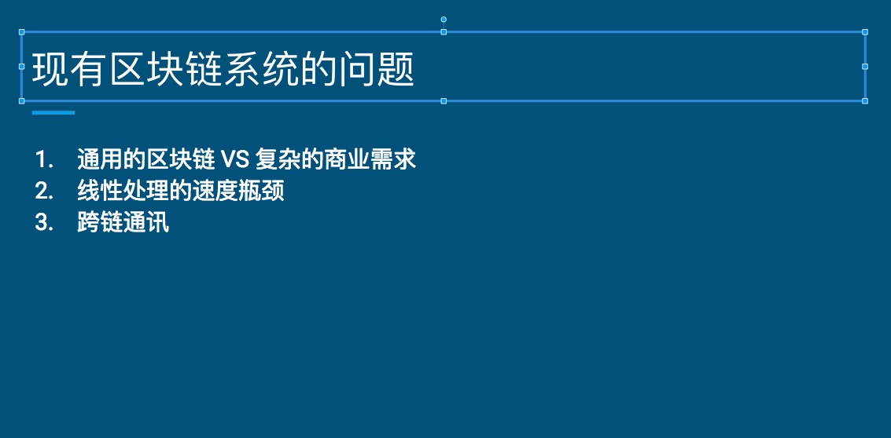
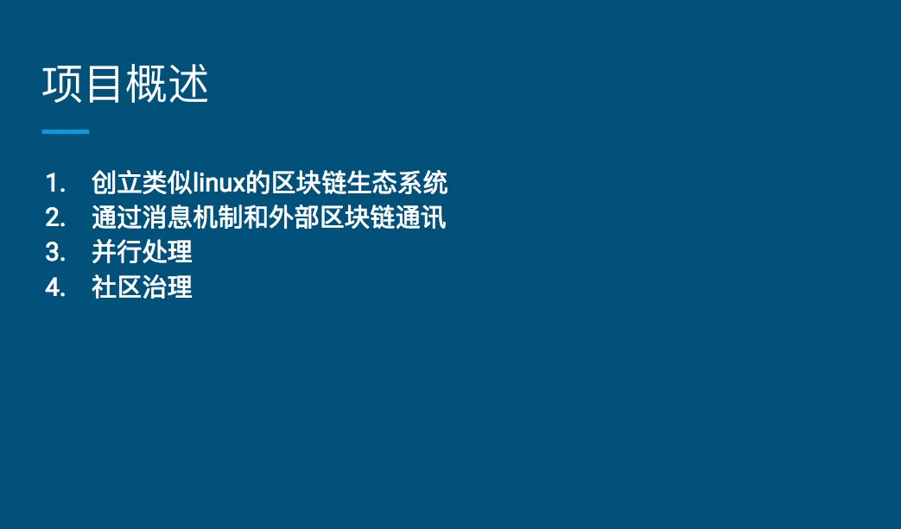
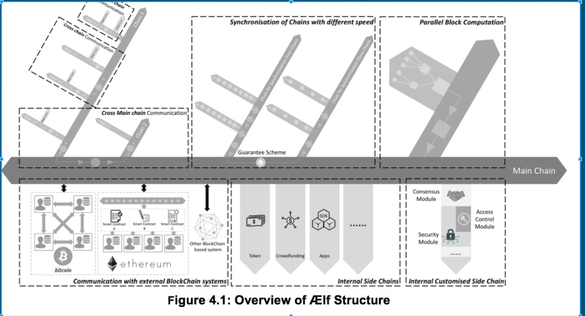
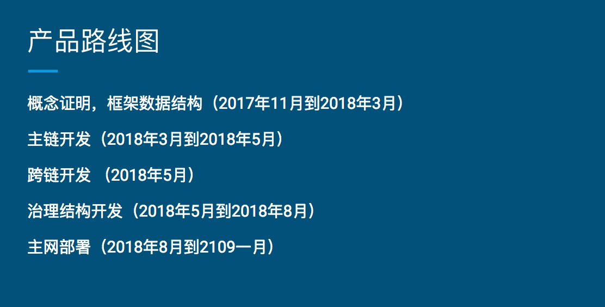
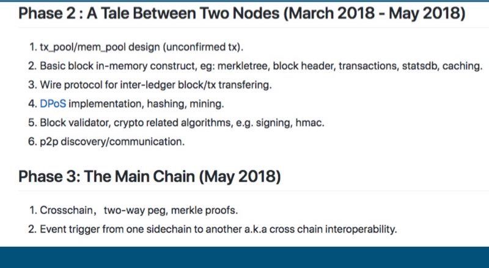

AELF 白皮书解读
===

分享人：王鲁明

## 区块链现有的问题

- 通用的区块链 VS 复杂的商业需求

    不同类别的应用对其依附的系统有着不同的需求，不是每个应用都注重速度，也不是每个应用都注重安全。比如票务系统更注重速度，毕竟攻击此类系统的经济收益并不高；而数字化的法律合同系统则会把安全性放在第一位。但是现有的区块链系统对于运行在其上的DApp都一视同仁，满足不了差异化的需求。

- 线性处理的速度瓶颈

    这是一个老生常谈的问题，也就是速度的问题。比如，以太猫就能拖垮整个以太坊网络。速度也是各个区块链项目的核心，解决方案主要包括：状态通道、闪电网络、侧链、以太坊的Plasma。

- 跨链通讯

    如果无法解决该问题，每个区块链则会成为价值孤岛。只有实现了跨链通讯，我们才可能会有一个全球性的低成本的价值转移网络。

## AELF项目概述

- 创立类似Linux的区块链生态系统

    AELF团队的愿景是建立一个类似Liux的区块链生态系统，AELF将由一个主链和多个侧链组成

- 通过消息机制和外部区块链通讯

    AELF将通过消息和动态索引机制来实现跨链通讯，消息机制比单纯的交易机制更灵活，可以传递任意信息，从而使跨链DApp的互动成为可能。闪电网络此类跨链交易是实现代币的交易，无法实现消息的传播

- 并行处理

	以提高系统的吞吐能力

- 社区治理

	AELF项目的代币持有者可以决定项目的演化和迭代，从而避免硬分叉问题

AELF借鉴了很多操作系统的概念，可以将其视为一个可以高度定制化的区块链世界里的Linux操作系统

图片中间像一条宽阔的马路，表示AELF的主链，用于连接各个模块。主链可以想象成操作系统的内核，侧链则相当于应用程序，内核负责系统的安全、用户之间的通讯、与外部世界的连接，以后还可以在内核中加入身份管理，从而实现DApp的快速开发。AELF旨在建立一个稳定的主链，实现多种侧链的热插拔，从而建立起一个完整的区块链生态系统，成为一个全球性的操作系统。

## AELF 侧链机制

- 侧链索引系统

    通过索引，AELF可以连接所有的侧链，索引可以帮助侧链快速定位和验证其它侧链的交易信息.索引是系统通过扫描侧链数据，结合Merkle Tree完成，所有侧链之间的交互都经过主链，侧链之间不存在任何直接联系，所以主链可以随时添加和移除侧链，就像在系统中添加或删除程序

- 索引服务的经济性

    当一个侧链被主链索引的时候，它从主链获得一些锁定的代币。当侧链收到交易手续费时，它也会和主链的矿工一起分享。当主链发现索引一条侧链在经济上不能获利的时候，主链有权终止索引，或者说允许两条提供相同服务的侧链之间互相竞争

- 用户自定制侧链

    开发者可以通过改变系统参数来迅速定制有不同特征的侧链，也可以改变其共识机制，指导思想是：一个侧链只为同一类的商业需求服务

- DApp的部署和开发

    AELF可以支持一链一应用，可以把每个应用部署到不同的侧链之上，当一个应用出现问题的时候，它对其它应用和主链不会有任何影响，这提高了系统的稳定性和灵活性

## AELF 内置侧链

AELF生态系统提供了一些内置功能，这些功能是通过内置侧链来实现的：

- 信息注册和验证侧链

    为电子商务、物流、供应链之类的应用服务

- 数字资产权益侧链

    主要用来储存数字资产和钱包的所有权信息

- 数字资产分配侧链

    用来进行ICO，当ICO完成之后，数字资产被转移到数字资产权益侧链

- 交易所侧链

    提供去中心化的交易所，支持KYC、资产转移、订单的创建和取消以及执行

## 产品路线图

下图是主链开发和跨链开发的计划细节：

## 参考资料

- [AELF White Paper](https://grid.hoopox.com/aelf_whitepaper_en.pdf)
- [AELF白皮书](https://grid.hoopox.com/aelf_whitepaper_ZH.pdf)

