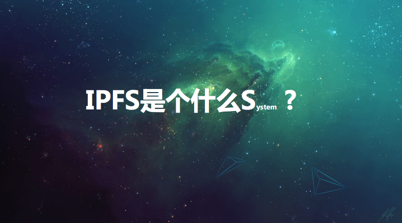
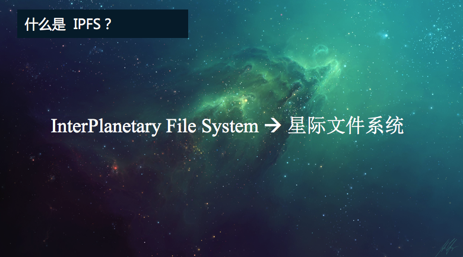
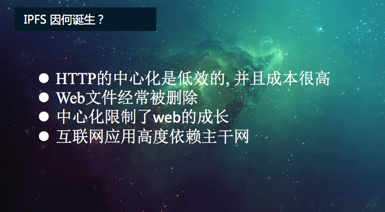
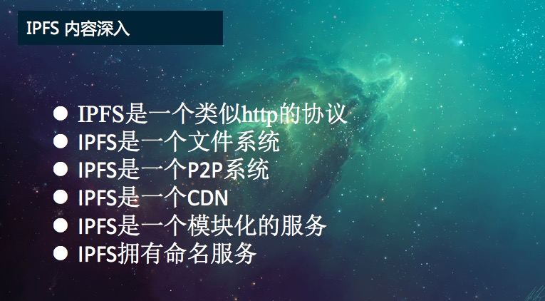
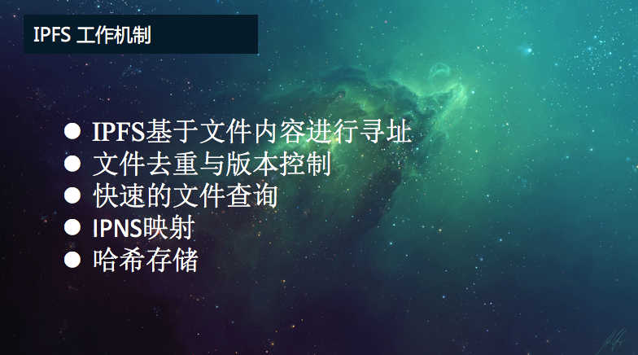
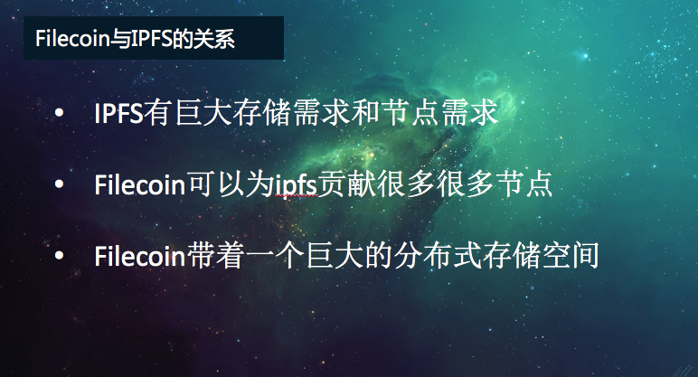

IPFS 是个什么 S<small>ystem</small>？
===

分享人：高冰

## 什么是 IPFS？

IPFS全称是InterPlanetary File System，即星际文件系统。它是一个分布式的Web，点到点的超媒体协议，它能让我们的网络速度更快，更加安全，更加开放

## IPFS 因何诞生？

- HTTP中心化，低效，成本很高
	- 每次使用HTTP协议，都要从服务器下载完整的文件，比如网页、视频、图片等，如果用P2P的方式来下载，则可以节省近60%的带宽。P2P的传输模式下，文件被分成小块，从多个服务器下载，速度可以得到提升
- Web文件经常被删除
	- 有些收藏的页面会被删除。页面平均生存周期大约只有100天，由于存储成本太高，所以无法永久保存
	- IPFS提供历史回溯功能，像Git版本控制工具一样，可以很容易的查看文件的历史版本，数据可以得到永久的保存
- 中心化限制了Web的成长
	- 我们现有的互联网它是一个高度中心化的网络。那互联网是我们二十世纪的一个伟大的发明，也是科技创新的加速器。但是各种管制将对互联网的一些功能造成威胁，比如互联网的封锁、监控、管制等等，这些都源于互联网的中心话。而分布式的IPFS可以克服这些缺点。
- 互联网应用高度依赖主干网
	- 主干网受制于诸多因素的影响，比如战争、自然灾害、前面提到的互联网管制以及中心化的服务器宕机等等，都可能使我们的互联网应用中断服务。IPFS可以极大地降低互联网应用对于主干网依赖。

IPFS不仅要对web做加速，其最终目标是为了取代http协议，使我们的互联网变得更加便捷高效

## IPFS

- IPFS是一个类似HTTP的协议
    - 定义了基于内容的寻址文件系统
    - 可以进行内容的分发
    - 使用技术分布式哈希、P2P传输以及版本管理系统
- IPFS是一个文件系统
    - 类似Linux，上面可以有各种各样的文件夹的目录和文件，然后还可以挂载其他的文件系统
- IPFS是一个P2P系统
    - 在世界范围内可以进行P2P的一个文件传输
    - 一个分布式的网络结构
    - 没有单点失效的问题
- IPFS是一个CDN
    - 可以将文件添加到IPFS网络中，然后在全世界的网络中进行CDN的加速那
    - 可以进行BT的带宽管理
- IPFS是一个模块化的服务
    - 连接层，通过其他任何网络的协议进行连接
    - 路由层，寻找定位文件所在的位置
    - 数据块交换，像BT一样来进行数据块的交换
- IPFS拥有命名服务
    - IPNS命名体系，这个体系基于sfs，即自认证系统的命名体系，可以和现有域名系统进行绑定

## IPFS 工作机制

- IPFS基于文件内容进行寻址
    - IPFS它为每一个文件分配一个独一无二的哈希值，也就是文件的指纹，可以根据文件的内容进行创建。即使两个文件只有一个比特的不同，其哈希值也是不同。IPFS是基于文件内容进行寻址，而不是像传统的HTTP协议一样基于域名寻址
- 文件去重与版本控制
    - IPfS会在整个网络范围内会减少并去掉重复的文件，并且给这些文件建立版本管理。也就是说，每个文件的变更历史都将会被记录下来。类似版本控制工具，Git以及SVN等等。我们可以很容易地回到文件的历史版本去查看我们的数据
- 快速的文件查询
    - 当我们在查询文件的时候，IPFS网络根据文件的全网惟一的哈希值进行查找。由于每个文件的哈希值全网惟一，所以查询会很容易地进行，并且可以很高效的得到我们想要的结果
- IPNS映射
    - 如果仅仅使用哈希值来区分文件的话，会给传播造成困难，因为哈希值不容易记忆。就像IP地址一样不容易记忆，于是人类方面的域名。IPFS利用IPNS技术将哈希值映射为容易记的名字
- 哈希存储
    - 每个节点除了存储自己需要的数据外，还存储了一张哈希表，用来记录文件存储所在的位置，以方便进行文件的查询和下载

## 解决了 HTTP 的痛点

- 下载速度快，不再依赖于主干网，中心化服务器
    - 整个IPFS系统，它是一个分布式的文件存储系统。在下载相关数据的时候，将从多个节点同时下载，相比于HTTP从中心服务器的下载速度要快很多
- 存储空间变得非常便宜
    - IPFS使用区块链技术，利用Filecoin来激励矿工分享自己的硬盘
    - IPFS在全网去掉了冗余的存储，这将大大节省网络存储空间
- 安全
    - 中心化的服务器目前很难抵挡DDoS攻击
    - IPFS天生就拥有抵挡这种攻击的能力，那是因为所有的访问将会被分散到不同的节点，甚至攻击者自己也是节点之一，某种程度上讲IPFS甚至能抵挡量子计算的攻击
- 开放
    - 类似比特币，建立在去中心化的分布式网络上的IPFS也很难被中心化管理和限制，整个网络生态将会更加的开放

## IPFS 仅仅是 CDN，永久的 Web？

总结 IPFS 的内容：

- 可以在根目录的IPFS以及根目录的IPNS下面挂载全球的文件系统，也就是说我们所有的文件都可以存到上面
- 可以挂载个人同步的文件夹，可以自动的进行版本的管理和备份，也就意味着未来我们将会有一个无限空间的网盘，不用担心数据丢失，也不用担心隐私泄露
- 作为加密文件和数据共享系统，IPFS天生就具备文件加密、数据共享的能力
- 一个带版本控制的软件包管理系统
- 可以作为虚拟机的根文件系统
- 可以作为管理程序，把IPFS作为虚拟机的引导文件系统，即在线操作系统
- 可以作为数据库来使用
- 作为一个加密的通讯平台，想要窃听消息基本是非常困难的
- 可以作为加密的CDN
- 永久的Web，不存在不能访问的链接，不会出现"404 Not Found"

## 什么是 Filecoin？

Filecoin是IPFS亲生的区块链项目，是一个分布式存储网络的区块链项目。Filecoin把云存储转换为算法市场，作为运行在IPFS上的激励层。Filecoin几乎可以存储一切的数据，运行分布式的应用，还可以实现智能合约的系统。

- Blockchain
- 交易市场
    - 检索市场
    - 存储市场
- 共识机制
    - 抛弃PoS
    - Proof of replication (PoRep) & Proof of spacetime
    - 这种共识机制能会将矿工当前在网络中使用的存储量和生成的时空证明转化为投票的权重，然后节点利用这个权重进行选举，产生一个或者多个的领导节点。然后，领导节点创建新的区块，并把它们传播到网络。Filecoin的区块数据结构也是采用了DAG有向无环图的结构
- 智能合约
    - 两个基本API：(1) 数据存储的put，(2) 数据获取的get
    - 在这两种操作的基础上，Filecoin支持文件的合约，让用户可以有更精细化的控制
    - Filecoin 集成了合约系统和桥的系统，可以把Filecoin的存储系统提供给其他区块链系统来使用，同时。可以让Filecoin使用其他区块链的功能

## Filecoin 与 IPFS 的关系？

- IPFS有巨大的存储需求和节点需求
- Filecoin可以为IPFS贡献很多的节点
- Filecoin带着一个巨大的分布式存储空间

首先，Filecoin是运行在IPFS协议上面的激励层。IPFS他有巨大的存储需求和节点需求，我们都知道P2P网络节点越多，下载越快。如果没有激励机制，谁愿意贡献如此多的节点和存储呢？于是Filecoin就来了，它可以为IPFS贡献很多的节点。同时，Filecoin还带着一个巨大的分布式的存储空间，解决了IPFS的存储的问题。

Filecoin的代币是沟通资源使用者（即用户）以及资源提供者（即矿工）的中介桥梁。前面提到过发有两个交易的市场，一个是数据检索市场，一个是数据存储市场。双方在市场里面提交自己的需求来达成交易。现在，IPFS和Filecoin就成为了一个共生的关系，离开一方，另外一方的发展就会变得相对困难。

## Q & A

Q: **@蒋宏伟-北京-前端**: 谢谢分享。有一个疑问，通过IPFS如果确保用户能访问到最新的资源。

A: **@高冰🏃助教**: 用户可以从任何的IPFS节点上访问到最新的资源，比如你需要访问的资源是： QmcKi2ae3uGb1kBg1yBpsuwoVqfmcByNdMiZ2pukxyLWD8 ， 你可以在 ipfs网络下输入 ipfs cat /ipfs/QmS4ustL54uo8FzR9455qaxZwuMiUhyvMcX9Ba8nUH4uVv   来访问你的目标资源

---

Q: **@尹礼春-广东-全栈**: 在ipfs网络中，现在的域名还有价值吗？

A: **@高冰🏃助教**: 在IPFS中，有些哈希是一些很大的、难看的字符串，而且不容易记住。所以IPFS允许用户使用现有的域名系统来为IPFS内容提供更具可读性的链接。

---

Q: **@刘彭+上海+Avid.ly区块链开发**: 记得SiaCoin也是做链上分布式存储的，FileCoin和它相比，优劣势分别是什么呢？

A: **@高冰🏃助教**: IPFS更多是通过协议层面解决内容冗余的问题，云存储只是其中的一个方面，它想取代http成为文件传输的底层协议，它更关注文件的共享。 Siacoin更关注私人文件的云存储，解决个人文件安全问题。

---

Q: **@王浩-北京-互联网**: ipfs预计啥时能发币呀？

A: **@高冰🏃助教**: IPFS 没有发币。去年艾希欧 的不是ipfs 而是FileCoin的FIL（代币名称），但是信息到国内就神奇地变成了IPFS，导致了一些误解。

