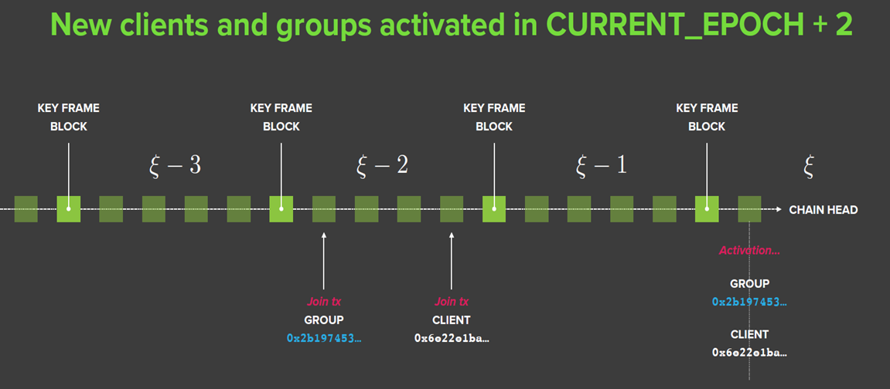
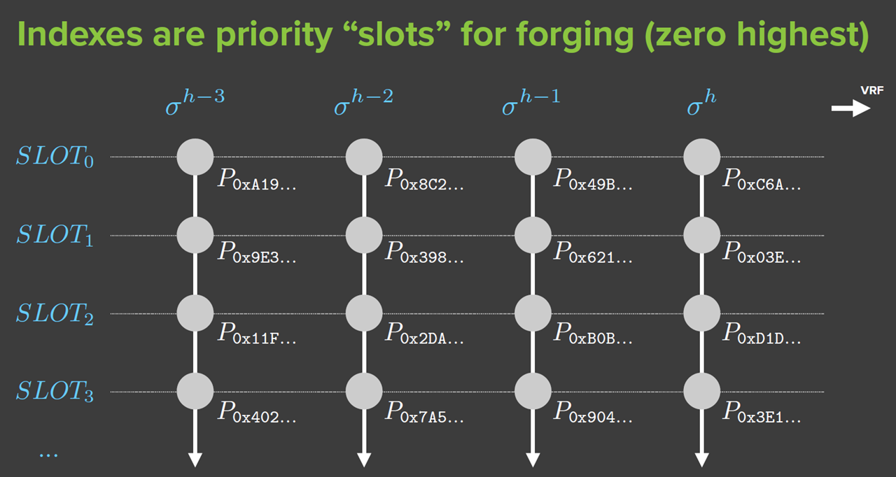
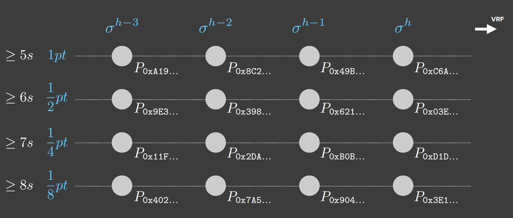
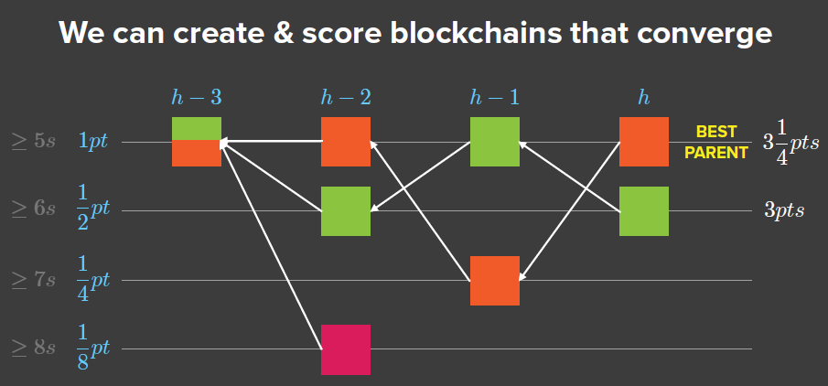

对Dfinity共识机制的简单介绍 (二)
===

分享人：题华龙

## 摘要

上次前京东移动技术负责人华龙分享了Dfinity中阈值接力的部分，今天仍然由华龙带来关于Dfinity的后续分享，主要探讨阈值组内部如何工作，也就是出块流程，包括概率插槽和区块公证两部分。

## 上期回顾

[上期复盘](https://github.com/Guigulive/Wiki/blob/master/weekly-seminar/2018.03.17-dfinity/2018.03.17-dfinity-consensus.md)

Dfinity 分成三层架构：(1) 共识层，(2) 验证层，(3) 数据层 (存储层)。上期所分享的阈值接力主要发生在共识层。

在共识层，Dfinity基于BLS组签名算法实现了一个不可预测的随机数发生器，被称为随机灯塔。Dfinity把所有的节点分成一个个阈值组，通过随机灯塔来挑选出一个工作组来完成出块以及签名。

## 概念介绍 - Epoch时间周期

在上图中可以看到，从一个组加入到正式开始工作，间隔有两个Epoch周期。

每个Epoch中的第一个区块是一个特殊的区块，被称为关键帧 (Key Frame)。关键帧记录了上一个周期内所有注册和撤销的客户端和阈值组。为什么需要Epoch? 原因是，对于轻客户端来说，它不需要同步所有区块，只需要关键帧即可正常工作。

对于Epoch周期的长度，官方倾向于为一个星期，但这个周期可以设置得更短，比如一天甚至一个小时。设置为一个星期，是为了保证轻客户端足够轻量化。但Epoch周期有一个最小值，即为区块交易达到最终一致性所需要的最小时间。如果所提交的区块交易已经过了两个周期，但是交易还没有达成最终一致性的话，则交易无效。

## 阈值组内部机制

### 生成随机灯塔

被选中为工作组后，所有的工作成员需要进行的第一个工作是生成随机灯塔。这个时候，组内的每个成员已经收到了上一轮的随机灯塔的输出，也就是一个随机数，然后组内每个成员轮流用自己的私钥对这个随机灯塔数进行签名，并广播给组内的其他成员，然后其他成员收集这个签名并加上自己的签名，然后这个签名达到阈值之后就会生成新的随机灯塔数，用于下一轮阈值组的选择以及当前轮的概率插槽 (Probabilistic Slot)

Dfinity的随机数发生机制被称为VRF，不仅用于阈值组的选择和概率插槽，在验证塔、存储的分片、甚至是上层的智能合约的随机数中都有应用

### 概率插槽

简单来说，概率插槽是依据权重对组内成员进行排序。那么排序的依据是什么？PoW基于算力排序，PoS基于权益排序，Dfinity内部则利用随机灯塔数作为排序依据。

上图中有四个区块高度，从`h - 3`到`h`，每个高度上，都对当前的阈值组进行排序，`SLOT 0`是权重最高的插槽，依次递减。因为阈值组内所有成员都有出块的权益，分成概率卡槽后，概率卡槽优先级越高，产生区块的权重就会越高。然后，在阈值组内，组员根据区块的权重来决定签名，会优先签权重最高的区块。

上图是根据概率插槽排序之后，对每个插槽内的区块的权重分配。如图所示，`SLOT 0`的权重是1，`SLOT 1`的权重是0.5，依次递减。同时每个插槽都有一个建议出块时间，权重最高的`SLOT 0`的建议出块时间是5秒，`SLOT 1`的为6秒，依次递增。

### 出块流程

- 在一定的时间内，组成员会把收集到的交易打包成区块，然后该区块链接到当前区块链的链头，也就是上一个阈值组公开的区块
- 在超过出块时间后，每个组成员会把自己挖出来的候选区块广播给整个阈值组
- 每个组成员会为当前轮次所收到的最高优先级的区块进行签名，并将区块的签名消息广播出去
- 在这种情况下，如果有任意一个最高优先级的区块，其签名超过了阈值组的限定之后，则会触发进行组签名的条件，该组签名也被称为公证
- 在一个组成员在签名后，可能会收到更高优先级的区块，此时则会继续对高优先级的区块进行签名，直到收到当前轮的组签名，组成员结束工作，进入下一轮
- 在这个过程中，可能会有多个区块触发公证条件，所以通过这个过程无法达到最终一致性，无法达成共识。但是在下一个阈值组进行工作时，它仍然会依据权重来选择，权重低的则会被抛弃

如上图所示，在`h`高度，橙色区块链的长度权重为3.25，绿色链的为3，所以`h + 1`高度的阈值组进行选择的时候，会选择橙色而抛弃绿色。

## 异常情况

上面介绍了正常情况下Dfinity是如何工作的，这里有一些可能出现的异常情况留给大家思考：

1. 如果网络分化？
2. 如果`SLOT 0`的成员故意广播多个版本的区块？
3. 自私挖矿攻击：恶意节点将挖出来的区块保留，并不及时发布，而是后期慢慢发布
4. 无利害关系问题：类似PoS里一个恶意节点在所有可能的链上生成新区块，保证利益最大化。在Dfinity中，如果恶意节点运气够好，被选为一系列`SLOT 0`插槽，那么它就可以随时在所有的分叉上进行投票，并从`h`高度之后创建分叉并实施重放攻击

## 参考资料

- [Dfinity White Paper](https://dfinity.org/pdf-viewer/pdfs/viewer?file=../library/dfinity-consensus.pdf)
- [Threshold Relay](https://dfinity.org/pdf-viewer/pdfs/viewer?file=../library/threshold-relay-blockchain-stanford.pdf)
